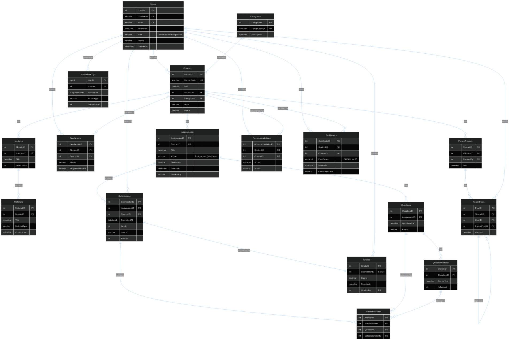
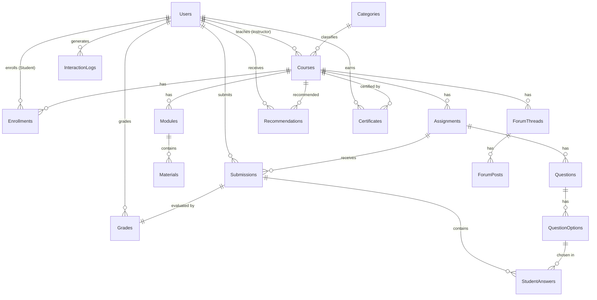

# Online Learning Management System (LMS) — DBI202

Dự án cơ sở dữ liệu cho hệ thống quản lý học tập trực tuyến (LMS), xây dựng trên
**Microsoft SQL Server (T-SQL)**. Hệ thống quản lý người dùng, khóa học, nội dung
học liệu, bài tập/kiểm tra, chấm điểm, thảo luận, gợi ý khóa học (AI) và phân tích
hành vi học tập.

## 1. Cấu trúc thư mục

```
sql/
├── 01_schema.sql              -- Tạo database + bảng + khóa + ràng buộc
├── 02_triggers.sql            -- Trigger thực thi các quy tắc nghiệp vụ
├── 03_functions_views.sql     -- Hàm (function) và view phục vụ truy vấn/báo cáo
├── 04_procedures.sql          -- Stored procedure (đăng ký, nộp bài, chấm điểm, gợi ý...)
├── 05_sample_data.sql         -- Dữ liệu mẫu (nền)
├── 06_reports.sql             -- 6 truy vấn báo cáo/thống kê theo yêu cầu
├── 07_business_rule_tests.sql -- Kiểm thử quy tắc nghiệp vụ (12 negative tests)
├── 08_more_sample_data.sql    -- Làm giàu dữ liệu mẫu (idempotent, chạy lại không nhân đôi)
├── 09_positive_smoke_tests.sql-- Smoke test luồng hợp lệ (chạy trong transaction + ROLLBACK, an toàn)
├── run_all.sql                -- Chạy tất cả theo thứ tự (đường dẫn TƯƠNG ĐỐI, SQLCMD mode)
└── run_all_local.sql          -- Chạy tất cả với đường dẫn TUYỆT ĐỐI (tiện chạy trong SSMS trên máy này)
docs/
├── erd.mmd / erd_chen.dot / erd_chen.svg -- ERD nguồn (mermaid + Graphviz Chen)
├── diagrams/                             -- Ảnh sơ đồ đã render (PNG/SVG)
│   ├── erd.png                           -- Sơ đồ ERD tổng quan (mermaid)
│   ├── erd_chen.png                      -- ERD Chen đầy đủ (dùng cho Lab 2 & Final Report)
│   ├── lms_core_chen_erd_presentation.png / .svg / .dot -- ERD Chen rút gọn (Lab 4 & slide thuyết trình)
│   └── block_diagram.png                 -- Sơ đồ khối kiến trúc hệ thống
├── Normalization_and_DataDictionary.md   -- Chuẩn hóa 1NF/2NF/3NF + Data dictionary
├── PROJECT_REVIEW.md / .pdf              -- Bản tự rà soát/đánh giá tổng thể dự án
├── Lab 1..5 *.docx                       -- Đề bài gốc (template) của 5 lab từ giảng viên
├── reports/                              -- Báo cáo 5 lab để nộp + phụ trợ (xem mục 1b)
│   ├── lab1_data_models.md / .docx
│   ├── lab2_entities_fds_keys.md / .docx
│   ├── lab3_anomalies_and_normalization.md / .docx
│   ├── lab4_relational_design_process.md / .docx
│   ├── lab5_sql_programming.md / .docx
│   ├── _build_lab_docx.py                -- Script build 5 .md -> .docx (python-docx)
│   └── _build_lab_pdfs.py                -- Script build 5 .md -> .pdf
└── screenshots/                          -- Ảnh chụp web app (minh họa cho Lab 5 / Final Report)
webapp/                          -- Web app demo (Flask + pyodbc) kết nối SQL Server thật
├── app.py                       -- Route Flask
├── db.py                        -- Lớp truy cập DB (parameterized, chỉ đọc/gọi SP có sẵn)
├── templates/                   -- Giao diện Jinja2 + Bootstrap
├── static/css/app.css           -- CSS tùy biến (giao diện academic)
├── requirements.txt             -- Thư viện Python
├── .env.example                 -- Mẫu biến môi trường (copy thành .env)
└── README.md                    -- Hướng dẫn riêng cho web app
README.md
```

> Tài liệu thiết kế chi tiết (chuẩn hóa 3NF & từ điển dữ liệu):
> [`docs/Normalization_and_DataDictionary.md`](docs/Normalization_and_DataDictionary.md).
> Sơ đồ ERD: [`docs/diagrams/erd.png`](docs/diagrams/erd.png).
> Hướng dẫn web app demo: [`webapp/README.md`](webapp/README.md).

## 1b. Báo cáo các lab (docs/reports/)

Năm bài lab của môn được viết trong `docs/reports/` (mỗi lab có bản `.md` nguồn và bản
`.docx` để nộp). Trang bìa để placeholder — nhóm điền `[GROUP NAME]`,
`[FULL NAME — STUDENT ID]`, `[CLASS CODE]`, `[SUBMISSION DATE]` trước khi nộp.

| Lab | Nội dung | File |
|-----|----------|------|
| Lab 1 | Study of Data Models (so sánh các mô hình dữ liệu, biện minh chọn mô hình quan hệ) | `lab1_data_models.md` / `.docx` |
| Lab 2 | Entities, attributes, functional dependencies, keys (17 thực thể) | `lab2_entities_fds_keys.md` / `.docx` |
| Lab 3 | Anomalies + chuẩn hóa 1NF→2NF→3NF (ghi chú BCNF) | `lab3_anomalies_and_normalization.md` / `.docx` |
| Lab 4 | Quy trình thiết kế CSDL quan hệ (ERD → logical → physical → constraints) | `lab4_relational_design_process.md` / `.docx` |
| Lab 5 | SQL cơ bản → nâng cao + view/index/function/procedure/trigger | `lab5_sql_programming.md` / `.docx` |

- **Build lại tài liệu:** `python docs/reports/_build_lab_docx.py` (ra `.docx`),
  `python docs/reports/_build_lab_pdfs.py` (ra `.pdf`).

## 2. Cách chạy database

> ⚠️ **Quan trọng:** `run_all.sql` / `run_all_local.sql` sẽ **DROP và tạo lại** database `LMS`
> (xem `01_schema.sql`: `ALTER DATABASE ... SINGLE_USER WITH ROLLBACK IMMEDIATE; DROP DATABASE LMS;`).
> Mọi dữ liệu trong `LMS` sẽ bị xóa và dựng lại từ đầu. **Hãy tắt web app trước khi chạy** (xem mục 2.3).

### 2.1. Cách A — SSMS (khuyến nghị `run_all_local.sql`)

1. Mở `sql/run_all_local.sql` (file này dùng **đường dẫn tuyệt đối** nên không bị lỗi
   "file not found" như `run_all.sql` dùng đường dẫn tương đối).
2. Bật **SQLCMD Mode**: menu `Query > SQLCMD Mode` (bắt buộc, để chạy được lệnh `:r`).
3. Đổi database trên thanh công cụ sang **`master`** (KHÔNG để là `LMS`). Vì script drop/tạo
   lại `LMS`, nếu cửa sổ query đang đứng trong `LMS` thì sẽ tự khóa chính mình → lỗi kết nối.
4. Nhấn **F5 (Execute)**. Tab *Messages* sẽ in lần lượt `... created successfully`,
   `Sample data inserted successfully`, các REPORT, và `TEST 1..12: PASS`.

> Nếu chạy trên máy khác: sửa đường dẫn trong `run_all_local.sql`, hoặc mở từng file
> `01 → 09` theo đúng thứ tự và Execute lần lượt (cách này không cần SQLCMD Mode).

### 2.2. Cách B — dòng lệnh (sqlcmd)

```powershell
cd sql
sqlcmd -S localhost -E -C -i 01_schema.sql -i 02_triggers.sql -i 03_functions_views.sql -i 04_procedures.sql -i 05_sample_data.sql -i 06_reports.sql -i 07_business_rule_tests.sql -i 08_more_sample_data.sql -i 09_positive_smoke_tests.sql
```

> `-E` = Windows Authentication, `-C` = trust server certificate. Thay `-S` bằng
> tên instance của bạn (ví dụ `localhost\SQLEXPRESS`). Cách này luôn chạy ở context `master`.

### 2.3. Trình tự an toàn khi reset database

1. **Tắt web app** nếu đang chạy (Ctrl+C ở cửa sổ chạy Flask). Web app dùng pyodbc mở/đóng
   kết nối theo từng request nên thường không giữ `LMS`, nhưng tắt hẳn cho chắc.
2. Đóng các tab query SSMS đang nối vào `LMS` (hoặc chuyển chúng sang `master`).
3. Chạy `run_all_local.sql` (theo mục 2.1) → đợi `TEST 1..12: PASS` (và `SMOKE: PASS`).
4. Bật lại web app khi cần demo.

> Các file SQL **phải chạy đúng thứ tự** `01 → 09` (qua runner script hoặc thủ công),
> vì file sau phụ thuộc object do file trước tạo. File `09` (smoke test) chạy trong
> transaction và **ROLLBACK** nên không làm thay đổi dữ liệu mẫu.

## 2b. Vai trò của web app demo

- **SQL Server là dự án chính (core).** Toàn bộ logic nghiệp vụ nằm ở schema, ràng buộc,
  trigger, function, view, stored procedure và các truy vấn báo cáo.
- **`webapp/` chỉ là lớp demo/thuyết trình nhẹ.** Nó **không** chứa logic nghiệp vụ riêng;
  nó đọc dữ liệu và gọi các object có sẵn trong database.
- **Web app dùng dữ liệu SQL Server THẬT** (qua pyodbc + Windows Authentication), **không**
  dùng dữ liệu giả ở frontend, không mock, không JSON/SQLite/localStorage.
- Web demo gồm: danh mục & chi tiết khóa, cổng theo vai trò **Student / Instructor / Admin**,
  báo cáo **kèm biểu đồ**, hệ thống **chứng chỉ ≥ 80%**, showcase quy tắc nghiệp vụ, và trang
  **minh bạch SQL** (`/sql-objects` + panel "SQL chạy cho trang này") đọc trực tiếp system catalog.
- Chi tiết cài đặt & cách chạy web app: xem [`webapp/README.md`](webapp/README.md).

## 3. Sơ đồ thực thể quan hệ (ERD)



<details><summary>Mã nguồn mermaid của ERD</summary>



</details>

## 4. Danh sách bảng

| Bảng | Vai trò |
|------|---------|
| `Users` | Người dùng + vai trò (Student/Instructor/Admin) |
| `Categories` | Danh mục khóa học |
| `Courses` | Khóa học, mỗi khóa do một giảng viên quản lý |
| `Modules` | Chương/mô-đun của khóa học |
| `Materials` | Học liệu (Document/Video/Link/Slide) |
| `Enrollments` | Đăng ký học (quan hệ N-N giữa Student và Course) |
| `Assignments` | Bài tập/Quiz/Exam (bắt buộc có deadline) |
| `Questions`, `QuestionOptions` | Câu hỏi trắc nghiệm + đáp án (chấm tự động) |
| `Submissions` | Bài nộp (1 student + 1 assignment) |
| `StudentAnswers` | Lựa chọn của sinh viên cho quiz |
| `Grades` | Điểm cho mỗi bài nộp đã chấm |
| `ForumThreads`, `ForumPosts` | Thảo luận/diễn đàn |
| `Recommendations` | Gợi ý khóa học (AI) + theo dõi hiệu quả |
| `InteractionLogs` | Nhật ký tương tác phục vụ phân tích |
| `Certificates` | Chứng chỉ hoàn thành khóa (chỉ cấp khi điểm tổng kết ≥ 80%) |

## 5. Quy tắc nghiệp vụ và nơi thực thi

| Business Rule | Cơ chế thực thi |
|---------------|-----------------|
| Mỗi user có tài khoản & vai trò duy nhất | `UNIQUE(Username/Email)` + `CHECK CK_Users_Role` |
| Student–Course là quan hệ N-N | Bảng `Enrollments` + `UNIQUE(StudentID, CourseID)` |
| Mỗi khóa do **một** giảng viên quản lý | FK + trigger `trg_Courses_InstructorRole` |
| Bài tập/đánh giá phải có deadline | `Deadline DATETIME2 NOT NULL` |
| Nộp trễ → đánh dấu late / từ chối theo policy | trigger `trg_Submissions_Policy` |
| Nộp trễ cũng xử lý khi cập nhật bài nộp | trigger `trg_Submissions_Policy` (AFTER INSERT, UPDATE) |
| Mỗi bài nộp gắn 1 student + 1 assignment | FK + `UNIQUE(AssignmentID, StudentID, Attempt)` |
| Phải có điểm cho mỗi bài đã chấm | bảng `Grades` + trigger `trg_Grades_MarkGraded` |
| Người chấm phải là Instructor/Admin (NULL = hệ thống tự chấm) | trigger `trg_Grades_MarkGraded` |
| Đáp án sinh viên chọn phải thuộc đúng câu hỏi | trigger `trg_StudentAnswers_OptionMatchesQuestion` |
| Sinh viên chỉ truy cập khóa đã đăng ký | hàm `fn_CanAccessCourse`, `fn_AccessibleMaterials`, chặn nộp bài khi chưa đăng ký |
| Khóa `Published` phải có ≥ 1 module (cả khi INSERT lẫn UPDATE) | trigger `trg_Courses_PublishNeedsModule`, `trg_Modules_KeepAtLeastOne` |
| Chứng chỉ chỉ cấp khi điểm tổng kết khóa ≥ 80% (Coursera-style) | `CHECK CK_Cert_Pass` + `sp_IssueCertificate` + `fn_CourseFinalGrade` |

## 6. Tính năng "AI" / xử lý dữ liệu

> **Làm rõ về thuật ngữ "AI":** module gợi ý ở đây là **bộ gợi ý content-based gọn nhẹ viết bằng SQL thuần**,
> **không phải mô hình máy học (ML) được huấn luyện**. Nó xếp hạng khóa học theo danh mục sinh viên đang
> theo học và độ phổ biến. Cách đặt tên "AI module" chỉ mang tính mô tả tính năng; giá trị học thuật nằm ở
> phần **thực thi bằng truy vấn/stored procedure trong SQL Server** phục vụ minh họa cơ sở dữ liệu.

- `sp_RecommendCourses` — gợi ý khóa học theo danh mục sinh viên đang học (content-based, SQL thuần), lưu lại để đo hiệu quả.
- `sp_AutoGradeQuiz` — tự động chấm quiz/exam trắc nghiệm theo đáp án đúng, quy đổi về thang điểm `MaxScore` (luật rõ ràng, không phải ML).
- `InteractionLogs` — ghi nhận hành vi để phân tích (active users, session duration).
- **Chứng chỉ (Coursera-style):** `fn_CourseFinalGrade` tính điểm tổng kết khóa (%), `fn_HasPassedCourse` xác định đạt ≥ 80%; `sp_IssueCertificate` cấp chứng chỉ và đánh dấu hoàn thành khóa. Ngưỡng 80% được khóa cứng bởi `CHECK CK_Cert_Pass` trên bảng `Certificates`.

> **Tiến độ học — hai khái niệm khác nhau (tránh nhầm):**
> - `fn_CourseProgress(StudentID, CourseID)` — **tính trực tiếp (live)** tỷ lệ bài đánh giá đã được chấm / tổng số bài của khóa. Web dashboard dùng hàm này để hiển thị tiến độ theo thời gian thực.
> - `Enrollments.ProgressPercent` — **giá trị lưu sẵn (snapshot)** trên bản ghi đăng ký; mặc định 0 và được `sp_IssueCertificate` cập nhật thành `100` (kèm `Status='Completed'`, `CompletedAt`) khi học viên đạt và được cấp chứng chỉ.
> Hai giá trị phục vụ mục đích khác nhau và **cố ý không đồng bộ realtime** để giữ thiết kế đơn giản.

## 7. Báo cáo (`06_reports.sql`)

1. Báo cáo kết quả học tập của sinh viên (điểm, tiến độ)
2. Tỷ lệ đăng ký & hoàn thành theo khóa học
3. Hoạt động giảng viên & hiệu quả khóa học
4. Thống kê nộp bài đúng hạn vs trễ hạn
5. Phân tích sử dụng hệ thống (người dùng hoạt động, thời lượng phiên)
6. Hiệu quả gợi ý khóa học (CTR, tỷ lệ chuyển đổi)

> **Phân tầng báo cáo (để tránh nhầm "6" với "5/3"):**
> - **Tầng SQL** (`06_reports.sql`): cung cấp **đủ 6** truy vấn báo cáo nêu trên — đây là phần được chấm điểm.
> - **Tầng web** (`/reports`): chỉ là lớp trình bày, hiển thị **một tập con theo vai trò** đang chọn:
>   **Instructor** thấy báo cáo **1, 2, 4** (3 báo cáo liên quan giảng dạy); **Admin** thấy báo cáo **1–5** (5 báo cáo).
>   Báo cáo **số 6 (hiệu quả gợi ý)** vẫn nằm trong `06_reports.sql` nhưng **không đưa lên web** (đồng bộ với việc đã bỏ trang gợi ý riêng).
> Biểu đồ trên web (Chart.js) lấy dữ liệu **trực tiếp từ các truy vấn trên**, không có số liệu giả ở frontend.

## 8. Ghi chú thiết kế: mô hình vai trò đơn giản hóa (Role model)

Triển khai này **cố ý** dùng mô hình phân quyền đơn giản hóa để phù hợp phạm vi DBI202:

- **`Users.Role`** lưu trực tiếp một trong ba giá trị: `Student`, `Instructor`, `Admin`
  (ràng buộc bởi `CHECK CK_Users_Role`). **Không** tách thành các bảng
  `Roles` / `Actions` / `Role_Actions`.
- **Quyền theo vai trò** (ví dụ: ai được VIEW/EDIT khóa học, ai được chấm điểm,
  ai được nhận gợi ý) được biểu diễn ở **tầng business-rule / stored procedure /
  trigger**, thay vì bảng phân quyền riêng. Ví dụ:
  - `trg_Courses_InstructorRole`: chỉ `Instructor` mới sở hữu khóa học.
  - `trg_Enroll_Validate`: chỉ `Student` mới ghi danh.
  - `trg_Grades_MarkGraded`: chỉ `Instructor`/`Admin` (hoặc hệ thống = `NULL`) mới chấm điểm.
  - `sp_RecommendCourses`: chỉ sinh ra gợi ý cho `Student`.
- Lựa chọn này giúp schema gọn, dễ trình bày và đủ thể hiện đầy đủ nghiệp vụ
  multi-role mà không cần mô hình RBAC đầy đủ.

### Bản đồ ERD thực tế (khớp schema đã hiện thực)

- **`Users`** — gộp cả ba vai trò vào một bảng qua cột `Role` (không có bảng `Roles` riêng).
- **`Assignments`** — đại diện cho cả `Assignment` / `Quiz` / `Exam` thông qua cột `AType`.
- **`Questions`, `QuestionOptions`, `StudentAnswers`** — hỗ trợ câu hỏi trắc nghiệm
  khách quan và **chấm tự động** (`sp_AutoGradeQuiz`).
- **`ForumThreads`, `ForumPosts`** — hỗ trợ thảo luận diễn đàn và trả lời lồng nhau
  (`ForumPosts.ParentPostID` tự tham chiếu).
- **`Recommendations`** — lưu gợi ý khóa học do module AI sinh ra + trạng thái để đo hiệu quả.
- **`InteractionLogs`** — lưu hành vi người dùng phục vụ phân tích (active users, session duration).

## 9. Xử lý sự cố (Troubleshooting)

| Triệu chứng | Nguyên nhân | Cách xử lý |
|---|---|---|
| `Msg 102: Incorrect syntax near ':'` khi chạy runner | Chưa bật **SQLCMD Mode** | Menu `Query > SQLCMD Mode`, rồi chạy lại |
| `The file specified for :r command was not found` | `run_all.sql` dùng đường dẫn **tương đối**, SSMS không tìm thấy | Dùng `run_all_local.sql` (đường dẫn tuyệt đối), hoặc sửa lại đường dẫn cho đúng máy |
| Lỗi `connection broken / unrecoverable`, DB hiện **`LMS (Single User)`** | Cửa sổ query đang đứng trong `LMS` khi script `DROP DATABASE LMS` → tự khóa chính mình | Đổi database trên thanh công cụ sang **`master`** rồi chạy lại. Nếu vẫn kẹt Single User: chạy `ALTER DATABASE LMS SET MULTI_USER;` từ một cửa sổ nối vào `master` |
| `Msg 208: Invalid object name 'sp_...'` khi tạo procedure | Có procedure tên `sp_...` bị lỡ tạo trong database `master` (do từng chạy lẻ đoạn `CREATE PROCEDURE` khi đang đứng ở `master`); tên `sp_` được SQL Server tra ở `master` trước | Xóa proc "ma" trong `master`: `DROP PROCEDURE IF EXISTS dbo.sp_EnrollStudent, dbo.sp_SubmitAssignment, dbo.sp_GradeSubmission, dbo.sp_AutoGradeQuiz, dbo.sp_RecommendCourses;` (chạy ở `master`), rồi chạy lại runner. **Phòng ngừa:** luôn chạy nguyên file (đã có `USE LMS;`), không bôi đen chạy lẻ khi đứng ở `master` |
| Reset database báo lỗi đang bị dùng / kẹt Single User | Web app hoặc tab SSMS đang giữ kết nối tới `LMS` | **Tắt web app** (Ctrl+C) và đóng/đổi tab SSMS sang `master` trước khi chạy runner (xem mục 2.3) |
| Web app `/health` trả lỗi kết nối | Sai tên ODBC driver, hoặc thiếu `TrustServerCertificate` | Kiểm tra `webapp/.env` đúng `DB_DRIVER=ODBC Driver 18 for SQL Server` và `DB_TRUST_SERVER_CERTIFICATE=yes` |
