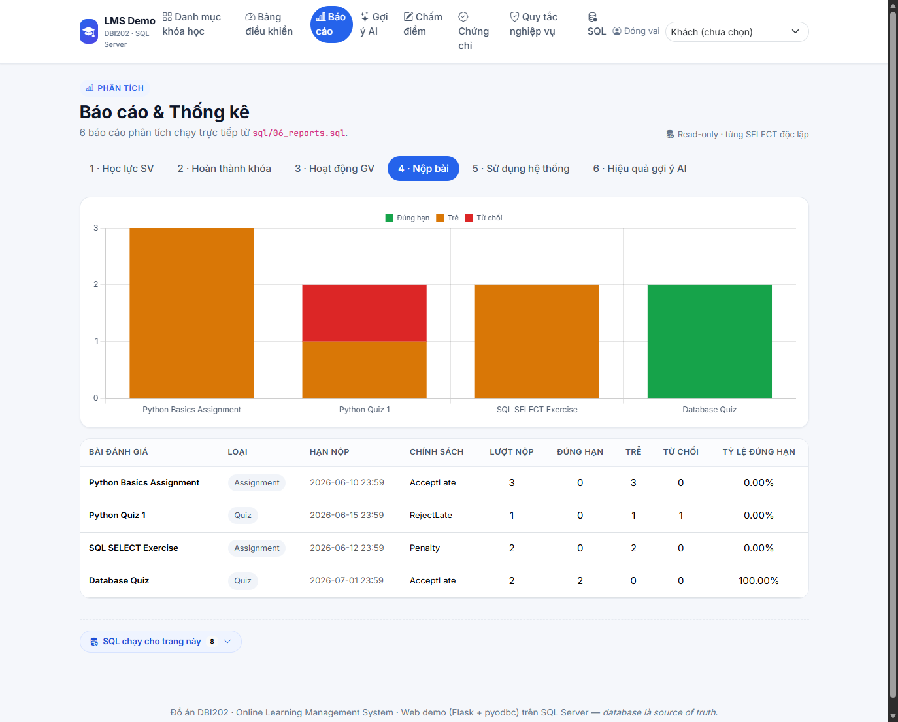
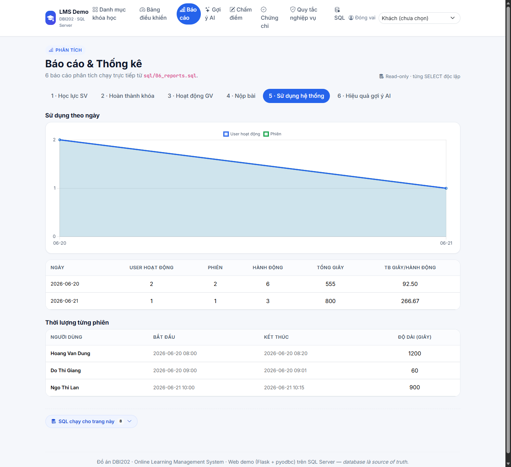
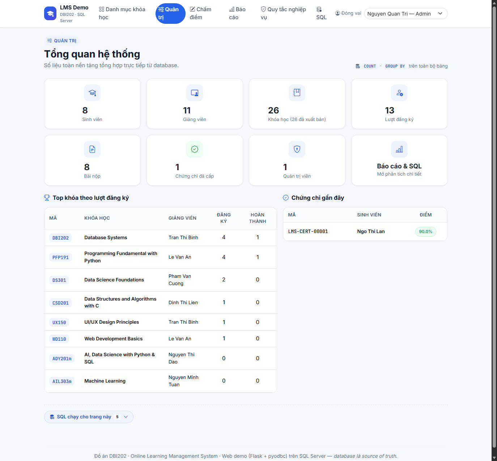
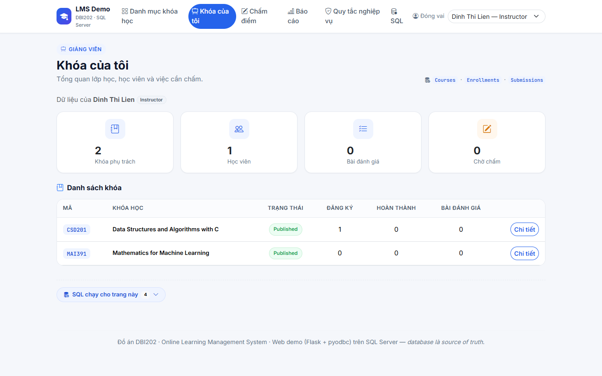
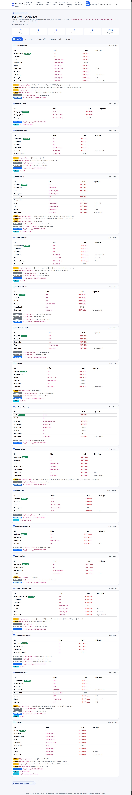
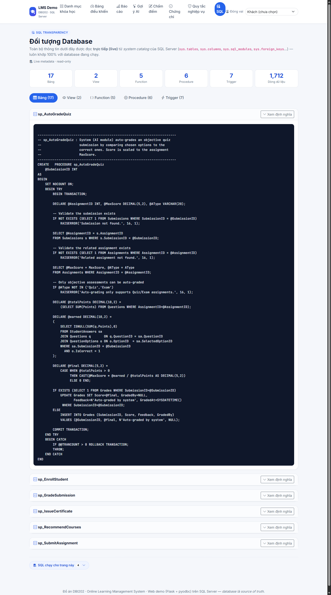
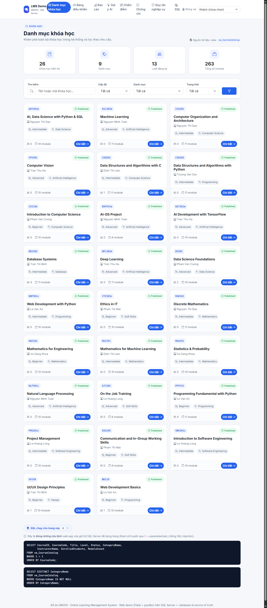

# BÁO CÁO REVIEW DỰ ÁN — Online Learning Management System (LMS)

> **Môn học:** DBI202 — Database Systems
> **Loại dự án:** Cơ sở dữ liệu SQL Server (lõi) + Web app demo (Flask) lấy điểm cộng
> **Mục đích tài liệu:** Cung cấp cái nhìn đầy đủ về dự án để mentor AI review và góp ý.
> Tài liệu này mô tả **đúng những gì đã hiện thực**, kèm ảnh chụp web app thật chạy trên database SQL Server.

---

<!-- SQL_FOCUS_START -->
> ### Trọng tâm chấm điểm: MÃ NGUỒN SQL
> Lõi của đồ án là **database (T-SQL)** — mọi quy tắc nghiệp vụ đều nằm ở đây. **Toàn bộ mã nguồn chính** (schema
> + ràng buộc, **7 trigger**, **5 function**, **2 view**, **6 stored procedure**, **6 truy vấn báo cáo**,
> **12 negative test** và **smoke test luồng hợp lệ**) được **in đầy đủ trong _Phụ lục A — Mã nguồn SQL_** ở cuối
> tài liệu. Riêng hai script **dữ liệu mẫu** (`05_sample_data.sql`, `08_more_sample_data.sql`) chỉ gồm câu lệnh
> `INSERT`, **nằm trong repository** và **không in** ở đây để tài liệu gọn. Phần demo web (Mục 8) chỉ minh họa
> DB chạy trong ứng dụng thật.

<!-- SQL_FOCUS_END -->

## 1. Tổng quan

Hệ thống quản lý học tập trực tuyến (LMS) mô phỏng một nền tảng kiểu Coursera: quản lý người dùng,
khóa học, nội dung học liệu, bài tập/kiểm tra, chấm điểm (thủ công + tự động), thảo luận, gợi ý khóa
học bằng module AI, phân tích hành vi học tập, và **cấp chứng chỉ khi đạt ≥ 80%**.

| Hạng mục | Con số thực tế |
|---|---|
| Bảng (3NF) | **17** |
| Trigger (quy tắc nghiệp vụ) | **7** |
| Function | **5** |
| View | **2** |
| Stored procedure | **6** |
| Truy vấn báo cáo | **6** (web hiển thị theo vai trò: Instructor 3, Admin 5) |
| Test quy tắc nghiệp vụ (negative test) | **12 / 12 PASS** |
| Khóa học mẫu | **26** (theo chương trình ngành AI của FPT) |
| Người dùng (SV / GV / Admin) | **39** (23 / 15 / 1) |
| Lượt đăng ký (Completed / Dropped) | **161** (39 / 15) |
| Bài nộp / Đã chấm | **136 / 134** |
| Chứng chỉ đã cấp (≥ 80%) | **38** |
| Module / Học liệu | **263 / 1315** |

**Công nghệ:**
- **Database:** Microsoft SQL Server (T-SQL) — toàn bộ logic nghiệp vụ nằm ở đây.
- **Web demo:** Python + Flask + pyodbc (ODBC Driver 18) + Jinja2 + Bootstrap 5 + Chart.js; kết nối bằng
  **Windows Authentication** (không lưu mật khẩu). Web app **không chứa logic nghiệp vụ riêng** —
  chỉ đọc view/function/stored procedure có sẵn và hiển thị.
- **Trải nghiệm theo vai trò:** điều hướng & trang chủ thay đổi theo Student / Instructor / Admin
  (chọn qua ô "Đóng vai"), kèm trang **minh bạch SQL** đọc trực tiếp từ system catalog.

---

## 2. Kiến trúc tổng thể


Luồng: Người dùng → (SSMS hoặc Web App) → các object lập trình trong SQL Server (Stored Procedure /
View / Function / Reports) → Bảng dữ liệu (3NF). **Trigger** đứng giữa, ép các quy tắc nghiệp vụ trước
khi dữ liệu được ghi.

---

## 3. Thiết kế cơ sở dữ liệu

### 3.1. Sơ đồ ERD


### 3.2. Danh sách bảng (17)

| Bảng | Vai trò |
|------|---------|
| `Users` | Người dùng + vai trò (Student/Instructor/Admin) |
| `Categories` | Danh mục khóa học |
| `Courses` | Khóa học, mỗi khóa do 1 giảng viên quản lý |
| `Modules` | Chương/mô-đun của khóa học |
| `Materials` | Học liệu (Document/Video/Link/Slide) |
| `Enrollments` | Đăng ký học (N-N giữa Student và Course) |
| `Assignments` | Bài tập/Quiz/Exam (bắt buộc có deadline) |
| `Questions`, `QuestionOptions` | Câu hỏi trắc nghiệm + đáp án (chấm tự động) |
| `Submissions` | Bài nộp (1 student + 1 assignment) |
| `StudentAnswers` | Lựa chọn của sinh viên cho quiz |
| `Grades` | Điểm cho mỗi bài nộp đã chấm |
| `ForumThreads`, `ForumPosts` | Thảo luận/diễn đàn (trả lời lồng nhau) |
| `Recommendations` | Gợi ý khóa học (AI) + theo dõi hiệu quả |
| `InteractionLogs` | Nhật ký tương tác phục vụ phân tích |
| `Certificates` | **Chứng chỉ hoàn thành (chỉ cấp khi điểm tổng kết ≥ 80%)** |

### 3.3. Chuẩn hóa (1NF → 2NF → 3NF)

CSDL đạt **3NF**. Tóm tắt lý do, gắn với chính các bảng của LMS:

| Dạng chuẩn | Yêu cầu | Cách thiết kế LMS thỏa mãn |
|---|---|---|
| **1NF** | Mỗi ô một giá trị nguyên tử, không nhóm lặp; có khóa chính | Mỗi bảng có PK `IDENTITY`; dữ liệu đa trị được tách thành **dòng/bảng riêng**: `Modules`, `Materials`, `Questions`, `QuestionOptions` (không dồn "M1; M2; M3" vào một cột) |
| **2NF** | Đạt 1NF & thuộc tính không khóa phụ thuộc **toàn bộ** khóa (không phụ thuộc bộ phận) | Quan hệ N-N tách bằng **bảng nối** `Enrollments` (Student↔Course); chi tiết bài nộp/điểm tách thành `Submissions` + `Grades`; nhờ dùng khóa thay thế đơn (surrogate) nên không phát sinh phụ thuộc bộ phận |
| **3NF** | Đạt 2NF & **không** có phụ thuộc bắc cầu (non-key → non-key) | Sự kiện không khóa được tách thành thực thể riêng: `Categories` (thay vì lặp tên danh mục trong `Courses`), `Users` giữ thông tin giảng viên (Courses chỉ giữ FK `InstructorID`), `Grades.GradedBy` là FK tới `Users` thay vì lưu tên người chấm |

Chi tiết quá trình UNF → 1NF → 2NF → 3NF, bảng kiểm tra phụ thuộc hàm và từ điển dữ liệu đầy đủ:
[`Normalization_and_DataDictionary.md`](Normalization_and_DataDictionary.md).

---

## 4. Quy tắc nghiệp vụ & nơi thực thi

| Business Rule | Cơ chế thực thi |
|---|---|
| Mỗi user có tài khoản & vai trò duy nhất | `UNIQUE(Username/Email)` + `CHECK CK_Users_Role` |
| Student–Course là quan hệ N-N, không trùng | bảng `Enrollments` + `UNIQUE(StudentID, CourseID)` |
| Mỗi khóa do **một** giảng viên quản lý | FK + trigger `trg_Courses_InstructorRole` |
| Chỉ Student mới được ghi danh | trigger `trg_Enroll_Validate` |
| Bài đánh giá phải có deadline | `Deadline DATETIME2 NOT NULL` |
| Nộp trễ → đánh dấu late / từ chối theo policy | trigger `trg_Submissions_Policy` (AFTER INSERT, UPDATE) |
| Mỗi bài nộp gắn 1 student + 1 assignment | FK + `UNIQUE(AssignmentID, StudentID, Attempt)` |
| Điểm không vượt MaxScore; người chấm là Instructor/Admin | trigger `trg_Grades_MarkGraded` |
| Đáp án sinh viên chọn phải thuộc đúng câu hỏi | trigger `trg_StudentAnswers_OptionMatchesQuestion` |
| Sinh viên chỉ truy cập khóa đã đăng ký | `fn_CanAccessCourse`, `fn_AccessibleMaterials` |
| Khóa `Published` phải có ≥ 1 module | trigger `trg_Courses_PublishNeedsModule`, `trg_Modules_KeepAtLeastOne` |
| **Chứng chỉ chỉ cấp khi điểm tổng kết ≥ 80%** | `CHECK CK_Cert_Pass` + `sp_IssueCertificate` + `fn_CourseFinalGrade` |

### Lưu đồ quy trình nộp & chấm bài


---

## 5. Đối tượng lập trình trong database

**Trigger (7):** `trg_Courses_InstructorRole`, `trg_Enroll_Validate`, `trg_Submissions_Policy`,
`trg_Modules_KeepAtLeastOne`, `trg_Courses_PublishNeedsModule`, `trg_Grades_MarkGraded`,
`trg_StudentAnswers_OptionMatchesQuestion`.

**Function (5):**
- `fn_CanAccessCourse` — kiểm tra quyền truy cập khóa.
- `fn_CourseProgress` — tiến độ học (% bài đã được chấm).
- `fn_AccessibleMaterials` — (table-valued) học liệu sinh viên được xem.
- `fn_CourseFinalGrade` — **điểm tổng kết khóa (%)** = trung bình % các bài đánh giá (thiếu/bị từ chối = 0).
- `fn_HasPassedCourse` — trả 1 nếu điểm tổng kết ≥ 80%.

**View (2):** `vw_CourseCatalog` (danh mục + sĩ số + số module), `vw_Gradebook` (bảng điểm).

**Stored procedure (6):**
- `sp_EnrollStudent` — đăng ký học (kiểm tra quy tắc).
- `sp_SubmitAssignment` — nộp bài (OUTPUT SubmissionID; trigger xử lý trễ hạn).
- `sp_GradeSubmission` — chấm điểm thủ công.
- `sp_AutoGradeQuiz` — **module AI** tự chấm quiz trắc nghiệm, quy đổi về thang MaxScore.
- `sp_RecommendCourses` — **module AI** gợi ý khóa học (content-based) + lưu để đo hiệu quả.
- `sp_IssueCertificate` — cấp chứng chỉ khi đạt ≥ 80% + đánh dấu hoàn thành khóa.

---

## 6. Tính năng nổi bật

1. **Chấm quiz tự động (`sp_AutoGradeQuiz`)** — so đáp án sinh viên với đáp án đúng, quy đổi điểm.
2. **Gợi ý khóa học 2 lớp ngay trên trang Danh mục (`/catalog`)** — bỏ trang gợi ý riêng, đưa thẳng vào
   nơi học viên duyệt khóa (kiểu Coursera):
   - **"Gợi ý cho bạn"** — cá nhân hóa theo từng sinh viên qua `sp_RecommendCourses` (content-based: ưu tiên
     khóa cùng danh mục SV đang học), lưu `Recommendations` với trạng thái `Shown/Clicked/Enrolled/Ignored`.
     Nếu SV chưa có gợi ý, web gọi SP để sinh ngay (lazy-generate). Chỉ hiển thị cho vai trò Student.
   - **"Khóa học phổ biến nhất"** — xếp hạng theo `COUNT(Enrollments)` (popularity-based), hiển thị cho mọi vai trò.
   - Hai mục chỉ hiện khi **không áp dụng bộ lọc** (để không gây nhiễu khi người dùng đang tìm kiếm có chủ đích).
3. **Chứng chỉ kiểu Coursera** — học viên phải làm các graded assignment, đạt **≥ 80%** điểm
   tổng kết mới nhận được chứng chỉ. Ngưỡng 80% được **khóa cứng ở cấp dữ liệu** bằng `CHECK CK_Cert_Pass`
   nên kể cả INSERT trực tiếp cũng không thể tạo chứng chỉ dưới chuẩn.
4. **Minh bạch SQL (SQL Transparency)** — trang `/sql-objects` đọc **trực tiếp** từ system catalog
   (`sys.tables`, `sys.columns`, `sys.sql_modules`, `sys.foreign_keys`…) để liệt kê bảng + cột + ràng buộc
   + số dòng thật và **định nghĩa nguyên văn** của view/function/procedure/trigger. Ngoài ra mỗi trang có
   panel **"SQL chạy cho trang này"** hiển thị đúng câu lệnh (parameterized) vừa gửi tới SQL Server.
5. **Biểu đồ phân tích (Reports Charts)** — 6 báo cáo có biểu đồ trực quan (Chart.js): cột, cột chồng,
   đường, doughnut… dữ liệu đẩy thẳng từ các `SELECT ... GROUP BY` trong `06_reports.sql`, **không** có
   dữ liệu giả ở frontend; bảng dữ liệu thô vẫn giữ bên dưới để đối chiếu.
6. **Cổng theo vai trò (Role Portal)** — Student có `/dashboard`, Instructor có `/instructor` (khóa phụ
   trách, học viên, việc cần chấm), Admin có `/admin` (tổng quan toàn hệ thống, top khóa, chứng chỉ gần
   đây). Navbar tự đổi theo vai; quyền vẫn được DB kiểm soát ở tầng trigger/procedure.
7. **Báo cáo phân quyền (Role-gated Reports)** — trang `/reports` lọc nội dung theo vai: **Instructor** chỉ
   xem 3 báo cáo liên quan giảng dạy (kết quả học tập, tỷ lệ hoàn thành khóa, tình hình nộp bài); **Admin**
   xem đủ 5 báo cáo (thêm hoạt động giảng viên, mức sử dụng hệ thống). Web chỉ truy vấn đúng phần được phép.
8. **Thông điệp tiếng Việt (Web-tier Localization)** — message lỗi do trigger/`RAISERROR`/`THROW` trả về (tiếng
   Anh) được dịch sang tiếng Việt ở tầng web (bảng tra `_VI_MESSAGES` + `localize_error`) để demo thân thiện;
   **logic và ràng buộc gốc vẫn nằm nguyên trong database**, web chỉ làm lớp hiển thị.

---

## 7. Kiểm thử quy tắc nghiệp vụ (`07_business_rule_tests.sql`)

Tất cả là **negative test** — cố tình vi phạm để chứng minh database **chặn** đúng. Kết quả: **12/12 PASS**.

| # | Tình huống cố tình sai | Kết quả |
|---|---|---|
| 1 | Đăng ký trùng (StudentID, CourseID) | PASS — chặn bởi `UQ_Enroll` |
| 2 | Người không phải Instructor sở hữu khóa | PASS — chặn bởi trigger |
| 3 | Người không phải Student ghi danh | PASS — chặn bởi trigger |
| 4 | Role không hợp lệ | PASS — chặn bởi `CK_Users_Role` |
| 5 | Sinh viên chưa đăng ký nộp bài | PASS — chặn bởi trigger |
| 6 | Điểm vượt MaxScore | PASS — chặn bởi trigger |
| 7 | Publish khóa không có module | PASS — chặn bởi trigger |
| 8 | Student tự chấm điểm | PASS — chặn bởi trigger |
| 9 | Chọn đáp án thuộc câu hỏi khác | PASS — chặn bởi trigger |
| 10 | INSERT khóa Published mà không có module | PASS — chặn bởi trigger |
| 11 | Cấp chứng chỉ khi điểm < 80% (qua SP) | PASS — `sp_IssueCertificate` từ chối |
| 12 | INSERT trực tiếp chứng chỉ < 80% | PASS — chặn bởi `CK_Cert_Pass` |

---

## 8. Web app demo (Flask trên SQL Server thật)

Web app chứng minh database hoạt động trong ứng dụng thật. Mỗi trang ánh xạ tới object SQL thật.
Có thanh **"Đóng vai"** (demo user selector) để xem dữ liệu theo từng vai trò mà không cần xây
authentication; **navbar tự đổi** theo vai trò đang đóng. Mỗi trang còn có panel
**"SQL chạy cho trang này"** hiển thị đúng câu lệnh (parameterized) vừa gửi tới SQL Server.

| Trang | Chức năng | Object SQL tái dùng |
|---|---|---|
| `/catalog` | Danh mục + lọc + **"Gợi ý cho bạn"** (SV) + **"Khóa phổ biến nhất"** | `vw_CourseCatalog`, `sp_RecommendCourses`, `COUNT(Enrollments)` |
| `/courses/<id>` | Chi tiết khóa, học liệu, nộp bài, **điểm & chứng chỉ**, thảo luận | `Modules`,`Materials`,`fn_CanAccessCourse`,`fn_CourseFinalGrade`,`sp_*` |
| `/dashboard` | Điểm + tiến độ + chứng chỉ của SV (cổng Student) | `vw_Gradebook`,`fn_CourseProgress`,`Certificates` |
| `/instructor` | **Cổng giảng viên**: khóa phụ trách, học viên, việc cần chấm | `Courses`,`Enrollments`,`Submissions` |
| `/admin` | **Cổng quản trị**: tổng quan hệ thống, top khóa, chứng chỉ gần đây | `COUNT`/`GROUP BY` trên toàn bộ bảng |
| `/portal` | Điều hướng tới cổng đúng theo vai trò | (redirect) |
| `/reports` | Báo cáo phân tích **kèm biểu đồ** — **phân quyền: Instructor 3, Admin 5** | các SELECT trong `06_reports.sql` |
| `/grading` | Chấm điểm (Instructor/Admin) | `sp_GradeSubmission` |
| `/certificates`, `/certificate/<id>` | Danh sách & chứng chỉ in được | `Certificates`,`sp_IssueCertificate` |
| `/business-rules` | Cố tình vi phạm để DB chặn & hiện lỗi | trigger + SP |
| `/sql-objects` | **Minh bạch SQL**: bảng/cột/ràng buộc + định nghĩa view/func/proc/trigger | `sys.tables`,`sys.columns`,`sys.sql_modules`,`sys.foreign_keys` |

### 8.1. Danh mục khóa học (`/catalog`)


### 8.2. Chi tiết khóa học + Kết quả & Chứng chỉ (`/courses/2`, đóng vai SV đã đạt)
Hiển thị điểm tổng kết **90%**, ngưỡng đạt 80%, nút xem chứng chỉ; outline module → học liệu; bảng bài
đánh giá (nộp qua `sp_SubmitAssignment`); thảo luận.


### 8.3. Bảng điều khiển sinh viên (`/dashboard`)
Tiến độ theo khóa, **điểm tổng kết + trạng thái Đạt**, danh sách **chứng chỉ đã đạt**, và bảng điểm
(quiz auto-graded 10/10, assignment 8/10).


### 8.4. Chứng chỉ in được (`/certificate/2`)
Cấp qua `sp_IssueCertificate`, chỉ tồn tại khi điểm ≥ 80% (`CK_Cert_Pass`). Có nút **In / Lưu PDF**.


### 8.5. Danh sách chứng chỉ (`/certificates`)


### 8.6. Gợi ý khóa học trên trang Danh mục (`/catalog`, đóng vai SV)
Hai mục nằm ngay đầu trang Danh mục: **"Gợi ý cho bạn"** (cá nhân hóa qua `sp_RecommendCourses`, có % độ
hợp + danh mục) và **"Khóa học phổ biến nhất"** (xếp theo `COUNT(Enrollments)`). Chỉ hiện khi không lọc.


### 8.7. Báo cáo / Thống kê (`/reports`) — kèm biểu đồ, phân quyền
Báo cáo dạng tab, mỗi tab có **biểu đồ Chart.js** (cột / cột chồng / đường / doughnut) + bảng dữ liệu thô.
**Instructor chỉ thấy 3 báo cáo** (kết quả học tập, hoàn thành khóa, nộp bài); **Admin thấy đủ 5** (thêm
hoạt động giảng viên, mức sử dụng hệ thống).




### 8.8. Showcase quy tắc nghiệp vụ (`/business-rules`)
Chọn (user, course) bất kỳ và bấm thử đăng ký — database trả về **nguyên văn message** từ trigger/procedure.


### 8.9. Khóa chưa đạt chuẩn chứng chỉ (đóng vai SV điểm thấp)
Hiển thị badge **"Chưa đạt 80%"** — đúng quy tắc, không cho nhận chứng chỉ.


### 8.10. Trang chấm điểm (`/grading`, đóng vai Admin/Instructor)


### 8.11. Cổng quản trị (`/admin`, đóng vai Admin)
Tổng quan toàn hệ thống (COUNT/GROUP BY), top khóa theo lượt đăng ký, chứng chỉ gần đây.


### 8.12. Cổng giảng viên (`/instructor`, đóng vai Instructor)
Khóa phụ trách, sĩ số/hoàn thành, số bài đánh giá và **số bài đang chờ chấm**.


### 8.13. Minh bạch SQL — đối tượng database (`/sql-objects`)
Đọc trực tiếp từ system catalog: 17 bảng (cột + ràng buộc + số dòng thật) và định nghĩa nguyên văn
của view/function/procedure/trigger.



### 8.14. Panel "SQL chạy cho trang này"
Mọi trang đều có thể bung ra để xem đúng câu lệnh (parameterized) vừa gửi tới SQL Server.


---

## 9. Dữ liệu mẫu

- **26 khóa học** bám chương trình ngành **AI của FPT University** (PFP191, MAD101, CSD201/203, CEA201,
  DBI202, AIL303m Machine Learning, CPV301 Computer Vision, DPL302m Deep Learning, NLP301c, DAT301m
  TensorFlow, MAI391, MAS291, SWE201c, PMG201c, ...). Mỗi khóa có **8–11 module** theo giáo trình thật,
  mỗi module **5 học liệu**.
- **23 sinh viên, 15 giảng viên, 1 admin** (39 người dùng) — đã làm giàu dữ liệu qua
  `08_more_sample_data.sql` (script **idempotent**, chạy lại không nhân đôi dữ liệu).
- **161 lượt đăng ký** (39 Completed, 15 Dropped), **136 bài nộp / 134 lượt chấm** (phân bố đậu–rớt thực tế),
  **38 chứng chỉ** đã cấp, gợi ý + nhật ký tương tác trải đều các khóa.
- Có sẵn kịch bản demo: SV **Ngo Thi Lan** đạt **90%** môn DBI202 → đã có chứng chỉ `LMS-CERT-00001`;
  SV **Hoang Van Dung** môn PFP191 **42.5%** → chưa đạt (minh họa quy tắc 80%).

---

## 10. Cách chạy

**Database (SSMS):** mở `sql/run_all_local.sql` → bật **SQLCMD Mode** → chọn database `master` → F5.
Kết quả in `... created successfully`, `Sample data inserted successfully`, và `TEST 1..12: PASS`.

**Web app:**
```powershell
cd webapp
python -m venv .venv
.\.venv\Scripts\python.exe -m pip install -r requirements.txt
copy .env.example .env
.\.venv\Scripts\python.exe app.py
```
Mở **http://127.0.0.1:5000**. Chi tiết: [`../README.md`](../README.md) và [`../webapp/README.md`](../webapp/README.md).

---

## 11. Hạn chế & hướng phát triển (để mentor góp ý)

- Web demo dùng **demo user selector** (đóng vai theo vai trò), chưa có authentication/đăng nhập thật —
  đây là lựa chọn có chủ đích để tập trung vào database, tránh rủi ro bảo mật khi demo.
- `fn_CourseFinalGrade` đang dùng công thức trung bình đơn giản (mỗi assignment trọng số bằng nhau);
  có thể nâng cấp **trọng số theo loại** (Quiz/Assignment/Exam).
- Chứng chỉ chưa có mã QR / trang xác minh công khai.
- Chưa có trang làm quiz trực tiếp trên web (hiện auto-grade chạy ở tầng DB qua `sp_AutoGradeQuiz`).
- Cổng Instructor/Admin mới ở mức xem (read-only); chưa có chức năng tạo/sửa khóa, bài tập qua web
  (cố ý — mọi thay đổi dữ liệu nên qua stored procedure để giữ ràng buộc nghiệp vụ).

> Mình sẽ dựa trên góp ý của mentor để quyết định cập nhật/làm thêm các hạng mục trên.

---

## 12. Checklist đối chiếu yêu cầu DBI202

- [x] Thiết kế schema chuẩn hóa 3NF (17 bảng, khóa chính/ngoại, ràng buộc CHECK/UNIQUE)
- [x] ERD + tài liệu chuẩn hóa + từ điển dữ liệu
- [x] Quy tắc nghiệp vụ thực thi bằng trigger + stored procedure + constraint
- [x] Stored procedure có transaction & xử lý lỗi
- [x] Function & View phục vụ truy vấn/báo cáo
- [x] 6 báo cáo/thống kê phục vụ ra quyết định
- [x] Bộ test quy tắc nghiệp vụ (12/12 PASS)
- [x] Module AI: gợi ý khóa học (content-based) + chấm quiz tự động
- [x] Dữ liệu mẫu phong phú (26 khóa theo giáo trình thật, 39 người dùng, 161 lượt đăng ký, 38 chứng chỉ)
- [x] (Điểm cộng) Web app thật chạy trên database SQL Server
- [x] Hệ thống chứng chỉ đạt ≥ 80% kiểu Coursera
- [x] (Điểm cộng) Minh bạch SQL: trang đối tượng DB + panel "SQL chạy cho trang này" (đọc system catalog)
- [x] (Điểm cộng) Biểu đồ phân tích cho báo cáo (Chart.js, dữ liệu từ SQL thật)
- [x] (Điểm cộng) Cổng theo vai trò Student / Instructor / Admin
- [x] (Điểm cộng) Gợi ý cá nhân hóa + khóa phổ biến ngay trên trang Danh mục (kiểu Coursera)
- [x] (Điểm cộng) Báo cáo phân quyền theo vai trò (Instructor 3 / Admin 5)
- [x] (Điểm cộng) Thông điệp lỗi nghiệp vụ tiếng Việt ở tầng web (logic vẫn ở DB)

<!-- SQL_APPENDIX_START -->
---

## Phụ lục A — Mã nguồn SQL đầy đủ

> Phần này in **nguyên văn các file mã nguồn chính** trong thư mục `sql/` (schema, trigger, function/view, stored procedure, truy vấn báo cáo, negative test, smoke test) — là phần chính để mentor chấm điểm. Hai script **dữ liệu mẫu** `05_sample_data.sql` và `08_more_sample_data.sql` (chỉ gồm `INSERT`) **nằm trong repository, không in ở đây** để tránh dài. Thứ tự chạy đầy đủ: `01 → 02 → 03 → 04 → 05 → 06 → 07 → 08 → 09`.

### A.1. Schema & ràng buộc (PK/FK/UNIQUE/CHECK) — `01_schema.sql` (327 dòng)

```sql
/* =====================================================================
   ONLINE LEARNING MANAGEMENT SYSTEM (LMS)
   File 01 - SCHEMA (DDL): databases, tables, keys & constraints
   DBMS: Microsoft SQL Server (T-SQL)
   ---------------------------------------------------------------------
   Run order: 01_schema -> 02_triggers -> 03_functions_views
              -> 04_procedures -> 05_sample_data -> 06_reports
   ===================================================================== */

-------------------------------------------------------------------------
-- 0. Create & select database
-------------------------------------------------------------------------
IF DB_ID('LMS') IS NOT NULL
BEGIN
    ALTER DATABASE LMS SET SINGLE_USER WITH ROLLBACK IMMEDIATE;
    DROP DATABASE LMS;
END
GO
CREATE DATABASE LMS;
GO
USE LMS;
GO

-------------------------------------------------------------------------
-- 1. USERS  (BR: each user has a unique account and ONE role)
-------------------------------------------------------------------------
CREATE TABLE Users (
    UserID        INT IDENTITY(1,1) PRIMARY KEY,
    Username      VARCHAR(50)   NOT NULL,
    PasswordHash  VARCHAR(255)  NOT NULL,
    Email         VARCHAR(150)  NOT NULL,
    FullName      NVARCHAR(150) NOT NULL,
    DateOfBirth   DATE          NULL,
    Role          VARCHAR(20)   NOT NULL,
    Status        VARCHAR(20)   NOT NULL CONSTRAINT DF_Users_Status DEFAULT ('Active'),
    CreatedAt     DATETIME2     NOT NULL CONSTRAINT DF_Users_CreatedAt DEFAULT (SYSDATETIME()),
    CONSTRAINT CK_Users_Username_Length CHECK (LEN(Username) >= 3),
    CONSTRAINT UQ_Users_Username UNIQUE (Username),
    CONSTRAINT UQ_Users_Email UNIQUE (Email),
    CONSTRAINT CK_Users_Role   CHECK (Role   IN ('Student','Instructor','Admin')),
    CONSTRAINT CK_Users_Status CHECK (Status IN ('Active','Inactive','Banned')),
    CONSTRAINT CK_Users_Email  CHECK (Email LIKE '%_@_%._%')
);
GO

-------------------------------------------------------------------------
-- 2. CATEGORIES (course catalog organization)
-------------------------------------------------------------------------
CREATE TABLE Categories (
    CategoryID   INT IDENTITY(1,1) PRIMARY KEY,
    CategoryName NVARCHAR(100) NOT NULL,
    Description  NVARCHAR(500) NULL,
    CONSTRAINT UQ_Categories_Name UNIQUE (CategoryName)
);
GO

-------------------------------------------------------------------------
-- 3. COURSES  (BR: each course is created & managed by ONE instructor)
-------------------------------------------------------------------------
CREATE TABLE Courses (
    CourseID     INT IDENTITY(1,1) PRIMARY KEY,
    CourseCode   VARCHAR(20)   NOT NULL,
    Title        NVARCHAR(200) NOT NULL,
    Description  NVARCHAR(MAX) NULL,
    InstructorID INT           NOT NULL,
    CategoryID   INT           NULL,
    Level        VARCHAR(20)   NOT NULL CONSTRAINT DF_Courses_Level DEFAULT ('Beginner'),
    Price        DECIMAL(10,2) NOT NULL CONSTRAINT DF_Courses_Price DEFAULT (0),
    Status       VARCHAR(20)   NOT NULL CONSTRAINT DF_Courses_Status DEFAULT ('Draft'),
    CreatedAt    DATETIME2     NOT NULL CONSTRAINT DF_Courses_CreatedAt DEFAULT (SYSDATETIME()),
    CONSTRAINT UQ_Courses_Code UNIQUE (CourseCode),
    CONSTRAINT FK_Courses_Instructor FOREIGN KEY (InstructorID) REFERENCES Users(UserID),
    CONSTRAINT FK_Courses_Category   FOREIGN KEY (CategoryID)   REFERENCES Categories(CategoryID),
    CONSTRAINT CK_Courses_Level  CHECK (Level  IN ('Beginner','Intermediate','Advanced')),
    CONSTRAINT CK_Courses_Status CHECK (Status IN ('Draft','Published','Archived')),
    CONSTRAINT CK_Courses_Price  CHECK (Price >= 0)
);
GO

-------------------------------------------------------------------------
-- 4. MODULES  (BR: each course must contain >= 1 learning module)
-------------------------------------------------------------------------
CREATE TABLE Modules (
    ModuleID    INT IDENTITY(1,1) PRIMARY KEY,
    CourseID    INT           NOT NULL,
    Title       NVARCHAR(200) NOT NULL,
    Description NVARCHAR(500) NULL,
    OrderIndex  INT           NOT NULL CONSTRAINT DF_Modules_Order DEFAULT (1),
    CONSTRAINT FK_Modules_Course FOREIGN KEY (CourseID)
        REFERENCES Courses(CourseID) ON DELETE CASCADE,
    CONSTRAINT UQ_Modules_Order UNIQUE (CourseID, OrderIndex)
);
GO

-------------------------------------------------------------------------
-- 5. MATERIALS  (documents, videos, links)
-------------------------------------------------------------------------
CREATE TABLE Materials (
    MaterialID  INT IDENTITY(1,1) PRIMARY KEY,
    ModuleID    INT           NOT NULL,
    Title       NVARCHAR(200) NOT NULL,
    MaterialType VARCHAR(20)  NOT NULL,
    ContentURL  NVARCHAR(500) NOT NULL,
    OrderIndex  INT           NOT NULL CONSTRAINT DF_Materials_Order DEFAULT (1),
    CreatedAt   DATETIME2     NOT NULL CONSTRAINT DF_Materials_CreatedAt DEFAULT (SYSDATETIME()),
    CONSTRAINT FK_Materials_Module FOREIGN KEY (ModuleID)
        REFERENCES Modules(ModuleID) ON DELETE CASCADE,
    CONSTRAINT CK_Materials_Type CHECK (MaterialType IN ('Document','Video','Link','Slide'))
);
GO

-------------------------------------------------------------------------
-- 6. ENROLLMENTS  (BR: many-to-many student <-> course)
-------------------------------------------------------------------------
CREATE TABLE Enrollments (
    EnrollmentID     INT IDENTITY(1,1) PRIMARY KEY,
    StudentID        INT          NOT NULL,
    CourseID         INT          NOT NULL,
    EnrollDate       DATETIME2    NOT NULL CONSTRAINT DF_Enroll_Date DEFAULT (SYSDATETIME()),
    Status           VARCHAR(20)  NOT NULL CONSTRAINT DF_Enroll_Status DEFAULT ('Active'),
    -- Stored progress SNAPSHOT (0..100). Set to 100 by sp_IssueCertificate on
    -- completion. For LIVE progress use fn_CourseProgress() instead.
    ProgressPercent  DECIMAL(5,2) NOT NULL CONSTRAINT DF_Enroll_Progress DEFAULT (0),
    CompletedAt      DATETIME2    NULL,
    CONSTRAINT FK_Enroll_Student FOREIGN KEY (StudentID) REFERENCES Users(UserID),
    CONSTRAINT FK_Enroll_Course  FOREIGN KEY (CourseID)  REFERENCES Courses(CourseID),
    CONSTRAINT UQ_Enroll UNIQUE (StudentID, CourseID),       -- no duplicate enrollment
    CONSTRAINT CK_Enroll_Status   CHECK (Status IN ('Active','Completed','Dropped')),
    CONSTRAINT CK_Enroll_Progress CHECK (ProgressPercent BETWEEN 0 AND 100)
);
GO

-------------------------------------------------------------------------
-- 7. ASSIGNMENTS / ASSESSMENTS  (BR: must have a defined deadline)
-------------------------------------------------------------------------
CREATE TABLE Assignments (
    AssignmentID INT IDENTITY(1,1) PRIMARY KEY,
    CourseID     INT           NOT NULL,
    Title        NVARCHAR(200) NOT NULL,
    Description  NVARCHAR(MAX) NULL,
    Atype        VARCHAR(20)   NOT NULL,            -- Assignment / Quiz / Exam
    MaxScore     DECIMAL(5,2)  NOT NULL CONSTRAINT DF_Assign_Max DEFAULT (10),
    Deadline     DATETIME2     NOT NULL,            -- deadline is REQUIRED
    LatePolicy   VARCHAR(20)   NOT NULL CONSTRAINT DF_Assign_Late DEFAULT ('AcceptLate'),
    PenaltyPct   DECIMAL(5,2)  NOT NULL CONSTRAINT DF_Assign_Penalty DEFAULT (0),
    CreatedAt    DATETIME2     NOT NULL CONSTRAINT DF_Assign_Created DEFAULT (SYSDATETIME()),
    CONSTRAINT FK_Assign_Course FOREIGN KEY (CourseID)
        REFERENCES Courses(CourseID) ON DELETE CASCADE,
    CONSTRAINT CK_Assign_Type    CHECK (AType IN ('Assignment','Quiz','Exam')),
    CONSTRAINT CK_Assign_Late    CHECK (LatePolicy IN ('AcceptLate','RejectLate','Penalty')),
    CONSTRAINT CK_Assign_Max     CHECK (MaxScore > 0),
    CONSTRAINT CK_Assign_Penalty CHECK (PenaltyPct BETWEEN 0 AND 100)
);
GO

-------------------------------------------------------------------------
-- 8. QUIZ QUESTIONS & OPTIONS  (for automated grading of objective tests)
-------------------------------------------------------------------------
CREATE TABLE Questions (
    QuestionID   INT IDENTITY(1,1) PRIMARY KEY,
    AssignmentID INT           NOT NULL,
    QuestionText NVARCHAR(MAX) NOT NULL,
    Points       DECIMAL(5,2)  NOT NULL CONSTRAINT DF_Q_Points DEFAULT (1),
    CONSTRAINT FK_Questions_Assignment FOREIGN KEY (AssignmentID)
        REFERENCES Assignments(AssignmentID) ON DELETE CASCADE,
    CONSTRAINT CK_Q_Points CHECK (Points > 0)
);
GO

CREATE TABLE QuestionOptions (
    OptionID   INT IDENTITY(1,1) PRIMARY KEY,
    QuestionID INT           NOT NULL,
    OptionText NVARCHAR(500) NOT NULL,
    IsCorrect  BIT           NOT NULL CONSTRAINT DF_Opt_Correct DEFAULT (0),
    CONSTRAINT FK_Options_Question FOREIGN KEY (QuestionID)
        REFERENCES Questions(QuestionID) ON DELETE CASCADE
);
GO

-------------------------------------------------------------------------
-- 9. SUBMISSIONS  (BR: one submission = one student + one assignment)
-------------------------------------------------------------------------
CREATE TABLE Submissions (
    SubmissionID INT IDENTITY(1,1) PRIMARY KEY,
    AssignmentID INT           NOT NULL,
    StudentID    INT           NOT NULL,
    SubmittedAt  DATETIME2     NOT NULL CONSTRAINT DF_Sub_At DEFAULT (SYSDATETIME()),
    ContentURL   NVARCHAR(500) NULL,
    IsLate       BIT           NOT NULL CONSTRAINT DF_Sub_Late DEFAULT (0),
    Status       VARCHAR(20)   NOT NULL CONSTRAINT DF_Sub_Status DEFAULT ('Submitted'),
    Attempt      INT           NOT NULL CONSTRAINT DF_Sub_Attempt DEFAULT (1),
    CONSTRAINT FK_Sub_Assignment FOREIGN KEY (AssignmentID) REFERENCES Assignments(AssignmentID),
    CONSTRAINT FK_Sub_Student    FOREIGN KEY (StudentID)    REFERENCES Users(UserID),
    CONSTRAINT UQ_Sub UNIQUE (AssignmentID, StudentID, Attempt),
    CONSTRAINT CK_Sub_Status CHECK (Status IN ('Submitted','Graded','Rejected'))
);
GO

-- Answers chosen by students for quiz questions (used by auto-grading)
CREATE TABLE StudentAnswers (
    AnswerID         INT IDENTITY(1,1) PRIMARY KEY,
    SubmissionID     INT NOT NULL,
    QuestionID       INT NOT NULL,
    SelectedOptionID INT NULL,
    CONSTRAINT FK_Ans_Submission FOREIGN KEY (SubmissionID)
        REFERENCES Submissions(SubmissionID) ON DELETE CASCADE,
    CONSTRAINT FK_Ans_Question FOREIGN KEY (QuestionID)   REFERENCES Questions(QuestionID),
    CONSTRAINT FK_Ans_Option   FOREIGN KEY (SelectedOptionID) REFERENCES QuestionOptions(OptionID),
    CONSTRAINT UQ_Ans UNIQUE (SubmissionID, QuestionID)
);
GO

-------------------------------------------------------------------------
-- 10. GRADES  (BR: a grade is recorded for each evaluated submission)
-------------------------------------------------------------------------
CREATE TABLE Grades (
    GradeID      INT IDENTITY(1,1) PRIMARY KEY,
    SubmissionID INT           NOT NULL,
    Score        DECIMAL(5,2)  NOT NULL,
    Feedback     NVARCHAR(MAX) NULL,
    GradedBy     INT           NULL,           -- NULL => auto-graded by system
    GradedAt     DATETIME2     NOT NULL CONSTRAINT DF_Grade_At DEFAULT (SYSDATETIME()),
    CONSTRAINT FK_Grade_Submission FOREIGN KEY (SubmissionID)
        REFERENCES Submissions(SubmissionID) ON DELETE CASCADE,
    CONSTRAINT FK_Grade_GradedBy FOREIGN KEY (GradedBy) REFERENCES Users(UserID),
    CONSTRAINT UQ_Grade UNIQUE (SubmissionID),   -- one grade per submission
    CONSTRAINT CK_Grade_Score CHECK (Score >= 0)
);
GO

-------------------------------------------------------------------------
-- 11. DISCUSSIONS / FORUMS
-------------------------------------------------------------------------
CREATE TABLE ForumThreads (
    ThreadID  INT IDENTITY(1,1) PRIMARY KEY,
    CourseID  INT           NOT NULL,
    CreatedBy INT           NOT NULL,
    Title     NVARCHAR(200) NOT NULL,
    CreatedAt DATETIME2     NOT NULL CONSTRAINT DF_Thread_At DEFAULT (SYSDATETIME()),
    CONSTRAINT FK_Thread_Course FOREIGN KEY (CourseID)  REFERENCES Courses(CourseID) ON DELETE CASCADE,
    CONSTRAINT FK_Thread_User   FOREIGN KEY (CreatedBy) REFERENCES Users(UserID)
);
GO

CREATE TABLE ForumPosts (
    PostID       INT IDENTITY(1,1) PRIMARY KEY,
    ThreadID     INT           NOT NULL,
    UserID       INT           NOT NULL,
    Content      NVARCHAR(MAX) NOT NULL,
    ParentPostID INT           NULL,
    CreatedAt    DATETIME2     NOT NULL CONSTRAINT DF_Post_At DEFAULT (SYSDATETIME()),
    CONSTRAINT FK_Post_Thread FOREIGN KEY (ThreadID) REFERENCES ForumThreads(ThreadID) ON DELETE CASCADE,
    CONSTRAINT FK_Post_User   FOREIGN KEY (UserID)   REFERENCES Users(UserID),
    CONSTRAINT FK_Post_Parent FOREIGN KEY (ParentPostID) REFERENCES ForumPosts(PostID)
);
GO

-------------------------------------------------------------------------
-- 12. RECOMMENDATION MODULE: course recommendations & interaction logs
--     NOTE: the recommender is a lightweight, SQL-based content-based
--     module (see sp_RecommendCourses) -- NOT a trained machine-learning
--     model. "AI module" is only a descriptive label for the feature.
-------------------------------------------------------------------------
CREATE TABLE Recommendations (
    RecommendationID INT IDENTITY(1,1) PRIMARY KEY,
    StudentID   INT           NOT NULL,
    CourseID    INT           NOT NULL,
    Reason      NVARCHAR(300) NULL,
    Score       DECIMAL(5,4)  NOT NULL CONSTRAINT DF_Rec_Score DEFAULT (0), -- confidence 0..1
    Status      VARCHAR(20)   NOT NULL CONSTRAINT DF_Rec_Status DEFAULT ('Shown'),
    CreatedAt   DATETIME2     NOT NULL CONSTRAINT DF_Rec_At DEFAULT (SYSDATETIME()),
    CONSTRAINT FK_Rec_Student FOREIGN KEY (StudentID) REFERENCES Users(UserID),
    CONSTRAINT FK_Rec_Course  FOREIGN KEY (CourseID)  REFERENCES Courses(CourseID),
    CONSTRAINT CK_Rec_Status CHECK (Status IN ('Shown','Clicked','Enrolled','Ignored')),
    CONSTRAINT CK_Rec_Score  CHECK (Score BETWEEN 0 AND 1)
);
GO

CREATE TABLE InteractionLogs (
    LogID      BIGINT IDENTITY(1,1) PRIMARY KEY,
    UserID     INT          NULL,
    SessionID  UNIQUEIDENTIFIER NOT NULL,
    ActionType VARCHAR(50)  NOT NULL,        -- Login, ViewMaterial, Submit, ...
    EntityType VARCHAR(50)  NULL,            -- Course, Material, Assignment ...
    EntityID   INT          NULL,
    DurationSec INT         NULL,
    CreatedAt  DATETIME2    NOT NULL CONSTRAINT DF_Log_At DEFAULT (SYSDATETIME()),
    CONSTRAINT FK_Log_User FOREIGN KEY (UserID) REFERENCES Users(UserID)
);
GO

-------------------------------------------------------------------------
-- 13. CERTIFICATES  (BR: issued only when course final score >= 80%)
--     Coursera-style: a learner who passes the graded assessments of a
--     course (final score >= passing threshold) earns ONE certificate.
--     The CHECK constraint guarantees the 80% rule at the data level, so
--     even a direct INSERT cannot create a certificate below the bar.
-------------------------------------------------------------------------
CREATE TABLE Certificates (
    CertificateID INT IDENTITY(1,1) PRIMARY KEY,
    StudentID     INT          NOT NULL,
    CourseID      INT          NOT NULL,
    FinalScore    DECIMAL(5,2) NOT NULL,        -- percentage 0..100
    IssuedAt      DATETIME2    NOT NULL CONSTRAINT DF_Cert_At DEFAULT (SYSDATETIME()),
    -- Human-friendly serial, derived from the identity (computed, no storage)
    CertificateCode AS ('LMS-CERT-' + RIGHT('00000' + CAST(CertificateID AS VARCHAR(10)), 5)),
    CONSTRAINT FK_Cert_Student FOREIGN KEY (StudentID) REFERENCES Users(UserID),
    CONSTRAINT FK_Cert_Course  FOREIGN KEY (CourseID)  REFERENCES Courses(CourseID),
    CONSTRAINT UQ_Cert UNIQUE (StudentID, CourseID),         -- one certificate per course
    CONSTRAINT CK_Cert_Pass  CHECK (FinalScore >= 80.0),     -- passing threshold = 80%
    CONSTRAINT CK_Cert_Range CHECK (FinalScore BETWEEN 0 AND 100)
);
GO

-------------------------------------------------------------------------
-- 14. Helpful indexes for reporting / lookups
-------------------------------------------------------------------------
CREATE INDEX IX_Courses_Instructor ON Courses(InstructorID);
CREATE INDEX IX_Enroll_Course      ON Enrollments(CourseID);
CREATE INDEX IX_Enroll_Student     ON Enrollments(StudentID);
CREATE INDEX IX_Sub_Student        ON Submissions(StudentID);
CREATE INDEX IX_Sub_Assignment     ON Submissions(AssignmentID);
CREATE INDEX IX_Log_User_Time      ON InteractionLogs(UserID, CreatedAt);
GO

PRINT 'Schema created successfully.';
GO
```

### A.2. Trigger — nơi thực thi quy tắc nghiệp vụ — `02_triggers.sql` (244 dòng)

```sql
/* =====================================================================
   File 02 - TRIGGERS : enforce business rules that simple constraints
                        cannot express.
   ===================================================================== */
USE LMS;
GO

-------------------------------------------------------------------------
-- BR: "Each course must be created and managed by ONE instructor."
--     => The InstructorID of a course must reference a user whose
--        Role = 'Instructor'.
-------------------------------------------------------------------------
CREATE OR ALTER TRIGGER trg_Courses_InstructorRole
ON Courses
AFTER INSERT, UPDATE
AS
BEGIN
    SET NOCOUNT ON;
    IF EXISTS (
        SELECT 1
        FROM inserted i
        JOIN Users u ON u.UserID = i.InstructorID
        WHERE u.Role <> 'Instructor'
    )
    BEGIN
        RAISERROR('Business rule violated: a course must be managed by a user with role Instructor.', 16, 1);
        ROLLBACK TRANSACTION;
    END
END
GO

-------------------------------------------------------------------------
-- BR: "A student can enroll ... " => the enrolled user must be a Student,
--     and only Published courses can be enrolled.
-------------------------------------------------------------------------
CREATE OR ALTER TRIGGER trg_Enroll_Validate
ON Enrollments
AFTER INSERT, UPDATE
AS
BEGIN
    SET NOCOUNT ON;
    IF EXISTS (
        SELECT 1 FROM inserted i
        JOIN Users u ON u.UserID = i.StudentID
        WHERE u.Role <> 'Student'
    )
    BEGIN
        RAISERROR('Business rule violated: only users with role Student can enroll.', 16, 1);
        ROLLBACK TRANSACTION;
        RETURN;
    END

    IF EXISTS (
        SELECT 1 FROM inserted i
        JOIN Courses c ON c.CourseID = i.CourseID
        WHERE c.Status <> 'Published'
    )
    BEGIN
        RAISERROR('Business rule violated: students can only enroll in Published courses.', 16, 1);
        ROLLBACK TRANSACTION;
    END
END
GO

-------------------------------------------------------------------------
-- BR: "Submissions after deadlines may be marked as late or rejected
--      based on policy." + "Each submission must be associated with one
--      student and one assignment" (student must be enrolled in course).
-- This trigger (runs on INSERT and UPDATE, fully set-based / multi-row safe):
--   * blocks submissions from students NOT enrolled in the course
--   * flags IsLate when SubmittedAt > Deadline
--   * sets Status = 'Rejected' when policy = 'RejectLate'
-------------------------------------------------------------------------
CREATE OR ALTER TRIGGER trg_Submissions_Policy
ON Submissions
AFTER INSERT, UPDATE
AS
BEGIN
    SET NOCOUNT ON;
    IF NOT EXISTS (SELECT 1 FROM inserted) RETURN;

    -- 1) Student must be enrolled in the course that owns the assignment
    IF EXISTS (
        SELECT 1
        FROM inserted i
        JOIN Assignments a ON a.AssignmentID = i.AssignmentID
        LEFT JOIN Enrollments e
               ON e.CourseID = a.CourseID
              AND e.StudentID = i.StudentID
              AND e.Status IN ('Active','Completed')
        WHERE e.EnrollmentID IS NULL
    )
    BEGIN
        RAISERROR('Business rule violated: student is not enrolled in the course of this assignment.', 16, 1);
        ROLLBACK TRANSACTION;
        RETURN;
    END

    -- 2) Late flag
    UPDATE s
       SET s.IsLate = 1
      FROM Submissions s
      JOIN inserted i ON i.SubmissionID = s.SubmissionID
      JOIN Assignments a ON a.AssignmentID = s.AssignmentID
     WHERE s.SubmittedAt > a.Deadline;

    -- 3) Reject late submissions when policy says so
    UPDATE s
       SET s.Status = 'Rejected'
      FROM Submissions s
      JOIN inserted i ON i.SubmissionID = s.SubmissionID
      JOIN Assignments a ON a.AssignmentID = s.AssignmentID
     WHERE s.SubmittedAt > a.Deadline
       AND a.LatePolicy = 'RejectLate';
END
GO

-------------------------------------------------------------------------
-- BR: "Each course must contain at least one learning module or material."
--     We cannot block creating an empty course on INSERT (the first module
--     is added afterwards), so instead we forbid DELETING the last module
--     of a published course.
-------------------------------------------------------------------------
CREATE OR ALTER TRIGGER trg_Modules_KeepAtLeastOne
ON Modules
AFTER DELETE
AS
BEGIN
    SET NOCOUNT ON;
    IF EXISTS (
        SELECT 1
        FROM deleted d
        JOIN Courses c ON c.CourseID = d.CourseID
        WHERE c.Status = 'Published'
          AND NOT EXISTS (SELECT 1 FROM Modules m WHERE m.CourseID = d.CourseID)
    )
    BEGIN
        RAISERROR('Business rule violated: a published course must keep at least one module.', 16, 1);
        ROLLBACK TRANSACTION;
    END
END
GO

-------------------------------------------------------------------------
-- BR: "A course can be Published only if it already has >= 1 module."
--     Runs on INSERT and UPDATE so a course cannot be created directly
--     as 'Published' without a module, nor updated to 'Published'.
-------------------------------------------------------------------------
CREATE OR ALTER TRIGGER trg_Courses_PublishNeedsModule
ON Courses
AFTER INSERT, UPDATE
AS
BEGIN
    SET NOCOUNT ON;
    IF EXISTS (
        SELECT 1
        FROM inserted i
        WHERE i.Status = 'Published'
          AND NOT EXISTS (SELECT 1 FROM Modules m WHERE m.CourseID = i.CourseID)
    )
    BEGIN
        RAISERROR('Business rule violated: a course needs at least one module before it can be Published.', 16, 1);
        ROLLBACK TRANSACTION;
    END
END
GO

-------------------------------------------------------------------------
-- BR: "Grades must be recorded for each evaluated submission."
--     When a grade is inserted, mark its submission as 'Graded'
--     (unless it was Rejected). Keeps Submissions.Status consistent.
-------------------------------------------------------------------------
CREATE OR ALTER TRIGGER trg_Grades_MarkGraded
ON Grades
AFTER INSERT, UPDATE
AS
BEGIN
    SET NOCOUNT ON;

    -- BR: the grader (if any) must be an Instructor or Admin.
    --     GradedBy = NULL is allowed (used by the auto-grading system).
    IF EXISTS (
        SELECT 1
        FROM inserted i
        JOIN Users u ON u.UserID = i.GradedBy
        WHERE i.GradedBy IS NOT NULL
          AND u.Role NOT IN ('Instructor','Admin')
    )
    BEGIN
        RAISERROR('Business rule violated: GradedBy must be Instructor or Admin.', 16, 1);
        ROLLBACK TRANSACTION;
        RETURN;
    END

    -- Score must not exceed assignment MaxScore (checked before side effects)
    IF EXISTS (
        SELECT 1
        FROM inserted i
        JOIN Submissions s ON s.SubmissionID = i.SubmissionID
        JOIN Assignments a ON a.AssignmentID = s.AssignmentID
        WHERE i.Score > a.MaxScore
    )
    BEGIN
        RAISERROR('Invalid grade: score exceeds the assignment MaxScore.', 16, 1);
        ROLLBACK TRANSACTION;
        RETURN;
    END

    -- Mark the graded submission as 'Graded' (unless it was Rejected)
    UPDATE s
       SET s.Status = 'Graded'
      FROM Submissions s
      JOIN inserted i ON i.SubmissionID = s.SubmissionID
     WHERE s.Status <> 'Rejected';
END
GO

-------------------------------------------------------------------------
-- BR: a student's selected option must belong to the same question that
--     the answer row points to (data-integrity across StudentAnswers).
--     Runs on INSERT and UPDATE, multi-row safe. NULL option = unanswered.
-------------------------------------------------------------------------
CREATE OR ALTER TRIGGER trg_StudentAnswers_OptionMatchesQuestion
ON StudentAnswers
AFTER INSERT, UPDATE
AS
BEGIN
    SET NOCOUNT ON;
    IF EXISTS (
        SELECT 1
        FROM inserted i
        JOIN QuestionOptions o ON o.OptionID = i.SelectedOptionID
        WHERE i.SelectedOptionID IS NOT NULL
          AND o.QuestionID <> i.QuestionID
    )
    BEGIN
        RAISERROR('Business rule violated: selected option does not belong to the question.', 16, 1);
        ROLLBACK TRANSACTION;
    END
END
GO

PRINT 'Triggers created successfully.';
GO
```

### A.3. Function & View — `03_functions_views.sql` (160 dòng)

```sql
/* =====================================================================
   File 03 - FUNCTIONS & VIEWS
   ===================================================================== */
USE LMS;
GO

-------------------------------------------------------------------------
-- FUNCTION: check whether a student can access a course
--           (BR: students can only access courses they are enrolled in)
-------------------------------------------------------------------------
CREATE OR ALTER FUNCTION dbo.fn_CanAccessCourse (@StudentID INT, @CourseID INT)
RETURNS BIT
AS
BEGIN
    DECLARE @ok BIT = 0;
    IF EXISTS (
        SELECT 1 FROM Enrollments
        WHERE StudentID = @StudentID
          AND CourseID  = @CourseID
          AND Status IN ('Active','Completed')
    )
        SET @ok = 1;
    RETURN @ok;
END
GO

-------------------------------------------------------------------------
-- FUNCTION: weighted course progress of a student
--           (ratio of graded assignments over total assignments)
-------------------------------------------------------------------------
CREATE OR ALTER FUNCTION dbo.fn_CourseProgress (@StudentID INT, @CourseID INT)
RETURNS DECIMAL(5,2)
AS
BEGIN
    DECLARE @total INT, @done INT;

    SELECT @total = COUNT(*) FROM Assignments WHERE CourseID = @CourseID;

    SELECT @done = COUNT(DISTINCT s.AssignmentID)
    FROM Submissions s
    JOIN Assignments a ON a.AssignmentID = s.AssignmentID
    WHERE a.CourseID = @CourseID
      AND s.StudentID = @StudentID
      AND s.Status = 'Graded';

    IF @total = 0 RETURN 0;
    RETURN CAST(100.0 * @done / @total AS DECIMAL(5,2));
END
GO

-------------------------------------------------------------------------
-- FUNCTION: final course grade of a student (Coursera-style, percent 0..100)
--   = average over ALL graded assignments of the course of
--     (best graded score / MaxScore * 100).
--   A missing or rejected (ungraded) assignment counts as 0, so a learner
--   must actually complete the graded work to reach the passing bar.
--   Returns NULL when the course has no assignments (nothing to grade yet).
-------------------------------------------------------------------------
CREATE OR ALTER FUNCTION dbo.fn_CourseFinalGrade (@StudentID INT, @CourseID INT)
RETURNS DECIMAL(5,2)
AS
BEGIN
    DECLARE @grade DECIMAL(5,2);

    SELECT @grade = CAST(AVG(perAssignment.Pct) AS DECIMAL(5,2))
    FROM (
        SELECT a.AssignmentID,
               ISNULL(MAX(100.0 * g.Score / NULLIF(a.MaxScore, 0)), 0) AS Pct
        FROM Assignments a
        LEFT JOIN Submissions s
               ON s.AssignmentID = a.AssignmentID
              AND s.StudentID    = @StudentID
              AND s.Status       = 'Graded'
        LEFT JOIN Grades g ON g.SubmissionID = s.SubmissionID
        WHERE a.CourseID = @CourseID
        GROUP BY a.AssignmentID
    ) AS perAssignment;

    RETURN @grade;   -- NULL if the course has no assignments
END
GO

-------------------------------------------------------------------------
-- FUNCTION: has the student passed the course? (final grade >= 80%)
--   Returns 1 only when there is a final grade AND it meets the threshold.
-------------------------------------------------------------------------
CREATE OR ALTER FUNCTION dbo.fn_HasPassedCourse (@StudentID INT, @CourseID INT)
RETURNS BIT
AS
BEGIN
    DECLARE @g DECIMAL(5,2) = dbo.fn_CourseFinalGrade(@StudentID, @CourseID);
    RETURN CASE WHEN @g IS NOT NULL AND @g >= 80.0 THEN 1 ELSE 0 END;
END
GO

-------------------------------------------------------------------------
-- TABLE-VALUED FUNCTION: materials a given student is allowed to see
-------------------------------------------------------------------------
CREATE OR ALTER FUNCTION dbo.fn_AccessibleMaterials (@StudentID INT)
RETURNS TABLE
AS
RETURN
(
    SELECT m.MaterialID, m.Title, m.MaterialType, m.ContentURL,
           c.CourseID, c.Title AS CourseTitle
    FROM Materials m
    JOIN Modules  mo ON mo.ModuleID = m.ModuleID
    JOIN Courses  c  ON c.CourseID  = mo.CourseID
    JOIN Enrollments e ON e.CourseID = c.CourseID
    WHERE e.StudentID = @StudentID
      AND e.Status IN ('Active','Completed')
);
GO

-------------------------------------------------------------------------
-- VIEW: course catalog with instructor & enrollment counts
-------------------------------------------------------------------------
CREATE OR ALTER VIEW vw_CourseCatalog
AS
SELECT  c.CourseID,
        c.CourseCode,
        c.Title,
        c.Level,
        c.Status,
        cat.CategoryName,
        u.FullName             AS InstructorName,
        COUNT(DISTINCT e.StudentID) AS EnrolledStudents,
        COUNT(DISTINCT m.ModuleID)  AS ModuleCount
FROM Courses c
JOIN Users u            ON u.UserID = c.InstructorID
LEFT JOIN Categories cat ON cat.CategoryID = c.CategoryID
LEFT JOIN Enrollments e  ON e.CourseID = c.CourseID
LEFT JOIN Modules m      ON m.CourseID = c.CourseID
GROUP BY c.CourseID, c.CourseCode, c.Title, c.Level, c.Status,
         cat.CategoryName, u.FullName;
GO

-------------------------------------------------------------------------
-- VIEW: gradebook — one row per SUBMISSION, with grade information when
--       available. Uses LEFT JOIN Grades, so an ungraded submission still
--       appears with NULL Score/Feedback/GradedAt/GradedBy.
-------------------------------------------------------------------------
CREATE OR ALTER VIEW vw_Gradebook
AS
SELECT  c.CourseID, c.Title AS CourseTitle,
        st.UserID  AS StudentID, st.FullName AS StudentName,
        a.AssignmentID, a.Title AS AssignmentTitle, a.AType, a.MaxScore,
        s.SubmissionID, s.SubmittedAt, s.IsLate, s.Status AS SubmissionStatus,
        g.Score, g.Feedback, g.GradedAt,
        gb.FullName AS GradedBy
FROM Submissions s
JOIN Assignments a  ON a.AssignmentID = s.AssignmentID
JOIN Courses c      ON c.CourseID = a.CourseID
JOIN Users st       ON st.UserID = s.StudentID
LEFT JOIN Grades g  ON g.SubmissionID = s.SubmissionID
LEFT JOIN Users gb  ON gb.UserID = g.GradedBy;
GO

PRINT 'Functions & views created successfully.';
GO
```

### A.4. Stored Procedure (có transaction & xử lý lỗi) — `04_procedures.sql` (309 dòng)

```sql
/* =====================================================================
   File 04 - STORED PROCEDURES
   Transaction-managed operations that keep data consistent.
   ===================================================================== */
USE LMS;
GO

-------------------------------------------------------------------------
-- sp_EnrollStudent : enroll a student into a course (idempotent-ish)
-------------------------------------------------------------------------
CREATE OR ALTER PROCEDURE sp_EnrollStudent
    @StudentID INT,
    @CourseID  INT
AS
BEGIN
    SET NOCOUNT ON;
    BEGIN TRY
        BEGIN TRANSACTION;

        IF EXISTS (SELECT 1 FROM Enrollments WHERE StudentID=@StudentID AND CourseID=@CourseID)
        BEGIN
            RAISERROR('Student is already enrolled in this course.', 16, 1);
        END

        INSERT INTO Enrollments (StudentID, CourseID)
        VALUES (@StudentID, @CourseID);     -- trigger validates role + published

        -- If this course was recommended, mark the recommendation as Enrolled
        UPDATE Recommendations
           SET Status = 'Enrolled'
         WHERE StudentID = @StudentID AND CourseID = @CourseID
           AND Status IN ('Shown','Clicked');

        COMMIT TRANSACTION;
    END TRY
    BEGIN CATCH
        IF @@TRANCOUNT > 0 ROLLBACK TRANSACTION;
        THROW;
    END CATCH
END
GO

-------------------------------------------------------------------------
-- sp_SubmitAssignment : create a submission (deadline/late logic handled
--                       by trg_Submissions_Policy)
-------------------------------------------------------------------------
CREATE OR ALTER PROCEDURE sp_SubmitAssignment
    @AssignmentID INT,
    @StudentID    INT,
    @ContentURL   NVARCHAR(500) = NULL,
    @SubmissionID INT OUTPUT
AS
BEGIN
    SET NOCOUNT ON;
    BEGIN TRY
        BEGIN TRANSACTION;

        DECLARE @attempt INT =
            (SELECT ISNULL(MAX(Attempt),0)+1 FROM Submissions
             WHERE AssignmentID=@AssignmentID AND StudentID=@StudentID);

        INSERT INTO Submissions (AssignmentID, StudentID, ContentURL, Attempt)
        VALUES (@AssignmentID, @StudentID, @ContentURL, @attempt);

        SET @SubmissionID = SCOPE_IDENTITY();
        COMMIT TRANSACTION;
    END TRY
    BEGIN CATCH
        IF @@TRANCOUNT > 0 ROLLBACK TRANSACTION;
        THROW;
    END CATCH
END
GO

-------------------------------------------------------------------------
-- sp_GradeSubmission : instructor records a grade (manual grading)
-------------------------------------------------------------------------
CREATE OR ALTER PROCEDURE sp_GradeSubmission
    @SubmissionID INT,
    @Score        DECIMAL(5,2),
    @Feedback     NVARCHAR(MAX) = NULL,
    @GradedBy     INT
AS
BEGIN
    SET NOCOUNT ON;
    BEGIN TRY
        BEGIN TRANSACTION;

        IF NOT EXISTS (SELECT 1 FROM Submissions WHERE SubmissionID=@SubmissionID)
            RAISERROR('Submission not found.', 16, 1);

        IF EXISTS (SELECT 1 FROM Grades WHERE SubmissionID=@SubmissionID)
        BEGIN
            UPDATE Grades
               SET Score=@Score, Feedback=@Feedback, GradedBy=@GradedBy, GradedAt=SYSDATETIME()
             WHERE SubmissionID=@SubmissionID;
        END
        ELSE
        BEGIN
            INSERT INTO Grades (SubmissionID, Score, Feedback, GradedBy)
            VALUES (@SubmissionID, @Score, @Feedback, @GradedBy);  -- trigger marks Graded
        END

        COMMIT TRANSACTION;
    END TRY
    BEGIN CATCH
        IF @@TRANCOUNT > 0 ROLLBACK TRANSACTION;
        THROW;
    END CATCH
END
GO

-------------------------------------------------------------------------
-- sp_AutoGradeQuiz : System (AI module) auto-grades an objective quiz
--                    submission by comparing chosen options to the
--                    correct ones. Score is scaled to the assignment
--                    MaxScore.
-------------------------------------------------------------------------
CREATE OR ALTER PROCEDURE sp_AutoGradeQuiz
    @SubmissionID INT
AS
BEGIN
    SET NOCOUNT ON;
    BEGIN TRY
        BEGIN TRANSACTION;

        DECLARE @AssignmentID INT, @MaxScore DECIMAL(5,2), @AType VARCHAR(20);

        -- Validate the submission exists
        IF NOT EXISTS (SELECT 1 FROM Submissions WHERE SubmissionID = @SubmissionID)
            RAISERROR('Submission not found.', 16, 1);

        SELECT @AssignmentID = s.AssignmentID
        FROM Submissions s WHERE s.SubmissionID = @SubmissionID;

        -- Validate the related assignment exists
        IF NOT EXISTS (SELECT 1 FROM Assignments WHERE AssignmentID = @AssignmentID)
            RAISERROR('Related assignment not found.', 16, 1);

        SELECT @MaxScore = MaxScore, @AType = AType
        FROM Assignments WHERE AssignmentID = @AssignmentID;

        -- Only objective assessments can be auto-graded
        IF @AType NOT IN ('Quiz','Exam')
            RAISERROR('Auto-grading only supports Quiz/Exam assignments.', 16, 1);

        DECLARE @totalPoints DECIMAL(10,2) =
            (SELECT SUM(Points) FROM Questions WHERE AssignmentID=@AssignmentID);

        DECLARE @earned DECIMAL(10,2) =
        (
            SELECT ISNULL(SUM(q.Points),0)
            FROM StudentAnswers sa
            JOIN Questions q       ON q.QuestionID = sa.QuestionID
            JOIN QuestionOptions o ON o.OptionID  = sa.SelectedOptionID
            WHERE sa.SubmissionID = @SubmissionID
              AND o.IsCorrect = 1
        );

        DECLARE @final DECIMAL(5,2) =
            CASE WHEN @totalPoints > 0
                 THEN CAST(@MaxScore * @earned / @totalPoints AS DECIMAL(5,2))
                 ELSE 0 END;

        IF EXISTS (SELECT 1 FROM Grades WHERE SubmissionID=@SubmissionID)
            UPDATE Grades SET Score=@final, GradedBy=NULL,
                   Feedback=N'Auto-graded by system', GradedAt=SYSDATETIME()
             WHERE SubmissionID=@SubmissionID;
        ELSE
            INSERT INTO Grades (SubmissionID, Score, Feedback, GradedBy)
            VALUES (@SubmissionID, @final, N'Auto-graded by system', NULL);

        COMMIT TRANSACTION;
    END TRY
    BEGIN CATCH
        IF @@TRANCOUNT > 0 ROLLBACK TRANSACTION;
        THROW;
    END CATCH
END
GO

-------------------------------------------------------------------------
-- sp_RecommendCourses : simple content-based recommender.
--   Suggests Published courses (not yet enrolled) in the categories the
--   student already studies, ranked by category popularity. Stores the
--   recommendations so their effectiveness can be measured later.
-------------------------------------------------------------------------
CREATE OR ALTER PROCEDURE sp_RecommendCourses
    @StudentID INT,
    @TopN      INT = 5
AS
BEGIN
    SET NOCOUNT ON;

    -- Recommendations are only meaningful for Student users
    IF NOT EXISTS (SELECT 1 FROM Users WHERE UserID = @StudentID AND Role = 'Student')
    BEGIN
        RAISERROR('Recommendations can only be generated for Student users.', 16, 1);
        RETURN;
    END

    ;WITH MyCategories AS (
        SELECT DISTINCT c.CategoryID
        FROM Enrollments e
        JOIN Courses c ON c.CourseID = e.CourseID
        WHERE e.StudentID = @StudentID AND c.CategoryID IS NOT NULL
    ),
    Candidates AS (
        SELECT  c.CourseID,
                c.CategoryID,
                COUNT(e.EnrollmentID) AS Popularity
        FROM Courses c
        LEFT JOIN Enrollments e ON e.CourseID = c.CourseID
        WHERE c.Status = 'Published'
          AND c.CategoryID IN (SELECT CategoryID FROM MyCategories)
          AND NOT EXISTS (SELECT 1 FROM Enrollments x
                          WHERE x.CourseID = c.CourseID AND x.StudentID = @StudentID)
        GROUP BY c.CourseID, c.CategoryID
    )
    INSERT INTO Recommendations (StudentID, CourseID, Reason, Score, Status)
    SELECT TOP (@TopN)
           @StudentID,
           CourseID,
           N'Similar to categories you study',
           CAST(0.5 + 0.5 * Popularity / (1.0 + Popularity) AS DECIMAL(5,4)),
           'Shown'
    FROM Candidates
    WHERE NOT EXISTS (SELECT 1 FROM Recommendations r
                      WHERE r.StudentID=@StudentID AND r.CourseID=Candidates.CourseID
                        AND r.Status IN ('Shown','Clicked','Enrolled'))
    ORDER BY Popularity DESC;

    SELECT r.RecommendationID, r.CourseID, c.Title, r.Score, r.Reason
    FROM Recommendations r
    JOIN Courses c ON c.CourseID = r.CourseID
    WHERE r.StudentID = @StudentID AND r.Status = 'Shown'
    ORDER BY r.Score DESC;
END
GO

-------------------------------------------------------------------------
-- sp_IssueCertificate : Coursera-style course completion certificate.
--   Issues ONE certificate for (student, course) ONLY IF the learner's
--   final course grade >= 80%. Also marks the enrollment as Completed.
--   Idempotent: if a certificate already exists it is simply returned.
--   Business rules enforced here AND by CK_Cert_Pass on the table.
-------------------------------------------------------------------------
CREATE OR ALTER PROCEDURE sp_IssueCertificate
    @StudentID INT,
    @CourseID  INT
AS
BEGIN
    SET NOCOUNT ON;
    BEGIN TRY
        BEGIN TRANSACTION;

        -- Only Students earn certificates
        IF NOT EXISTS (SELECT 1 FROM Users WHERE UserID=@StudentID AND Role='Student')
            RAISERROR('Only Student users can earn a certificate.', 16, 1);

        -- Must be enrolled in the course
        IF NOT EXISTS (SELECT 1 FROM Enrollments WHERE StudentID=@StudentID AND CourseID=@CourseID)
            RAISERROR('Student is not enrolled in this course.', 16, 1);

        -- Already certified? -> return existing (idempotent)
        IF EXISTS (SELECT 1 FROM Certificates WHERE StudentID=@StudentID AND CourseID=@CourseID)
        BEGIN
            COMMIT TRANSACTION;
            SELECT CertificateID, CertificateCode, StudentID, CourseID, FinalScore, IssuedAt
            FROM Certificates WHERE StudentID=@StudentID AND CourseID=@CourseID;
            RETURN;
        END

        DECLARE @final DECIMAL(5,2) = dbo.fn_CourseFinalGrade(@StudentID, @CourseID);

        IF @final IS NULL
            RAISERROR('This course has no graded assignments yet.', 16, 1);

        IF @final < 80.0
        BEGIN
            -- NB: RAISERROR always parses '%' as a format spec, so avoid it.
            DECLARE @msg NVARCHAR(200) =
                N'Final score ' + CAST(@final AS VARCHAR(10))
                + N' percent is below the passing threshold of 80 percent.';
            RAISERROR(@msg, 16, 1);
        END

        INSERT INTO Certificates (StudentID, CourseID, FinalScore)
        VALUES (@StudentID, @CourseID, @final);     -- CK_Cert_Pass double-guards the 80%

        -- Passing the course completes the enrollment
        UPDATE Enrollments
           SET Status='Completed', ProgressPercent=100, CompletedAt=SYSDATETIME()
         WHERE StudentID=@StudentID AND CourseID=@CourseID;

        COMMIT TRANSACTION;

        SELECT CertificateID, CertificateCode, StudentID, CourseID, FinalScore, IssuedAt
        FROM Certificates WHERE StudentID=@StudentID AND CourseID=@CourseID;
    END TRY
    BEGIN CATCH
        IF @@TRANCOUNT > 0 ROLLBACK TRANSACTION;
        THROW;
    END CATCH
END
GO

PRINT 'Stored procedures created successfully.';
GO
```

### A.5. Truy vấn báo cáo / thống kê — `06_reports.sql` (122 dòng)

```sql
/* =====================================================================
   File 06 - REPORTS / STATISTICS
   The six required analytical reports. Run after sample data is loaded.
   ===================================================================== */
USE LMS;
GO

PRINT '=== REPORT 1: Student performance report (grades & progress) ===';
SELECT  st.UserID                         AS StudentID,
        st.FullName                       AS StudentName,
        c.Title                           AS Course,
        COUNT(DISTINCT a.AssignmentID)    AS TotalAssignments,
        COUNT(DISTINCT g.GradeID)         AS GradedCount,
        CAST(AVG(g.Score) AS DECIMAL(5,2)) AS AvgScore,
        dbo.fn_CourseProgress(st.UserID, c.CourseID) AS ProgressPct,
        e.Status                          AS EnrollStatus
FROM Enrollments e
JOIN Users  st ON st.UserID = e.StudentID
JOIN Courses c ON c.CourseID = e.CourseID
LEFT JOIN Assignments a ON a.CourseID = c.CourseID
LEFT JOIN Submissions s ON s.AssignmentID = a.AssignmentID AND s.StudentID = st.UserID
LEFT JOIN Grades g      ON g.SubmissionID = s.SubmissionID
GROUP BY st.UserID, st.FullName, c.Title, c.CourseID, e.Status
ORDER BY st.FullName, Course;
GO

PRINT '=== REPORT 2: Course enrollment & completion rates ===';
SELECT  c.CourseID,
        c.CourseCode,
        c.Title,
        u.FullName AS Instructor,
        COUNT(e.EnrollmentID)                                       AS TotalEnrollments,
        SUM(CASE WHEN e.Status='Completed' THEN 1 ELSE 0 END)       AS Completed,
        SUM(CASE WHEN e.Status='Dropped'   THEN 1 ELSE 0 END)       AS Dropped,
        CAST(100.0 * SUM(CASE WHEN e.Status='Completed' THEN 1 ELSE 0 END)
             / NULLIF(COUNT(e.EnrollmentID),0) AS DECIMAL(5,2))     AS CompletionRatePct
FROM Courses c
JOIN Users u ON u.UserID = c.InstructorID
LEFT JOIN Enrollments e ON e.CourseID = c.CourseID
GROUP BY c.CourseID, c.CourseCode, c.Title, u.FullName
ORDER BY TotalEnrollments DESC;
GO

PRINT '=== REPORT 3: Instructor activity & course effectiveness ===';
SELECT  u.UserID AS InstructorID,
        u.FullName AS Instructor,
        COUNT(DISTINCT c.CourseID)      AS CoursesOwned,
        COUNT(DISTINCT a.AssignmentID)  AS AssignmentsCreated,
        COUNT(DISTINCT e.StudentID)     AS StudentsTaught,
        CAST(AVG(g.Score) AS DECIMAL(5,2)) AS AvgStudentScore
FROM Users u
LEFT JOIN Courses c     ON c.InstructorID = u.UserID
LEFT JOIN Assignments a ON a.CourseID = c.CourseID
LEFT JOIN Enrollments e ON e.CourseID = c.CourseID
LEFT JOIN Submissions s ON s.AssignmentID = a.AssignmentID
LEFT JOIN Grades g      ON g.SubmissionID = s.SubmissionID
WHERE u.Role = 'Instructor'
GROUP BY u.UserID, u.FullName
ORDER BY StudentsTaught DESC;
GO

PRINT '=== REPORT 4: Assignment submission statistics (on-time vs late) ===';
SELECT  a.AssignmentID,
        a.Title,
        a.AType,
        a.Deadline,
        a.LatePolicy,
        COUNT(s.SubmissionID)                                  AS TotalSubmissions,
        SUM(CASE WHEN s.IsLate=0 THEN 1 ELSE 0 END)            AS OnTime,
        SUM(CASE WHEN s.IsLate=1 THEN 1 ELSE 0 END)            AS Late,
        SUM(CASE WHEN s.Status='Rejected' THEN 1 ELSE 0 END)   AS Rejected,
        CAST(100.0 * SUM(CASE WHEN s.IsLate=0 THEN 1 ELSE 0 END)
             / NULLIF(COUNT(s.SubmissionID),0) AS DECIMAL(5,2)) AS OnTimeRatePct
FROM Assignments a
LEFT JOIN Submissions s ON s.AssignmentID = a.AssignmentID
GROUP BY a.AssignmentID, a.Title, a.AType, a.Deadline, a.LatePolicy
ORDER BY a.AssignmentID;
GO

PRINT '=== REPORT 5: System usage analytics (active users, session duration) ===';
SELECT  CAST(CreatedAt AS DATE)            AS [Date],
        COUNT(DISTINCT UserID)             AS ActiveUsers,
        COUNT(DISTINCT SessionID)          AS Sessions,
        COUNT(*)                           AS TotalActions,
        SUM(ISNULL(DurationSec,0))         AS TotalDurationSec,
        CAST(AVG(CAST(ISNULL(DurationSec,0) AS FLOAT)) AS DECIMAL(8,2)) AS AvgActionSec
FROM InteractionLogs
GROUP BY CAST(CreatedAt AS DATE)
ORDER BY [Date];

-- Per-session duration summary
SELECT  l.SessionID,
        u.FullName AS [User],
        MIN(l.CreatedAt) AS SessionStart,
        MAX(l.CreatedAt) AS SessionEnd,
        DATEDIFF(SECOND, MIN(l.CreatedAt), MAX(l.CreatedAt)) AS SessionLengthSec
FROM InteractionLogs l
LEFT JOIN Users u ON u.UserID = l.UserID
GROUP BY l.SessionID, u.FullName
ORDER BY SessionStart;
GO

PRINT '=== REPORT 6: AI recommendation effectiveness ===';
SELECT  COUNT(*)                                                          AS TotalShown,
        SUM(CASE WHEN Status='Clicked'  THEN 1 ELSE 0 END)                AS Clicked,
        SUM(CASE WHEN Status='Enrolled' THEN 1 ELSE 0 END)                AS Enrolled,
        SUM(CASE WHEN Status='Ignored'  THEN 1 ELSE 0 END)                AS Ignored,
        CAST(100.0 * SUM(CASE WHEN Status IN ('Clicked','Enrolled') THEN 1 ELSE 0 END)
             / NULLIF(COUNT(*),0) AS DECIMAL(5,2))                        AS ClickThroughRatePct,
        CAST(100.0 * SUM(CASE WHEN Status='Enrolled' THEN 1 ELSE 0 END)
             / NULLIF(COUNT(*),0) AS DECIMAL(5,2))                        AS ConversionRatePct
FROM Recommendations;

-- Effectiveness broken down by course
SELECT  c.Title AS RecommendedCourse,
        COUNT(*) AS Times,
        SUM(CASE WHEN r.Status='Enrolled' THEN 1 ELSE 0 END) AS Conversions
FROM Recommendations r
JOIN Courses c ON c.CourseID = r.CourseID
GROUP BY c.Title
ORDER BY Conversions DESC;
GO
```

### A.6. Kiểm thử quy tắc nghiệp vụ (negative test, 12/12 PASS) — `07_business_rule_tests.sql` (159 dòng)

```sql
/* =====================================================================
   File 07 - BUSINESS RULE VERIFICATION (negative tests)
   Each block attempts an ILLEGAL operation and expects it to FAIL.
   A PASS message is printed when the rule correctly blocks the action.
   ===================================================================== */
USE LMS;
GO

PRINT '--- TEST 1: duplicate enrollment must fail (UQ_Enroll) ---';
BEGIN TRY
    INSERT INTO Enrollments (StudentID, CourseID) VALUES (5, 1); -- already enrolled
    PRINT '  FAIL: duplicate enrollment was allowed';
END TRY
BEGIN CATCH
    PRINT '  PASS: blocked -> ' + ERROR_MESSAGE();
END CATCH
GO

PRINT '--- TEST 2: a non-instructor cannot own a course ---';
BEGIN TRY
    INSERT INTO Courses (CourseCode, Title, InstructorID, CategoryID, Status)
    VALUES ('XX999', N'Illegal course', 5 /*a student*/, 1, 'Draft');
    PRINT '  FAIL: student was allowed to own a course';
END TRY
BEGIN CATCH
    PRINT '  PASS: blocked -> ' + ERROR_MESSAGE();
END CATCH
GO

PRINT '--- TEST 3: enrolling a non-student must fail ---';
BEGIN TRY
    INSERT INTO Enrollments (StudentID, CourseID) VALUES (2 /*instructor*/, 1);
    PRINT '  FAIL: instructor was allowed to enroll';
END TRY
BEGIN CATCH
    PRINT '  PASS: blocked -> ' + ERROR_MESSAGE();
END CATCH
GO

PRINT '--- TEST 4: invalid role value must fail (CK_Users_Role) ---';
BEGIN TRY
    INSERT INTO Users (Username, PasswordHash, Email, FullName, Role)
    VALUES ('ghost', 'h', 'ghost@lms.edu', N'Ghost', 'SuperUser');
    PRINT '  FAIL: invalid role accepted';
END TRY
BEGIN CATCH
    PRINT '  PASS: blocked -> ' + ERROR_MESSAGE();
END CATCH
GO

PRINT '--- TEST 5: submission by a non-enrolled student must fail ---';
BEGIN TRY
    DECLARE @sid INT;
    EXEC sp_SubmitAssignment @AssignmentID=1 /*CS101*/, @StudentID=8 /*not in CS101*/,
         @ContentURL=NULL, @SubmissionID=@sid OUTPUT;
    PRINT '  FAIL: non-enrolled student could submit';
END TRY
BEGIN CATCH
    PRINT '  PASS: blocked -> ' + ERROR_MESSAGE();
END CATCH
GO

PRINT '--- TEST 6: grade above MaxScore must fail ---';
BEGIN TRY
    EXEC sp_GradeSubmission @SubmissionID=1, @Score=99, @Feedback=N'too high', @GradedBy=2;
    PRINT '  FAIL: over-max score accepted';
END TRY
BEGIN CATCH
    PRINT '  PASS: blocked -> ' + ERROR_MESSAGE();
END CATCH
GO

PRINT '--- TEST 7: publishing a course with no module must fail ---';
BEGIN TRY
    INSERT INTO Courses (CourseCode, Title, InstructorID, CategoryID, Status)
    VALUES ('NM100', N'No-module course', 2, 1, 'Draft');
    DECLARE @cid INT = SCOPE_IDENTITY();
    UPDATE Courses SET Status='Published' WHERE CourseID=@cid;
    PRINT '  FAIL: empty course was published';
    DELETE FROM Courses WHERE CourseID=@cid;
END TRY
BEGIN CATCH
    PRINT '  PASS: blocked -> ' + ERROR_MESSAGE();
    DELETE FROM Courses WHERE CourseCode='NM100';
END CATCH
GO

PRINT '--- TEST 8: manual grade by a Student must fail ---';
BEGIN TRY
    -- SubmissionID 1 exists from sample data; UserID 5 is a Student
    EXEC sp_GradeSubmission @SubmissionID=1, @Score=5, @Feedback=N'illegal grader', @GradedBy=5;
    PRINT '  FAIL: a student was allowed to grade';
END TRY
BEGIN CATCH
    PRINT '  PASS: blocked -> ' + ERROR_MESSAGE();
END CATCH
GO

PRINT '--- TEST 9: StudentAnswers option from a different question must fail ---';
BEGIN TRY
    DECLARE @sub INT, @q1 INT, @optOfOtherQ INT;

    -- Use student 8 who is enrolled in DB202 (course of the Database Quiz, Assignment 4)
    EXEC sp_SubmitAssignment @AssignmentID=4, @StudentID=8, @ContentURL=NULL, @SubmissionID=@sub OUTPUT;

    -- Q4 belongs to Assignment 4; pick an option that belongs to Q5 (a DIFFERENT question)
    SELECT TOP 1 @q1 = QuestionID FROM Questions WHERE AssignmentID=4 ORDER BY QuestionID;          -- = 4
    SELECT TOP 1 @optOfOtherQ = OptionID FROM QuestionOptions
        WHERE QuestionID <> @q1 AND QuestionID IN (SELECT QuestionID FROM Questions WHERE AssignmentID=4)
        ORDER BY OptionID;                                                                          -- option of Q5

    INSERT INTO StudentAnswers (SubmissionID, QuestionID, SelectedOptionID)
    VALUES (@sub, @q1, @optOfOtherQ);   -- option belongs to another question -> must fail

    PRINT '  FAIL: mismatched option/question was accepted';
END TRY
BEGIN CATCH
    PRINT '  PASS: blocked -> ' + ERROR_MESSAGE();
END CATCH
GO

PRINT '--- TEST 10: inserting a course directly as Published with no module must fail ---';
BEGIN TRY
    INSERT INTO Courses (CourseCode, Title, InstructorID, CategoryID, Status)
    VALUES ('PUB100', N'Direct published course', 2 /*instructor*/, 1, 'Published');
    PRINT '  FAIL: published course with no module was inserted';
    DELETE FROM Courses WHERE CourseCode='PUB100';
END TRY
BEGIN CATCH
    PRINT '  PASS: blocked -> ' + ERROR_MESSAGE();
    DELETE FROM Courses WHERE CourseCode='PUB100';
END CATCH
GO

PRINT '--- TEST 11: issuing a certificate below 80% must fail ---';
BEGIN TRY
    -- Student 5 in PFP191 (CourseID 1) has not reached the 80% threshold
    EXEC sp_IssueCertificate @StudentID=5, @CourseID=1;
    PRINT '  FAIL: a certificate below 80% was issued';
END TRY
BEGIN CATCH
    PRINT '  PASS: blocked -> ' + ERROR_MESSAGE();
END CATCH
GO

PRINT '--- TEST 12: direct INSERT of a certificate below 80% must fail (CK_Cert_Pass) ---';
BEGIN TRY
    INSERT INTO Certificates (StudentID, CourseID, FinalScore)
    VALUES (6, 3, 55.0);   -- 55% < 80% -> CHECK constraint must block
    PRINT '  FAIL: CHECK constraint did not block sub-80% certificate';
    DELETE FROM Certificates WHERE StudentID=6 AND CourseID=3;
END TRY
BEGIN CATCH
    PRINT '  PASS: blocked -> ' + ERROR_MESSAGE();
END CATCH
GO

PRINT 'Business-rule verification finished.';
GO
```

### A.7. Smoke test luồng hợp lệ (positive, transaction + ROLLBACK) — `09_positive_smoke_tests.sql` (251 dòng)

```sql
/* =====================================================================
   File 09 - POSITIVE SMOKE TESTS (valid workflows that SHOULD succeed)
   ---------------------------------------------------------------------
   Complements 07_business_rule_tests.sql (12 NEGATIVE tests) with a set
   of POSITIVE tests that exercise the happy path of each core procedure.

   SAFETY:
     * Every test runs inside its own transaction and ROLLBACKs at the end,
       so NO sample data is modified (safe to re-run any time).
     * Targets are picked dynamically from sample data (by Role / Status /
       CourseCode-like conditions), NOT by fragile hard-coded IDs. If the
       data needed for a test is absent, the test prints SKIP (not FAIL).
     * Results are collected in a temp table and summarized at the end.

   HOW TO RUN STANDALONE (no database reset needed):
       sqlcmd -S localhost -E -C -d LMS -i 09_positive_smoke_tests.sql
   It is also wired into run_all.sql / run_all_local.sql after file 08.
   ===================================================================== */
USE LMS;
GO
SET NOCOUNT ON;
IF OBJECT_ID('tempdb..#smoke') IS NOT NULL DROP TABLE #smoke;
CREATE TABLE #smoke (TestNo INT, Name NVARCHAR(60), Result VARCHAR(10), Detail NVARCHAR(400));
PRINT '===== POSITIVE SMOKE TESTS (transaction-wrapped, auto rollback) =====';
GO

-------------------------------------------------------------------------
PRINT '--- SMOKE 1: a valid Student can enroll in a Published course ---';
BEGIN TRY
    DECLARE @stu INT, @crs INT, @ok BIT = 0;
    SELECT TOP 1 @stu = UserID FROM Users WHERE Role = 'Student' ORDER BY UserID;
    SELECT TOP 1 @crs = c.CourseID
    FROM Courses c
    WHERE c.Status = 'Published'
      AND NOT EXISTS (SELECT 1 FROM Enrollments e WHERE e.CourseID = c.CourseID AND e.StudentID = @stu)
    ORDER BY c.CourseID;

    IF @stu IS NULL OR @crs IS NULL
    BEGIN
        PRINT '  SKIP: no (student, un-enrolled published course) pair available';
        INSERT #smoke VALUES (1, N'enroll', 'SKIP', N'no suitable data');
    END
    ELSE
    BEGIN
        BEGIN TRAN;
        EXEC sp_EnrollStudent @StudentID = @stu, @CourseID = @crs;
        IF EXISTS (SELECT 1 FROM Enrollments WHERE StudentID = @stu AND CourseID = @crs) SET @ok = 1;
        IF @@TRANCOUNT > 0 ROLLBACK TRAN;
        IF @ok = 1 BEGIN PRINT '  PASS: enrollment created then rolled back'; INSERT #smoke VALUES (1, N'enroll', 'PASS', NULL); END
        ELSE        BEGIN PRINT '  FAIL: enrollment was not created';            INSERT #smoke VALUES (1, N'enroll', 'FAIL', NULL); END
    END
END TRY
BEGIN CATCH
    IF @@TRANCOUNT > 0 ROLLBACK TRAN;
    PRINT '  FAIL: ' + ERROR_MESSAGE();
    INSERT #smoke VALUES (1, N'enroll', 'FAIL', ERROR_MESSAGE());
END CATCH
GO

-------------------------------------------------------------------------
PRINT '--- SMOKE 2: an enrolled Student can submit an assignment ---';
BEGIN TRY
    DECLARE @stu INT, @asg INT, @sub INT, @ok BIT = 0;
    SELECT TOP 1 @stu = e.StudentID, @asg = a.AssignmentID
    FROM Enrollments e
    JOIN Assignments a ON a.CourseID = e.CourseID
    WHERE e.Status IN ('Active','Completed')
      AND a.LatePolicy <> 'RejectLate'   -- avoid auto-Reject so Status stays 'Submitted'
    ORDER BY a.AssignmentID;

    IF @stu IS NULL OR @asg IS NULL
    BEGIN
        PRINT '  SKIP: no (enrolled student, assignment) pair available';
        INSERT #smoke VALUES (2, N'submit', 'SKIP', N'no suitable data');
    END
    ELSE
    BEGIN
        BEGIN TRAN;
        EXEC sp_SubmitAssignment @AssignmentID = @asg, @StudentID = @stu,
             @ContentURL = N'http://smoke/submit', @SubmissionID = @sub OUTPUT;
        IF @sub IS NOT NULL AND EXISTS (SELECT 1 FROM Submissions WHERE SubmissionID = @sub AND Status <> 'Rejected') SET @ok = 1;
        IF @@TRANCOUNT > 0 ROLLBACK TRAN;
        IF @ok = 1 BEGIN PRINT '  PASS: submission created'; INSERT #smoke VALUES (2, N'submit', 'PASS', NULL); END
        ELSE        BEGIN PRINT '  FAIL: submission missing/rejected'; INSERT #smoke VALUES (2, N'submit', 'FAIL', NULL); END
    END
END TRY
BEGIN CATCH
    IF @@TRANCOUNT > 0 ROLLBACK TRAN;
    PRINT '  FAIL: ' + ERROR_MESSAGE();
    INSERT #smoke VALUES (2, N'submit', 'FAIL', ERROR_MESSAGE());
END CATCH
GO

-------------------------------------------------------------------------
PRINT '--- SMOKE 3: Instructor can grade a submission (Score <= MaxScore) ---';
BEGIN TRY
    DECLARE @sub INT, @max DECIMAL(5,2), @grader INT, @ok BIT = 0;
    SELECT TOP 1 @sub = s.SubmissionID, @max = a.MaxScore
    FROM Submissions s
    JOIN Assignments a ON a.AssignmentID = s.AssignmentID
    WHERE s.Status <> 'Rejected'
    ORDER BY s.SubmissionID;
    SELECT TOP 1 @grader = UserID FROM Users WHERE Role = 'Instructor' ORDER BY UserID;

    IF @sub IS NULL OR @grader IS NULL
    BEGIN
        PRINT '  SKIP: no submission / instructor available';
        INSERT #smoke VALUES (3, N'grade', 'SKIP', N'no suitable data');
    END
    ELSE
    BEGIN
        BEGIN TRAN;
        EXEC sp_GradeSubmission @SubmissionID = @sub, @Score = @max, @Feedback = N'smoke ok', @GradedBy = @grader;
        IF EXISTS (SELECT 1 FROM Grades WHERE SubmissionID = @sub AND Score = @max) SET @ok = 1;
        IF @@TRANCOUNT > 0 ROLLBACK TRAN;
        IF @ok = 1 BEGIN PRINT '  PASS: grade recorded at MaxScore'; INSERT #smoke VALUES (3, N'grade', 'PASS', NULL); END
        ELSE        BEGIN PRINT '  FAIL: grade not recorded'; INSERT #smoke VALUES (3, N'grade', 'FAIL', NULL); END
    END
END TRY
BEGIN CATCH
    IF @@TRANCOUNT > 0 ROLLBACK TRAN;
    PRINT '  FAIL: ' + ERROR_MESSAGE();
    INSERT #smoke VALUES (3, N'grade', 'FAIL', ERROR_MESSAGE());
END CATCH
GO

-------------------------------------------------------------------------
PRINT '--- SMOKE 4: sp_AutoGradeQuiz grades a Quiz/Exam submission ---';
BEGIN TRY
    DECLARE @asg INT, @stu INT, @sub INT, @max DECIMAL(5,2), @score DECIMAL(5,2), @ok BIT = 0;
    SELECT TOP 1 @asg = a.AssignmentID, @stu = e.StudentID, @max = a.MaxScore
    FROM Assignments a
    JOIN Enrollments e ON e.CourseID = a.CourseID AND e.Status IN ('Active','Completed')
    WHERE a.AType IN ('Quiz','Exam')
      AND a.LatePolicy <> 'RejectLate'
      AND EXISTS (SELECT 1 FROM Questions q WHERE q.AssignmentID = a.AssignmentID)
      AND EXISTS (SELECT 1 FROM Questions q
                  JOIN QuestionOptions o ON o.QuestionID = q.QuestionID
                  WHERE q.AssignmentID = a.AssignmentID AND o.IsCorrect = 1)
      AND NOT EXISTS (SELECT 1 FROM Submissions s WHERE s.AssignmentID = a.AssignmentID AND s.StudentID = e.StudentID)
    ORDER BY a.AssignmentID;

    IF @asg IS NULL OR @stu IS NULL
    BEGIN
        PRINT '  SKIP: no suitable Quiz/Exam with correct options & fresh student';
        INSERT #smoke VALUES (4, N'autograde', 'SKIP', N'no suitable data');
    END
    ELSE
    BEGIN
        BEGIN TRAN;
        EXEC sp_SubmitAssignment @AssignmentID = @asg, @StudentID = @stu, @ContentURL = NULL, @SubmissionID = @sub OUTPUT;
        INSERT INTO StudentAnswers (SubmissionID, QuestionID, SelectedOptionID)
        SELECT @sub, q.QuestionID,
               (SELECT TOP 1 o.OptionID FROM QuestionOptions o
                 WHERE o.QuestionID = q.QuestionID AND o.IsCorrect = 1 ORDER BY o.OptionID)
        FROM Questions q
        WHERE q.AssignmentID = @asg
          AND EXISTS (SELECT 1 FROM QuestionOptions o WHERE o.QuestionID = q.QuestionID AND o.IsCorrect = 1);
        EXEC sp_AutoGradeQuiz @SubmissionID = @sub;
        SELECT @score = Score FROM Grades WHERE SubmissionID = @sub;
        IF @score IS NOT NULL AND @score >= 0 AND @score <= @max SET @ok = 1;
        IF @@TRANCOUNT > 0 ROLLBACK TRAN;
        IF @ok = 1 BEGIN PRINT '  PASS: auto-graded score=' + CAST(@score AS VARCHAR(20)) + '/' + CAST(@max AS VARCHAR(20));
                         INSERT #smoke VALUES (4, N'autograde', 'PASS', N'score=' + CAST(@score AS NVARCHAR(20))); END
        ELSE        BEGIN PRINT '  FAIL: auto-grade did not produce a valid score';
                         INSERT #smoke VALUES (4, N'autograde', 'FAIL', NULL); END
    END
END TRY
BEGIN CATCH
    IF @@TRANCOUNT > 0 ROLLBACK TRAN;
    PRINT '  FAIL: ' + ERROR_MESSAGE();
    INSERT #smoke VALUES (4, N'autograde', 'FAIL', ERROR_MESSAGE());
END CATCH
GO

-------------------------------------------------------------------------
PRINT '--- SMOKE 5: sp_RecommendCourses runs for a Student ---';
BEGIN TRY
    DECLARE @stu INT, @before INT, @after INT, @ok BIT = 0;
    SELECT TOP 1 @stu = e.StudentID
    FROM Enrollments e
    JOIN Courses c ON c.CourseID = e.CourseID
    WHERE c.CategoryID IS NOT NULL
    GROUP BY e.StudentID
    ORDER BY e.StudentID;

    IF @stu IS NULL
    BEGIN
        PRINT '  SKIP: no student with a categorized enrollment';
        INSERT #smoke VALUES (5, N'recommend', 'SKIP', N'no suitable data');
    END
    ELSE
    BEGIN
        SELECT @before = COUNT(*) FROM Recommendations WHERE StudentID = @stu;
        BEGIN TRAN;
        EXEC sp_RecommendCourses @StudentID = @stu, @TopN = 5;
        SELECT @after = COUNT(*) FROM Recommendations WHERE StudentID = @stu;
        IF @after >= @before SET @ok = 1;   -- executed without error
        IF @@TRANCOUNT > 0 ROLLBACK TRAN;
        IF @ok = 1 BEGIN PRINT '  PASS: recommender ran (rows before=' + CAST(@before AS VARCHAR(10)) + ', after=' + CAST(@after AS VARCHAR(10)) + ')';
                         INSERT #smoke VALUES (5, N'recommend', 'PASS', N'before=' + CAST(@before AS NVARCHAR(10)) + N' after=' + CAST(@after AS NVARCHAR(10))); END
        ELSE        BEGIN PRINT '  FAIL: recommender did not run as expected';
                         INSERT #smoke VALUES (5, N'recommend', 'FAIL', NULL); END
    END
END TRY
BEGIN CATCH
    IF @@TRANCOUNT > 0 ROLLBACK TRAN;
    PRINT '  FAIL: ' + ERROR_MESSAGE();
    INSERT #smoke VALUES (5, N'recommend', 'FAIL', ERROR_MESSAGE());
END CATCH
GO

-------------------------------------------------------------------------
PRINT '--- SMOKE 6: sp_IssueCertificate is idempotent for an existing pass ---';
BEGIN TRY
    DECLARE @stu INT, @crs INT, @ok BIT = 0;
    SELECT TOP 1 @stu = StudentID, @crs = CourseID FROM Certificates ORDER BY CertificateID;

    IF @stu IS NULL
    BEGIN
        PRINT '  SKIP: no certificate exists in sample data';
        INSERT #smoke VALUES (6, N'certificate', 'SKIP', N'no suitable data');
    END
    ELSE
    BEGIN
        BEGIN TRAN;
        EXEC sp_IssueCertificate @StudentID = @stu, @CourseID = @crs;  -- should return existing cert, no error
        IF EXISTS (SELECT 1 FROM Certificates WHERE StudentID = @stu AND CourseID = @crs) SET @ok = 1;
        IF @@TRANCOUNT > 0 ROLLBACK TRAN;
        IF @ok = 1 BEGIN PRINT '  PASS: existing certificate returned idempotently'; INSERT #smoke VALUES (6, N'certificate', 'PASS', NULL); END
        ELSE        BEGIN PRINT '  FAIL: certificate not returned'; INSERT #smoke VALUES (6, N'certificate', 'FAIL', NULL); END
    END
END TRY
BEGIN CATCH
    IF @@TRANCOUNT > 0 ROLLBACK TRAN;
    PRINT '  FAIL: ' + ERROR_MESSAGE();
    INSERT #smoke VALUES (6, N'certificate', 'FAIL', ERROR_MESSAGE());
END CATCH
GO

-------------------------------------------------------------------------
PRINT '===== SMOKE TEST SUMMARY =====';
SELECT TestNo, Name, Result, Detail FROM #smoke ORDER BY TestNo;
DECLARE @pass INT = (SELECT COUNT(*) FROM #smoke WHERE Result = 'PASS');
DECLARE @fail INT = (SELECT COUNT(*) FROM #smoke WHERE Result = 'FAIL');
DECLARE @skip INT = (SELECT COUNT(*) FROM #smoke WHERE Result = 'SKIP');
PRINT '  PASS=' + CAST(@pass AS VARCHAR(5)) + '  FAIL=' + CAST(@fail AS VARCHAR(5)) + '  SKIP=' + CAST(@skip AS VARCHAR(5));
IF @fail = 0 PRINT 'SMOKE: PASS (no failures)';
ELSE         PRINT 'SMOKE: FAIL (see rows above)';
DROP TABLE #smoke;
GO
```

<!-- SQL_APPENDIX_END -->
