# BÁO CÁO REVIEW DỰ ÁN — Online Learning Management System (LMS)

> **Môn học:** DBI202 — Database Systems
> **Loại dự án:** Cơ sở dữ liệu SQL Server (lõi) + Web app demo (Flask) lấy điểm cộng
> **Mục đích tài liệu:** Cung cấp cái nhìn đầy đủ về dự án để mentor AI review và góp ý.
> Tài liệu này mô tả **đúng những gì đã hiện thực**, kèm ảnh chụp web app thật chạy trên database SQL Server.

---

## 1. Tổng quan

Hệ thống quản lý học tập trực tuyến (LMS) mô phỏng một nền tảng kiểu Coursera: quản lý người dùng,
khóa học, nội dung học liệu, bài tập/kiểm tra, chấm điểm (thủ công + tự động), thảo luận, gợi ý khóa
học bằng module AI, phân tích hành vi học tập, và **cấp chứng chỉ khi đạt ≥ 80%**.

| Hạng mục | Con số thực tế |
|---|---|
| Bảng (3NF) | **17** |
| Trigger (quy tắc nghiệp vụ) | **7** |
| Function | **5** |
| View | **2** |
| Stored procedure | **6** |
| Truy vấn báo cáo | **6** |
| Test quy tắc nghiệp vụ (negative test) | **12 / 12 PASS** |
| Khóa học mẫu | **26** (theo chương trình ngành AI của FPT) |
| Sinh viên / Giảng viên | **8 / 11** |
| Module / Học liệu | **263 / 1315** |

**Công nghệ:**
- **Database:** Microsoft SQL Server (T-SQL) — toàn bộ logic nghiệp vụ nằm ở đây.
- **Web demo:** Python + Flask + pyodbc (ODBC Driver 18) + Jinja2 + Bootstrap 5; kết nối bằng
  **Windows Authentication** (không lưu mật khẩu). Web app **không chứa logic nghiệp vụ riêng** —
  chỉ đọc view/function/stored procedure có sẵn và hiển thị.

---

## 2. Kiến trúc tổng thể

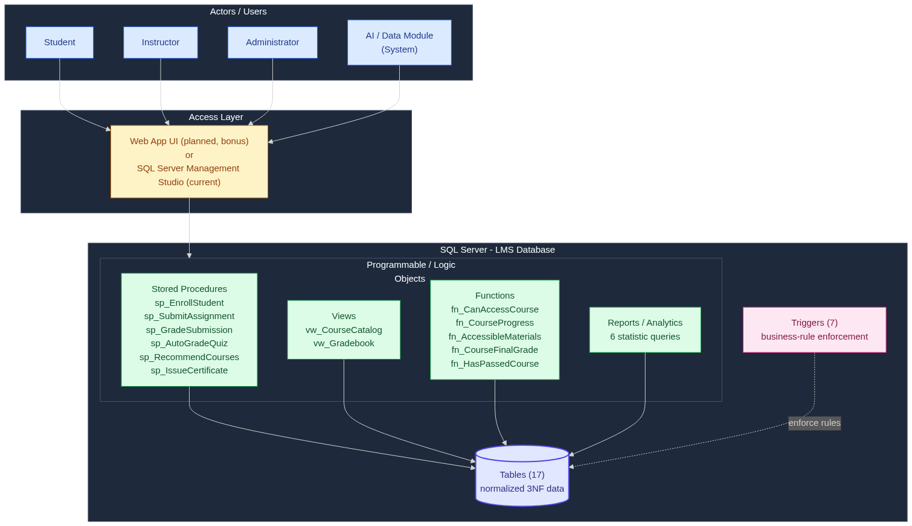

Luồng: Người dùng → (SSMS hoặc Web App) → các object lập trình trong SQL Server (Stored Procedure /
View / Function / Reports) → Bảng dữ liệu (3NF). **Trigger** đứng giữa, ép các quy tắc nghiệp vụ trước
khi dữ liệu được ghi.

---

## 3. Thiết kế cơ sở dữ liệu

### 3.1. Sơ đồ ERD


### 3.2. Danh sách bảng (17)

| Bảng | Vai trò |
|------|---------|
| `Users` | Người dùng + vai trò (Student/Instructor/Admin) |
| `Categories` | Danh mục khóa học |
| `Courses` | Khóa học, mỗi khóa do 1 giảng viên quản lý |
| `Modules` | Chương/mô-đun của khóa học |
| `Materials` | Học liệu (Document/Video/Link/Slide) |
| `Enrollments` | Đăng ký học (N-N giữa Student và Course) |
| `Assignments` | Bài tập/Quiz/Exam (bắt buộc có deadline) |
| `Questions`, `QuestionOptions` | Câu hỏi trắc nghiệm + đáp án (chấm tự động) |
| `Submissions` | Bài nộp (1 student + 1 assignment) |
| `StudentAnswers` | Lựa chọn của sinh viên cho quiz |
| `Grades` | Điểm cho mỗi bài nộp đã chấm |
| `ForumThreads`, `ForumPosts` | Thảo luận/diễn đàn (trả lời lồng nhau) |
| `Recommendations` | Gợi ý khóa học (AI) + theo dõi hiệu quả |
| `InteractionLogs` | Nhật ký tương tác phục vụ phân tích |
| `Certificates` | **Chứng chỉ hoàn thành (chỉ cấp khi điểm tổng kết ≥ 80%)** |

### 3.3. Chuẩn hóa

CSDL đạt **3NF**, có tài liệu chuẩn hóa 1NF → 2NF → 3NF và từ điển dữ liệu chi tiết tại
[`Normalization_and_DataDictionary.md`](Normalization_and_DataDictionary.md).

---

## 4. Quy tắc nghiệp vụ & nơi thực thi

| Business Rule | Cơ chế thực thi |
|---|---|
| Mỗi user có tài khoản & vai trò duy nhất | `UNIQUE(Username/Email)` + `CHECK CK_Users_Role` |
| Student–Course là quan hệ N-N, không trùng | bảng `Enrollments` + `UNIQUE(StudentID, CourseID)` |
| Mỗi khóa do **một** giảng viên quản lý | FK + trigger `trg_Courses_InstructorRole` |
| Chỉ Student mới được ghi danh | trigger `trg_Enroll_Validate` |
| Bài đánh giá phải có deadline | `Deadline DATETIME2 NOT NULL` |
| Nộp trễ → đánh dấu late / từ chối theo policy | trigger `trg_Submissions_Policy` (AFTER INSERT, UPDATE) |
| Mỗi bài nộp gắn 1 student + 1 assignment | FK + `UNIQUE(AssignmentID, StudentID, Attempt)` |
| Điểm không vượt MaxScore; người chấm là Instructor/Admin | trigger `trg_Grades_MarkGraded` |
| Đáp án sinh viên chọn phải thuộc đúng câu hỏi | trigger `trg_StudentAnswers_OptionMatchesQuestion` |
| Sinh viên chỉ truy cập khóa đã đăng ký | `fn_CanAccessCourse`, `fn_AccessibleMaterials` |
| Khóa `Published` phải có ≥ 1 module | trigger `trg_Courses_PublishNeedsModule`, `trg_Modules_KeepAtLeastOne` |
| **Chứng chỉ chỉ cấp khi điểm tổng kết ≥ 80%** | `CHECK CK_Cert_Pass` + `sp_IssueCertificate` + `fn_CourseFinalGrade` |

### Lưu đồ quy trình nộp & chấm bài

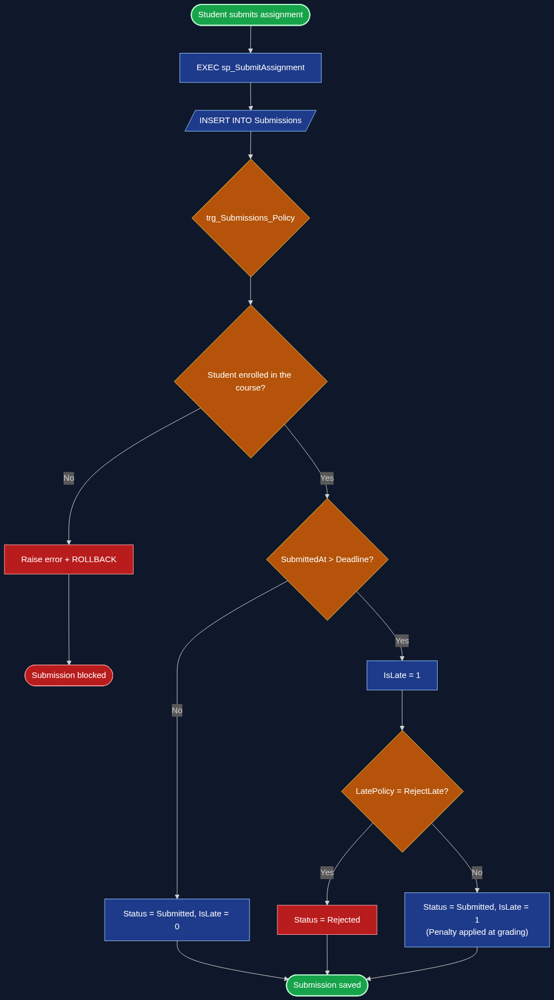

---

## 5. Đối tượng lập trình trong database

**Trigger (7):** `trg_Courses_InstructorRole`, `trg_Enroll_Validate`, `trg_Submissions_Policy`,
`trg_Modules_KeepAtLeastOne`, `trg_Courses_PublishNeedsModule`, `trg_Grades_MarkGraded`,
`trg_StudentAnswers_OptionMatchesQuestion`.

**Function (5):**
- `fn_CanAccessCourse` — kiểm tra quyền truy cập khóa.
- `fn_CourseProgress` — tiến độ học (% bài đã được chấm).
- `fn_AccessibleMaterials` — (table-valued) học liệu sinh viên được xem.
- `fn_CourseFinalGrade` — **điểm tổng kết khóa (%)** = trung bình % các bài đánh giá (thiếu/bị từ chối = 0).
- `fn_HasPassedCourse` — trả 1 nếu điểm tổng kết ≥ 80%.

**View (2):** `vw_CourseCatalog` (danh mục + sĩ số + số module), `vw_Gradebook` (bảng điểm).

**Stored procedure (6):**
- `sp_EnrollStudent` — đăng ký học (kiểm tra quy tắc).
- `sp_SubmitAssignment` — nộp bài (OUTPUT SubmissionID; trigger xử lý trễ hạn).
- `sp_GradeSubmission` — chấm điểm thủ công.
- `sp_AutoGradeQuiz` — **module AI** tự chấm quiz trắc nghiệm, quy đổi về thang MaxScore.
- `sp_RecommendCourses` — **module AI** gợi ý khóa học (content-based) + lưu để đo hiệu quả.
- `sp_IssueCertificate` — cấp chứng chỉ khi đạt ≥ 80% + đánh dấu hoàn thành khóa.

---

## 6. Tính năng nổi bật

1. **Chấm quiz tự động (`sp_AutoGradeQuiz`)** — so đáp án sinh viên với đáp án đúng, quy đổi điểm.
2. **Gợi ý khóa học AI (`sp_RecommendCourses`)** — đề xuất khóa cùng danh mục sinh viên đang học,
   lưu trạng thái `Shown/Clicked/Enrolled/Ignored` để đo Click-Through Rate & tỷ lệ chuyển đổi.
3. **Chứng chỉ kiểu Coursera (mới)** — học viên phải làm các graded assignment, đạt **≥ 80%** điểm
   tổng kết mới nhận được chứng chỉ. Ngưỡng 80% được **khóa cứng ở cấp dữ liệu** bằng `CHECK CK_Cert_Pass`
   nên kể cả INSERT trực tiếp cũng không thể tạo chứng chỉ dưới chuẩn.

---

## 7. Kiểm thử quy tắc nghiệp vụ (`07_business_rule_tests.sql`)

Tất cả là **negative test** — cố tình vi phạm để chứng minh database **chặn** đúng. Kết quả: **12/12 PASS**.

| # | Tình huống cố tình sai | Kết quả |
|---|---|---|
| 1 | Đăng ký trùng (StudentID, CourseID) | PASS — chặn bởi `UQ_Enroll` |
| 2 | Người không phải Instructor sở hữu khóa | PASS — chặn bởi trigger |
| 3 | Người không phải Student ghi danh | PASS — chặn bởi trigger |
| 4 | Role không hợp lệ | PASS — chặn bởi `CK_Users_Role` |
| 5 | Sinh viên chưa đăng ký nộp bài | PASS — chặn bởi trigger |
| 6 | Điểm vượt MaxScore | PASS — chặn bởi trigger |
| 7 | Publish khóa không có module | PASS — chặn bởi trigger |
| 8 | Student tự chấm điểm | PASS — chặn bởi trigger |
| 9 | Chọn đáp án thuộc câu hỏi khác | PASS — chặn bởi trigger |
| 10 | INSERT khóa Published mà không có module | PASS — chặn bởi trigger |
| 11 | Cấp chứng chỉ khi điểm < 80% (qua SP) | PASS — `sp_IssueCertificate` từ chối |
| 12 | INSERT trực tiếp chứng chỉ < 80% | PASS — chặn bởi `CK_Cert_Pass` |

---

## 8. Web app demo (Flask trên SQL Server thật)

Web app chứng minh database hoạt động trong ứng dụng thật. Mỗi trang ánh xạ tới object SQL thật.
Có thanh **"Đóng vai"** (demo user selector) để xem dữ liệu theo từng vai trò mà không cần xây
authentication.

| Trang | Chức năng | Object SQL tái dùng |
|---|---|---|
| `/catalog` | Danh mục + lọc | `vw_CourseCatalog` |
| `/courses/<id>` | Chi tiết khóa, học liệu, nộp bài, **điểm & chứng chỉ**, thảo luận | `Modules`,`Materials`,`fn_CanAccessCourse`,`fn_CourseFinalGrade`,`sp_*` |
| `/dashboard` | Điểm + tiến độ + chứng chỉ của SV | `vw_Gradebook`,`fn_CourseProgress`,`Certificates` |
| `/reports` | 6 báo cáo phân tích | các SELECT trong `06_reports.sql` |
| `/recommendations` | Gợi ý AI | `sp_RecommendCourses` |
| `/grading` | Chấm điểm (Instructor/Admin) | `sp_GradeSubmission` |
| `/certificates`, `/certificate/<id>` | Danh sách & chứng chỉ in được | `Certificates`,`sp_IssueCertificate` |
| `/business-rules` | Cố tình vi phạm để DB chặn & hiện lỗi | trigger + SP |

### 8.1. Danh mục khóa học (`/catalog`)
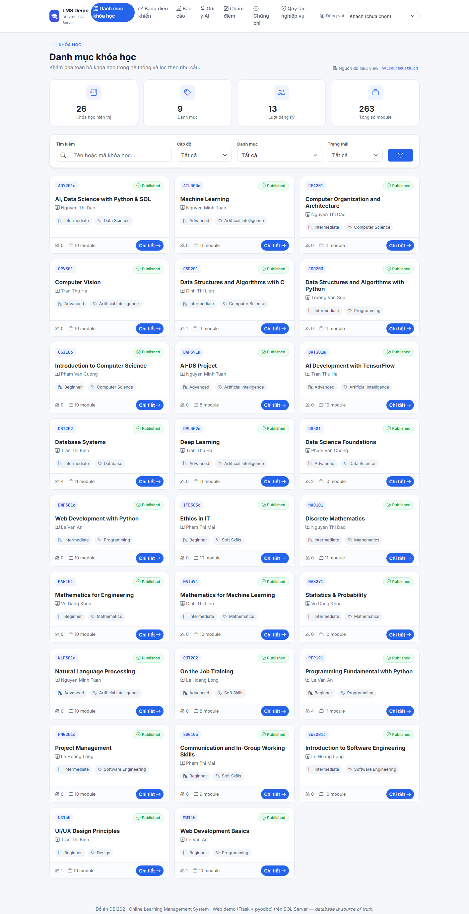

### 8.2. Chi tiết khóa học + Kết quả & Chứng chỉ (`/courses/2`, đóng vai SV đã đạt)
Hiển thị điểm tổng kết **90%**, ngưỡng đạt 80%, nút xem chứng chỉ; outline module → học liệu; bảng bài
đánh giá (nộp qua `sp_SubmitAssignment`); thảo luận.
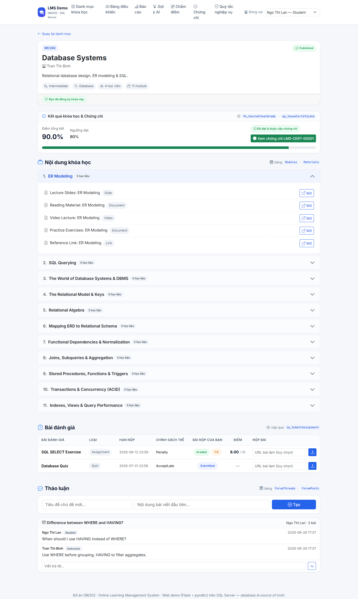

### 8.3. Bảng điều khiển sinh viên (`/dashboard`)
Tiến độ theo khóa, **điểm tổng kết + trạng thái Đạt**, danh sách **chứng chỉ đã đạt**, và bảng điểm
(quiz auto-graded 10/10, assignment 8/10).
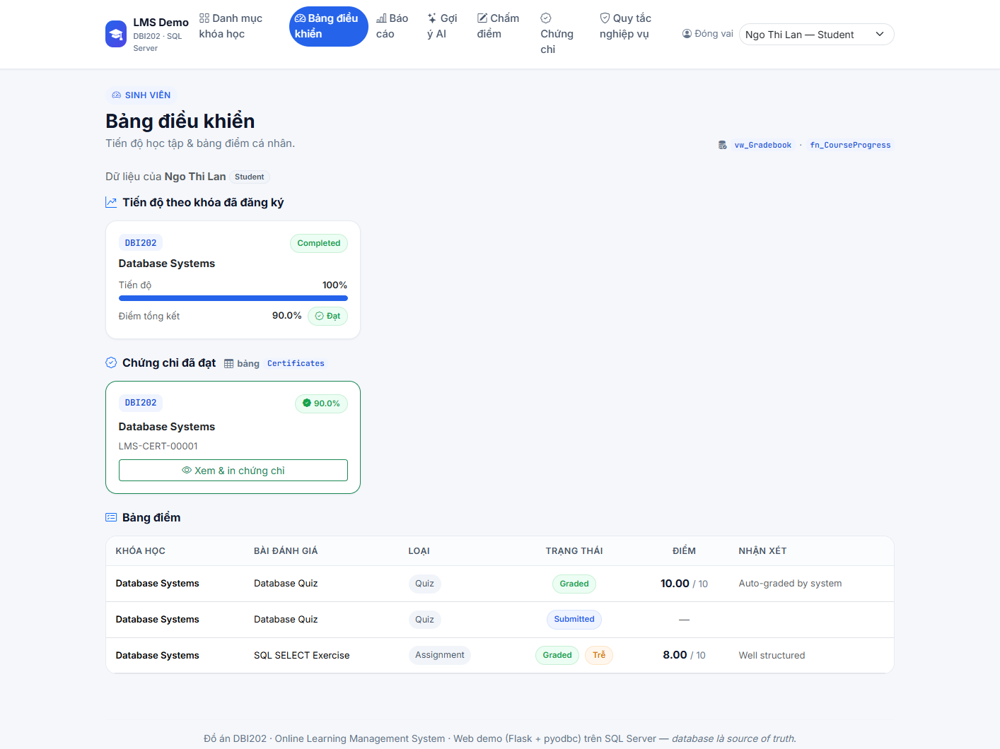

### 8.4. Chứng chỉ in được (`/certificate/2`)
Cấp qua `sp_IssueCertificate`, chỉ tồn tại khi điểm ≥ 80% (`CK_Cert_Pass`). Có nút **In / Lưu PDF**.
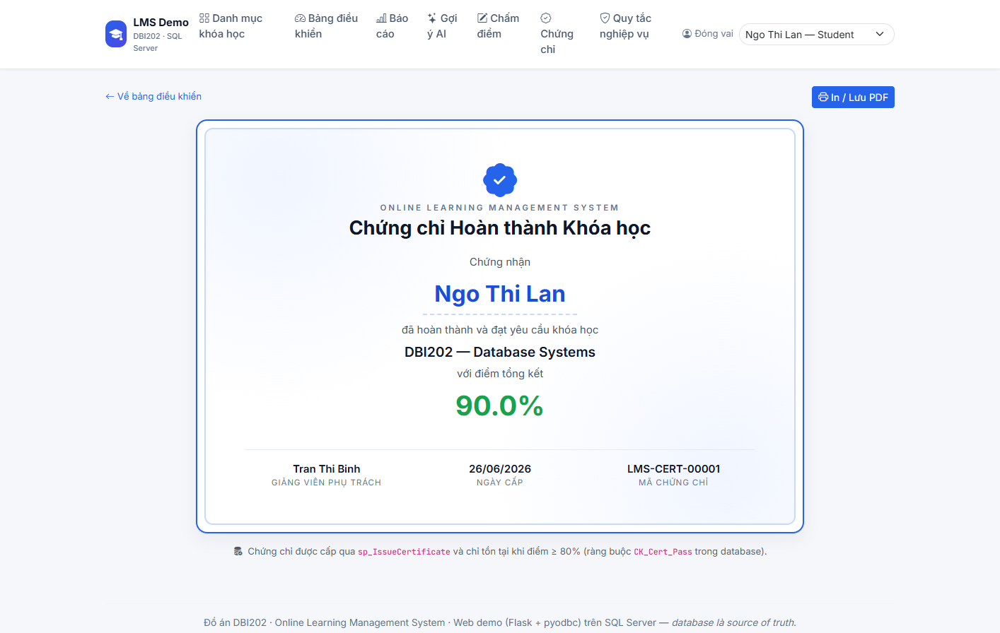

### 8.5. Danh sách chứng chỉ (`/certificates`)
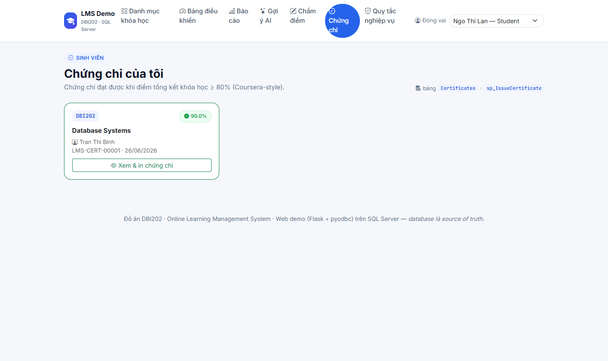

### 8.6. Gợi ý khóa học AI (`/recommendations`)
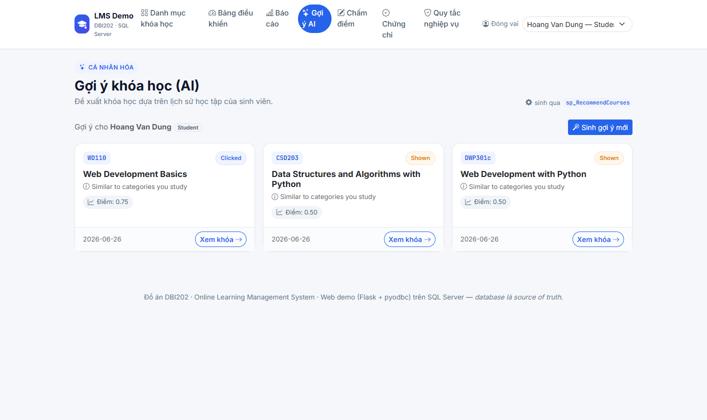

### 8.7. Báo cáo / Thống kê (`/reports`)
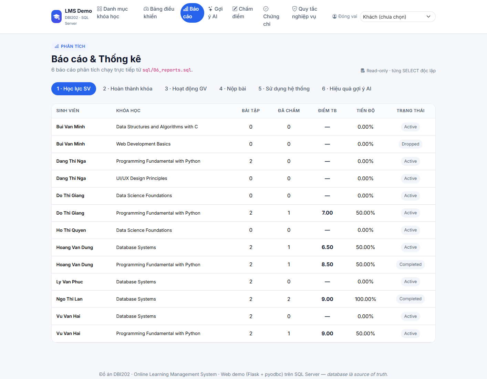

### 8.8. Showcase quy tắc nghiệp vụ (`/business-rules`)
Chọn (user, course) bất kỳ và bấm thử đăng ký — database trả về **nguyên văn message** từ trigger/procedure.
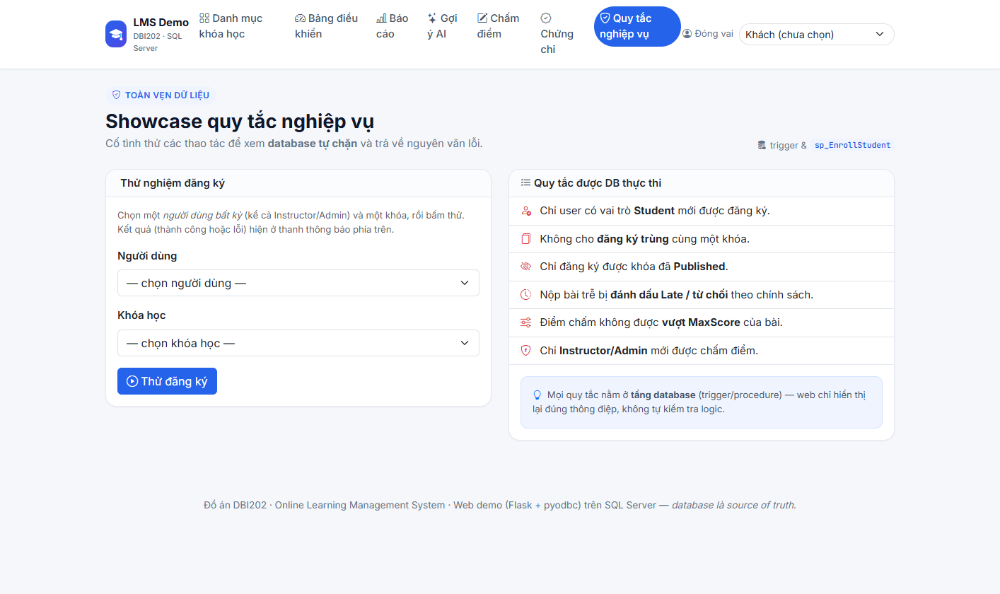

### 8.9. Khóa chưa đạt chuẩn chứng chỉ (đóng vai SV điểm thấp)
Hiển thị badge **"Chưa đạt 80%"** — đúng quy tắc, không cho nhận chứng chỉ.
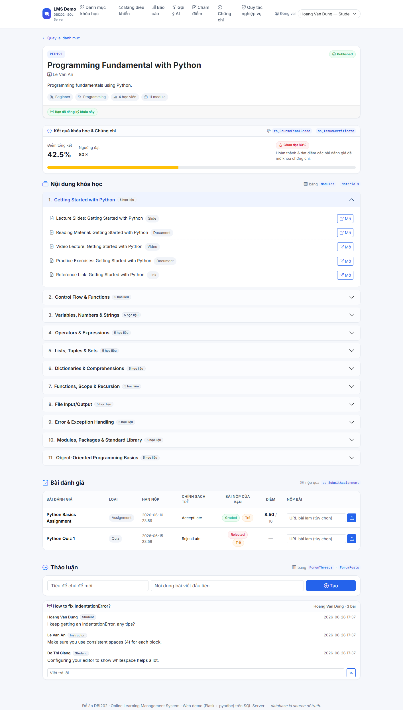

### 8.10. Trang chấm điểm (`/grading`, đóng vai Admin/Instructor)
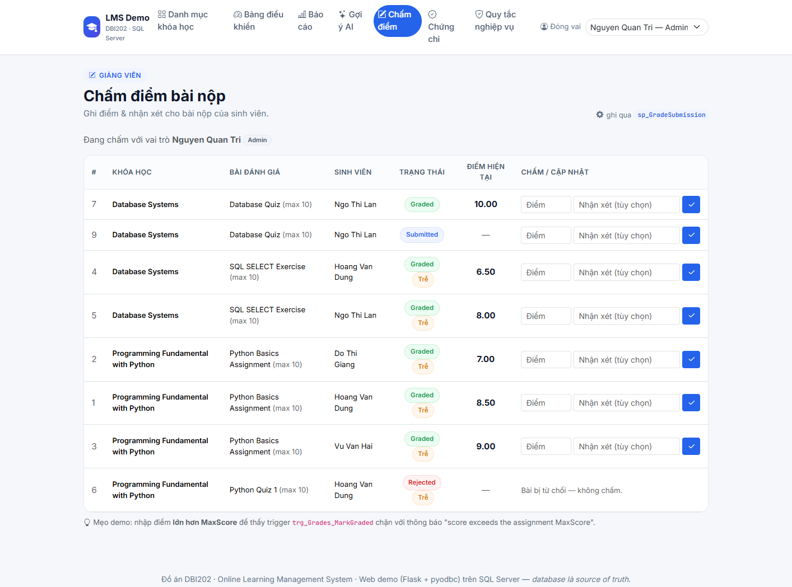

---

## 9. Dữ liệu mẫu

- **26 khóa học** bám chương trình ngành **AI của FPT University** (PFP191, MAD101, CSD201/203, CEA201,
  DBI202, AIL303m Machine Learning, CPV301 Computer Vision, DPL302m Deep Learning, NLP301c, DAT301m
  TensorFlow, MAI391, MAS291, SWE201c, PMG201c, ...). Mỗi khóa có **8–11 module** theo giáo trình thật,
  mỗi module **5 học liệu**.
- **8 sinh viên, 11 giảng viên, 1 admin.**
- Có sẵn kịch bản demo: SV **Ngo Thi Lan** đạt **90%** môn DBI202 → đã có chứng chỉ `LMS-CERT-00001`;
  SV **Hoang Van Dung** môn PFP191 **42.5%** → chưa đạt (minh họa quy tắc 80%).

---

## 10. Cách chạy

**Database (SSMS):** mở `sql/run_all_local.sql` → bật **SQLCMD Mode** → chọn database `master` → F5.
Kết quả in `... created successfully`, `Sample data inserted successfully`, và `TEST 1..12: PASS`.

**Web app:**
```powershell
cd webapp
python -m venv .venv
.\.venv\Scripts\python.exe -m pip install -r requirements.txt
copy .env.example .env
.\.venv\Scripts\python.exe app.py
```
Mở **http://127.0.0.1:5000**. Chi tiết: [`../README.md`](../README.md) và [`../webapp/README.md`](../webapp/README.md).

---

## 11. Hạn chế & hướng phát triển (để mentor góp ý)

- Web demo dùng **demo user selector** (đóng vai), chưa có authentication/đăng nhập thật.
- `fn_CourseFinalGrade` đang dùng công thức trung bình đơn giản (mỗi assignment trọng số bằng nhau);
  có thể nâng cấp **trọng số theo loại** (Quiz/Assignment/Exam).
- Chứng chỉ chưa có mã QR / trang xác minh công khai.
- Chưa có trang làm quiz trực tiếp trên web (hiện auto-grade chạy ở tầng DB qua `sp_AutoGradeQuiz`).
- Báo cáo có thể bổ sung biểu đồ trực quan (hiện đang ở dạng bảng).

> Mình sẽ dựa trên góp ý của mentor để quyết định cập nhật/làm thêm các hạng mục trên.

---

## 12. Checklist đối chiếu yêu cầu DBI202

- [x] Thiết kế schema chuẩn hóa 3NF (17 bảng, khóa chính/ngoại, ràng buộc CHECK/UNIQUE)
- [x] ERD + tài liệu chuẩn hóa + từ điển dữ liệu
- [x] Quy tắc nghiệp vụ thực thi bằng trigger + stored procedure + constraint
- [x] Stored procedure có transaction & xử lý lỗi
- [x] Function & View phục vụ truy vấn/báo cáo
- [x] 6 báo cáo/thống kê phục vụ ra quyết định
- [x] Bộ test quy tắc nghiệp vụ (12/12 PASS)
- [x] Module AI: gợi ý khóa học + chấm quiz tự động
- [x] Dữ liệu mẫu phong phú (26 khóa theo giáo trình thật)
- [x] (Điểm cộng) Web app thật chạy trên database SQL Server
- [x] (Mới) Hệ thống chứng chỉ đạt ≥ 80% kiểu Coursera
