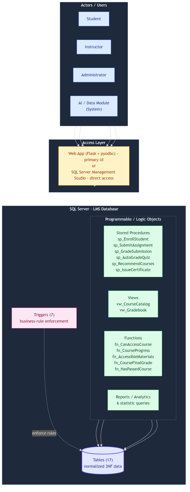
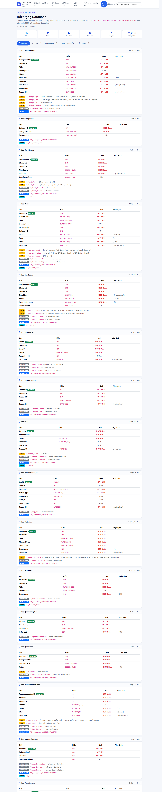
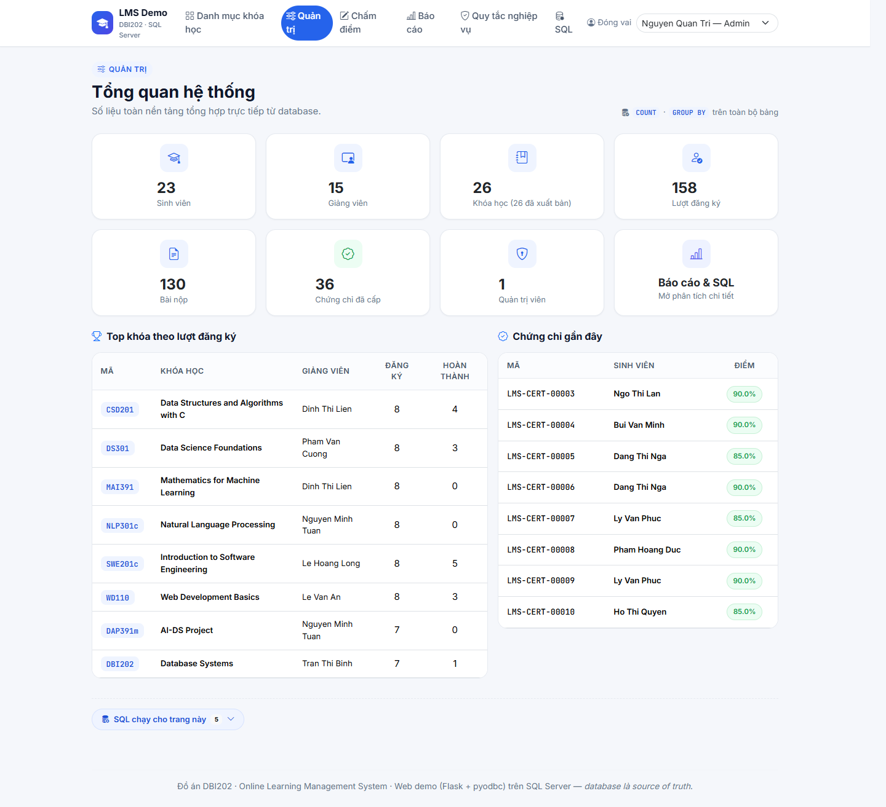
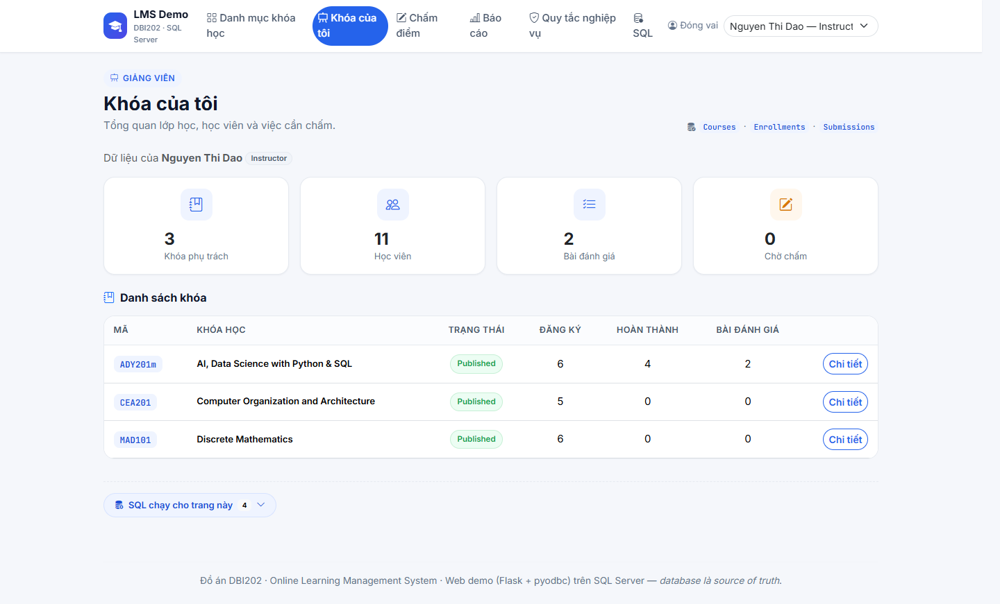

# Final Report Gr1 — Hệ thống Quản lý Học tập Trực tuyến (LMS)

> **Môn học:** DBI202 — Database Systems
> **Nhóm:** 1 — Lớp AI2014
> **Ngày nộp:** 
> **Loại đồ án:** Cơ sở dữ liệu SQL Server (phần lõi) + web app minh họa viết bằng Flask
> **Mục đích tài liệu:** Tổng hợp thiết kế, phần hiện thực và kết quả kiểm thử của đồ án để phục vụ buổi bảo vệ và chấm điểm cuối kỳ.
>
> Nhóm em xây dựng phần lõi là cơ sở dữ liệu SQL Server (schema, ràng buộc, trigger, function, view, stored procedure, truy vấn báo cáo và bộ kiểm thử), sau đó viết thêm một web app nhỏ để minh họa database chạy được trong một ứng dụng thật. Toàn bộ số liệu nêu trong tài liệu được lấy trực tiếp từ database sau khi chạy các script trong thư mục `sql/`.

**Thành viên nhóm**

| STT | Họ và tên | MSSV |
|-----|-----------|------|
| 1 | Huynh Pham Phi Linh | SE211780 |
| 2 | Nguyen Tan Thinh | SE212249 |
| 3 | Nguyen Quoc Bao | SE212261 |
| 4 | Nguyen Hoang Vu | SE212202 |

---

<!-- SQL_FOCUS_START -->
> ### Trọng tâm chấm điểm: MÃ NGUỒN SQL
> Lõi của đồ án là **database (T-SQL)** — mọi quy tắc nghiệp vụ đều nằm ở đây: schema + ràng buộc, **7 trigger**,
> **5 function**, **2 view**, **6 stored procedure**, **6 truy vấn báo cáo**, **12 negative test** và **smoke
> test luồng hợp lệ**. Toàn bộ mã nguồn nằm trong thư mục [`sql/`](../sql/) (cách chạy: xem Mục 10); tài liệu
> này không in lại nguyên văn để giữ báo cáo gọn. Phần demo web (Mục 8) chỉ minh họa DB chạy trong ứng dụng thật.

<!-- SQL_FOCUS_END -->

## 1. Tổng quan

Đề tài của nhóm là một hệ thống quản lý học tập trực tuyến (LMS). Hệ thống quản lý người dùng theo
vai trò, khóa học và học liệu, bài tập/quiz, chấm điểm (thủ công cho bài tự luận và tự động cho quiz),
thảo luận, gợi ý khóa học theo nội dung (content-based, viết bằng SQL), ghi nhận hoạt động học tập và
cấp chứng chỉ khi điểm tổng kết đạt **≥ 80%**. Điểm nhóm em muốn nhấn mạnh là **mọi quy tắc nghiệp vụ
đều được đặt trong database**; web app chỉ gọi lại chính các đối tượng đó để hiển thị.

| Hạng mục | Con số thực tế |
|---|---|
| Bảng (3NF) | **17** |
| Trigger (quy tắc nghiệp vụ) | **7** |
| Function | **5** (4 scalar + 1 table-valued) |
| View | **2** |
| Stored procedure | **6** |
| Truy vấn báo cáo | **6** (web hiển thị theo vai trò: Instructor 3, Admin 5) |
| Test vi phạm quy tắc (negative test) | **12 / 12 PASS** |
| Smoke test luồng hợp lệ (positive test) | **6** |
| Khóa học mẫu (đều đã Published) | **26** |
| Danh mục khóa học | **9** |
| Người dùng (SV / GV / Admin) | **39** (23 / 15 / 1) |
| Lượt đăng ký (Active / Completed / Dropped) | **158** (107 / 37 / 14) |
| Bài đánh giá (Assignment / Quiz) | **24** (12 / 12) |
| Bài nộp / Đã chấm | **130 / 128** |
| Chứng chỉ đã cấp (≥ 80%) | **36** |
| Module / Học liệu | **263 / 1315** |

**Công nghệ sử dụng:**
- **Database:** Microsoft SQL Server (T-SQL) — nơi chứa toàn bộ logic nghiệp vụ.
- **Web app:** Python + Flask + pyodbc (ODBC Driver 18) + Jinja2 + Bootstrap 5 + Chart.js; kết nối tới
  SQL Server bằng **Windows Authentication** (không lưu mật khẩu trong code). Web app **không tự viết
  lại logic nghiệp vụ** — chỉ đọc view/function và gọi stored procedure có sẵn.
- **Trải nghiệm theo vai trò:** thanh điều hướng và trang chủ thay đổi theo Student / Instructor / Admin
  (chọn qua ô "Đóng vai"), kèm một trang **minh bạch SQL** đọc trực tiếp từ system catalog của SQL Server.

---

## 2. Kiến trúc tổng thể



Luồng: Người dùng → (SSMS hoặc Web App) → các object lập trình trong SQL Server (Stored Procedure /
View / Function / Reports) → Bảng dữ liệu (3NF). **Trigger** đứng giữa, ép các quy tắc nghiệp vụ trước
khi dữ liệu được ghi.

---

## 3. Thiết kế cơ sở dữ liệu

### 3.1. Sơ đồ ERD (ký hiệu Chen)

Nhóm dùng hai phiên bản ERD theo cùng ký hiệu Chen: bản đầy đủ để mô tả chi tiết thiết kế, và bản
rút gọn để nhìn nhanh tổng thể khi bảo vệ.

**a) ERD đầy đủ (17 bảng).**


*Hình 3.1a. ERD đầy đủ theo ký hiệu Chen: hình chữ nhật là thực thể, hình thoi là quan hệ, hình elip
là thuộc tính, thuộc tính gạch chân là khóa. Sơ đồ khớp đúng 17 bảng và các quan hệ khóa ngoại đã khai
báo trong `sql/01_schema.sql`.*

**b) ERD rút gọn (tập trung các thực thể cốt lõi).**


*Hình 3.1b. ERD rút gọn chỉ giữ 10 thực thể cốt lõi cùng thuộc tính và quan hệ chính, giúp nhìn nhanh
mô hình khi trình bày. Các bảng phụ (ForumThreads, ForumPosts, Recommendations, InteractionLogs,
Certificates, StudentAnswers) được lược bớt để dễ đọc — chúng vẫn có đầy đủ trong bản 3.1a và trong
`sql/01_schema.sql`.*

### 3.2. Danh sách bảng (17)

| Bảng | Vai trò |
|------|---------|
| `Users` | Người dùng + vai trò (Student/Instructor/Admin) |
| `Categories` | Danh mục khóa học |
| `Courses` | Khóa học, mỗi khóa do 1 giảng viên quản lý |
| `Modules` | Chương/mô-đun của khóa học |
| `Materials` | Học liệu (Document/Video/Link/Slide) |
| `Enrollments` | Đăng ký học (N-N giữa Student và Course) |
| `Assignments` | Bài tập/Quiz/Exam (bắt buộc có deadline) |
| `Questions`, `QuestionOptions` | Câu hỏi trắc nghiệm + đáp án (chấm tự động) |
| `Submissions` | Bài nộp (1 student + 1 assignment) |
| `StudentAnswers` | Lựa chọn của sinh viên cho quiz |
| `Grades` | Điểm cho mỗi bài nộp đã chấm |
| `ForumThreads`, `ForumPosts` | Thảo luận/diễn đàn (trả lời lồng nhau) |
| `Recommendations` | Gợi ý khóa học (content-based) + theo dõi hiệu quả |
| `InteractionLogs` | Nhật ký tương tác phục vụ phân tích |
| `Certificates` | **Chứng chỉ hoàn thành (chỉ cấp khi điểm tổng kết ≥ 80%)** |

### 3.3. Chuẩn hóa (1NF → 2NF → 3NF)

CSDL đạt **3NF**. Tóm tắt lý do, gắn với chính các bảng của LMS:

| Dạng chuẩn | Yêu cầu | Cách thiết kế LMS thỏa mãn |
|---|---|---|
| **1NF** | Mỗi ô một giá trị nguyên tử, không nhóm lặp; có khóa chính | Mỗi bảng có PK `IDENTITY`; dữ liệu đa trị được tách thành **dòng/bảng riêng**: `Modules`, `Materials`, `Questions`, `QuestionOptions` (không dồn "M1; M2; M3" vào một cột) |
| **2NF** | Đạt 1NF & thuộc tính không khóa phụ thuộc **toàn bộ** khóa (không phụ thuộc bộ phận) | Quan hệ N-N tách bằng **bảng nối** `Enrollments` (Student↔Course); chi tiết bài nộp/điểm tách thành `Submissions` + `Grades`; nhờ dùng khóa thay thế đơn (surrogate) nên không phát sinh phụ thuộc bộ phận |
| **3NF** | Đạt 2NF & **không** có phụ thuộc bắc cầu (non-key → non-key) | Sự kiện không khóa được tách thành thực thể riêng: `Categories` (thay vì lặp tên danh mục trong `Courses`), `Users` giữ thông tin giảng viên (Courses chỉ giữ FK `InstructorID`), `Grades.GradedBy` là FK tới `Users` thay vì lưu tên người chấm |

Chi tiết quá trình UNF → 1NF → 2NF → 3NF, bảng kiểm tra phụ thuộc hàm và từ điển dữ liệu đầy đủ:
[`Normalization_and_DataDictionary.md`](Normalization_and_DataDictionary.md).

---

## 4. Quy tắc nghiệp vụ & nơi thực thi

| Business Rule | Cơ chế thực thi |
|---|---|
| Mỗi user có tài khoản & vai trò duy nhất | `UNIQUE(Username/Email)` + `CHECK CK_Users_Role` |
| Student–Course là quan hệ N-N, không trùng | bảng `Enrollments` + `UNIQUE(StudentID, CourseID)` |
| Mỗi khóa do **một** giảng viên quản lý | FK + trigger `trg_Courses_InstructorRole` |
| Chỉ Student mới được ghi danh | trigger `trg_Enroll_Validate` |
| Bài đánh giá phải có deadline | `Deadline DATETIME2 NOT NULL` |
| Nộp trễ → đánh dấu late / từ chối theo policy | trigger `trg_Submissions_Policy` (AFTER INSERT, UPDATE) |
| Mỗi bài nộp gắn 1 student + 1 assignment | FK + `UNIQUE(AssignmentID, StudentID, Attempt)` |
| Điểm không vượt MaxScore; người chấm là Instructor/Admin | trigger `trg_Grades_MarkGraded` |
| Đáp án sinh viên chọn phải thuộc đúng câu hỏi | trigger `trg_StudentAnswers_OptionMatchesQuestion` |
| Sinh viên chỉ truy cập khóa đã đăng ký | `fn_CanAccessCourse`, `fn_AccessibleMaterials` |
| Khóa `Published` phải có ≥ 1 module | trigger `trg_Courses_PublishNeedsModule`, `trg_Modules_KeepAtLeastOne` |
| **Chứng chỉ chỉ cấp khi điểm tổng kết ≥ 80%** | `CHECK CK_Cert_Pass` + `sp_IssueCertificate` + `fn_CourseFinalGrade` |

---

## 5. Đối tượng lập trình trong database

**Trigger (7):** `trg_Courses_InstructorRole`, `trg_Enroll_Validate`, `trg_Submissions_Policy`,
`trg_Modules_KeepAtLeastOne`, `trg_Courses_PublishNeedsModule`, `trg_Grades_MarkGraded`,
`trg_StudentAnswers_OptionMatchesQuestion`.

**Function (5):**
- `fn_CanAccessCourse` — kiểm tra quyền truy cập khóa.
- `fn_CourseProgress` — tiến độ học (% bài đã được chấm).
- `fn_AccessibleMaterials` — (table-valued) học liệu sinh viên được xem.
- `fn_CourseFinalGrade` — **điểm tổng kết khóa (%)** = trung bình % các bài đánh giá (thiếu/bị từ chối = 0).
- `fn_HasPassedCourse` — trả 1 nếu điểm tổng kết ≥ 80%.

**View (2):** `vw_CourseCatalog` (danh mục + sĩ số + số module), `vw_Gradebook` (bảng điểm).

**Stored procedure (6):**
- `sp_EnrollStudent` — đăng ký học (kiểm tra quy tắc).
- `sp_SubmitAssignment` — nộp bài (OUTPUT SubmissionID; trigger xử lý trễ hạn).
- `sp_GradeSubmission` — chấm điểm thủ công.
- `sp_AutoGradeQuiz` — tự động chấm quiz trắc nghiệm bằng cách so đáp án, quy đổi về thang MaxScore.
- `sp_RecommendCourses` — gợi ý khóa học theo nội dung (content-based, thuần SQL) + lưu lại để đo hiệu quả.
- `sp_IssueCertificate` — cấp chứng chỉ khi đạt ≥ 80% + đánh dấu hoàn thành khóa.

---

## 6. Tính năng nổi bật

1. **Chấm quiz tự động (`sp_AutoGradeQuiz`)** — so đáp án sinh viên với đáp án đúng, quy đổi điểm.
2. **Gợi ý khóa học 2 lớp ngay trên trang Danh mục (`/catalog`)** — nhóm bỏ trang gợi ý riêng và đưa
   phần gợi ý vào thẳng nơi người học duyệt khóa:
   - **"Gợi ý cho bạn"** — cá nhân hóa theo từng sinh viên qua `sp_RecommendCourses` (content-based: ưu tiên
     khóa cùng danh mục SV đang học), lưu `Recommendations` với trạng thái `Shown/Clicked/Enrolled/Ignored`.
     Nếu SV chưa có gợi ý, web gọi SP để sinh ngay (lazy-generate). Chỉ hiển thị cho vai trò Student.
   - **"Khóa học phổ biến nhất"** — xếp hạng theo `COUNT(Enrollments)` (popularity-based), hiển thị cho mọi vai trò.
   - Hai mục chỉ hiện khi **không áp dụng bộ lọc** (để không gây nhiễu khi người dùng đang tìm kiếm có chủ đích).
3. **Chứng chỉ hoàn thành khóa** — sinh viên phải làm các bài đánh giá có chấm điểm và đạt **≥ 80%**
   điểm tổng kết mới được cấp chứng chỉ. Ngưỡng 80% được **khóa cứng ở cấp dữ liệu** bằng `CHECK CK_Cert_Pass`,
   nên kể cả khi INSERT trực tiếp vào bảng cũng không thể tạo ra một chứng chỉ dưới chuẩn.
4. **Minh bạch SQL (SQL Transparency)** — trang `/sql-objects` đọc **trực tiếp** từ system catalog
   (`sys.tables`, `sys.columns`, `sys.sql_modules`, `sys.foreign_keys`…) để liệt kê bảng + cột + ràng buộc
   + số dòng thật và **định nghĩa nguyên văn** của view/function/procedure/trigger. Ngoài ra mỗi trang có
   panel **"SQL chạy cho trang này"** hiển thị đúng câu lệnh (parameterized) vừa gửi tới SQL Server.
5. **Biểu đồ phân tích (Reports Charts)** — các báo cáo có biểu đồ trực quan (Chart.js): cột, cột chồng,
   đường… dữ liệu đẩy thẳng từ các `SELECT ... GROUP BY` trong `06_reports.sql`, **không** có dữ liệu giả
   ở frontend; bảng dữ liệu thô vẫn giữ bên dưới để đối chiếu.
6. **Cổng theo vai trò (Role Portal)** — Student có `/dashboard`, Instructor có `/instructor` (khóa phụ
   trách, học viên, việc cần chấm), Admin có `/admin` (tổng quan toàn hệ thống, top khóa, chứng chỉ gần
   đây). Navbar tự đổi theo vai; quyền vẫn được DB kiểm soát ở tầng trigger/procedure.
7. **Báo cáo phân quyền (Role-gated Reports)** — trang `/reports` lọc nội dung theo vai: **Instructor** chỉ
   xem 3 báo cáo liên quan giảng dạy (kết quả học tập, tỷ lệ hoàn thành khóa, tình hình nộp bài); **Admin**
   xem đủ 5 báo cáo (thêm hoạt động giảng viên, mức sử dụng hệ thống). Web chỉ truy vấn đúng phần được phép.
8. **Thông điệp tiếng Việt (Web-tier Localization)** — message lỗi do trigger/`RAISERROR`/`THROW` trả về (tiếng
   Anh) được dịch sang tiếng Việt ở tầng web (bảng tra `_VI_MESSAGES` + `localize_error`) để demo thân thiện;
   **logic và ràng buộc gốc vẫn nằm nguyên trong database**, web chỉ làm lớp hiển thị.

---

## 7. Kiểm thử quy tắc nghiệp vụ (`07_business_rule_tests.sql`)

Tất cả là **negative test** — cố tình vi phạm để chứng minh database **chặn** đúng. Kết quả: **12/12 PASS**.

| # | Tình huống cố tình sai | Kết quả |
|---|---|---|
| 1 | Đăng ký trùng (StudentID, CourseID) | PASS — chặn bởi `UQ_Enroll` |
| 2 | Người không phải Instructor sở hữu khóa | PASS — chặn bởi trigger |
| 3 | Người không phải Student ghi danh | PASS — chặn bởi trigger |
| 4 | Role không hợp lệ | PASS — chặn bởi `CK_Users_Role` |
| 5 | Sinh viên chưa đăng ký nộp bài | PASS — chặn bởi trigger |
| 6 | Điểm vượt MaxScore | PASS — chặn bởi trigger |
| 7 | Publish khóa không có module | PASS — chặn bởi trigger |
| 8 | Student tự chấm điểm | PASS — chặn bởi trigger |
| 9 | Chọn đáp án thuộc câu hỏi khác | PASS — chặn bởi trigger |
| 10 | INSERT khóa Published mà không có module | PASS — chặn bởi trigger |
| 11 | Cấp chứng chỉ khi điểm < 80% (qua SP) | PASS — `sp_IssueCertificate` từ chối |
| 12 | INSERT trực tiếp chứng chỉ < 80% | PASS — chặn bởi `CK_Cert_Pass` |

---

## 8. Web app minh họa (Flask chạy trên SQL Server thật)

Sau khi hoàn thành database, nhóm viết thêm một web app nhỏ bằng Flask để cho thấy các đối tượng SQL
thật sự dùng được trong một ứng dụng. Web app **không tự xử lý nghiệp vụ**: mỗi trang đều ánh xạ về
một view, function hoặc stored procedure cụ thể trong database.

Vì đồ án tập trung vào database nên nhóm không làm phần đăng nhập thật. Thay vào đó có thanh
**"Đóng vai"** để chọn nhanh một người dùng và xem giao diện theo đúng vai trò của họ (Student /
Instructor / Admin); thanh điều hướng tự đổi theo vai đang chọn. Cuối mỗi trang còn có panel
**"SQL chạy cho trang này"** — bung ra sẽ thấy đúng câu lệnh (đã tham số hóa) mà trang vừa gửi xuống
SQL Server. Nhóm dùng panel này để chứng minh dữ liệu hiển thị đến từ database chứ không phải viết cứng.

Các ảnh dưới đây được chụp trên bản dữ liệu mẫu hiện tại của đồ án.

| Trang | Chức năng | Object SQL tái dùng |
|---|---|---|
| `/catalog` | Danh mục + lọc + **"Gợi ý cho bạn"** (SV) + **"Khóa phổ biến nhất"** | `vw_CourseCatalog`, `sp_RecommendCourses`, `COUNT(Enrollments)` |
| `/courses/<id>` | Chi tiết khóa, học liệu, nộp bài, **điểm & chứng chỉ**, thảo luận | `Modules`,`Materials`,`fn_CanAccessCourse`,`fn_CourseFinalGrade`,`sp_*` |
| `/dashboard` | Điểm + tiến độ + chứng chỉ của SV (cổng Student) | `vw_Gradebook`,`fn_CourseProgress`,`Certificates` |
| `/instructor` | **Cổng giảng viên**: khóa phụ trách, học viên, việc cần chấm | `Courses`,`Enrollments`,`Submissions` |
| `/admin` | **Cổng quản trị**: tổng quan hệ thống, top khóa, chứng chỉ gần đây | `COUNT`/`GROUP BY` trên toàn bộ bảng |
| `/portal` | Điều hướng tới cổng đúng theo vai trò | (redirect) |
| `/reports` | Báo cáo phân tích **kèm biểu đồ** — **phân quyền: Instructor 3, Admin 5** | các SELECT trong `06_reports.sql` |
| `/grading` | Chấm điểm (Instructor/Admin) | `sp_GradeSubmission` |
| `/certificates`, `/certificate/<id>` | Danh sách & chứng chỉ in được | `Certificates`,`sp_IssueCertificate` |
| `/business-rules` | Cố tình vi phạm để DB chặn & hiện lỗi | trigger + SP |
| `/sql-objects` | **Minh bạch SQL**: bảng/cột/ràng buộc + định nghĩa view/func/proc/trigger | `sys.tables`,`sys.columns`,`sys.sql_modules`,`sys.foreign_keys` |

### 8.1. Danh mục khóa học (`/catalog`)
Trang chủ liệt kê 26 khóa học đọc từ view `vw_CourseCatalog`. Bốn thẻ số liệu ở đầu trang (26 khóa,
9 danh mục, 158 lượt đăng ký, 263 module) được tính trực tiếp trong SQL. Có ô tìm kiếm và lọc theo
danh mục / trình độ / trạng thái.


### 8.2. Chi tiết khóa học + Kết quả & Chứng chỉ (`/courses/2`, đóng vai Ngo Thi Lan)
Khi đóng vai một sinh viên đã đạt, trang hiển thị điểm tổng kết **90.0%** (do `fn_CourseFinalGrade`
tính), ngưỡng đạt 80% và nút xem chứng chỉ `LMS-CERT-00001`. Bên dưới là outline module → học liệu,
bảng bài đánh giá (nộp qua `sp_SubmitAssignment`) và khu thảo luận.


### 8.3. Bảng điều khiển sinh viên (`/dashboard`)
Gom tiến độ từng khóa, điểm tổng kết kèm trạng thái Đạt/Chưa đạt và danh sách chứng chỉ đã có. Dữ liệu
lấy từ `vw_Gradebook`, `fn_CourseProgress` và bảng `Certificates`.


### 8.4. Chứng chỉ in được (`/certificate/2`)
Chứng chỉ của Ngo Thi Lan cho môn DBI202, điểm 90.0%, mã `LMS-CERT-00001`. Nó chỉ tồn tại vì đã được
cấp qua `sp_IssueCertificate` và vượt ràng buộc `CK_Cert_Pass` (≥ 80%). Có nút **In / Lưu PDF**.


### 8.5. Danh sách chứng chỉ của sinh viên (`/certificates`)


### 8.6. Gợi ý khóa học ngay trên trang Danh mục (đóng vai sinh viên)
Khi đóng vai sinh viên và không lọc, đầu trang Danh mục có thêm hai khối: **"Gợi ý cho bạn"** (cá nhân
hóa qua `sp_RecommendCourses`, kèm % độ phù hợp và danh mục) và **"Khóa học phổ biến nhất"** (xếp theo
`COUNT(Enrollments)`).


### 8.7. Báo cáo / Thống kê (`/reports`) — có biểu đồ và phân quyền
Mỗi báo cáo là một tab, có biểu đồ Chart.js đi kèm bảng số liệu thô lấy thẳng từ `06_reports.sql`.
Trang này phân quyền: khi đóng vai **Instructor** chỉ thấy 3 báo cáo liên quan tới dạy/chấm, khi đóng
vai **Admin** thấy đủ 5 báo cáo (thêm hoạt động giảng viên và mức sử dụng hệ thống).


### 8.8. Minh họa quy tắc nghiệp vụ (`/business-rules`)
Chọn một cặp (người dùng, khóa học) bất kỳ rồi bấm thử đăng ký. Nếu vi phạm quy tắc, database trả về
nguyên văn thông điệp từ trigger/stored procedure — cho thấy việc kiểm soát nằm ở tầng CSDL.


### 8.9. Khóa chưa đủ điều kiện chứng chỉ (đóng vai Hoang Van Dung)
Cùng giao diện chi tiết khóa nhưng với sinh viên điểm thấp (PFP191, **42.5%**): hệ thống hiện nhãn
**"Chưa đạt 80%"** và không cho nhận chứng chỉ — đúng như quy tắc đã cài trong database.


### 8.10. Trang chấm điểm (`/grading`)
Danh sách bài nộp cần chấm; khi lưu điểm, web gọi `sp_GradeSubmission` (trigger sẽ chặn nếu điểm vượt
MaxScore hoặc người chấm không phải Instructor/Admin).


### 8.11. Minh bạch SQL — đối tượng database (`/sql-objects`)
Trang đọc trực tiếp system catalog để liệt kê 17 bảng (kèm cột, ràng buộc, số dòng thật) và in nguyên
văn định nghĩa của view/function/procedure/trigger. Đây là bằng chứng rõ nhất rằng database là nơi
chứa toàn bộ logic.


### 8.12. Cổng quản trị (`/admin`, đóng vai Admin)
Tổng quan toàn hệ thống bằng các câu `COUNT`/`GROUP BY` (23 sinh viên, 15 giảng viên, 26 khóa, 158 lượt
đăng ký, 130 bài nộp, 36 chứng chỉ), kèm top khóa theo lượt đăng ký và các chứng chỉ cấp gần đây.


### 8.13. Cổng giảng viên (`/instructor`, đóng vai Instructor)
Giảng viên chỉ thấy phần của mình: các khóa phụ trách, sĩ số, số hoàn thành, số bài đánh giá và số bài
đang chờ chấm.


---

## 9. Dữ liệu mẫu

Dữ liệu mẫu được nạp bằng `05_sample_data.sql` rồi làm giàu thêm bằng `08_more_sample_data.sql`. Cả hai
script đều viết theo kiểu idempotent (chạy lại không nhân đôi dữ liệu). Các con số dưới đây lấy trực
tiếp từ database sau khi chạy, và trùng khớp với thẻ số liệu ở trang `/admin` (xem Mục 8.12):

- **Người dùng:** 39 (23 sinh viên, 15 giảng viên, 1 admin).
- **Khóa học:** 26 khóa, đều ở trạng thái Published, xếp vào 9 danh mục. Mã môn đặt theo các môn CNTT
  quen thuộc (PFP191, MAD101, CSD201/203, CEA201, DBI202, AIL303m, CPV301, DPL302m, NLP301c, DAT301m,
  MAI391, MAS291, SWE201c, PMG201c, ...). Mỗi khóa có 8–11 module.
- **Nội dung học:** 263 module và 1315 học liệu (Document / Video / Link / Slide).
- **Đăng ký:** 158 lượt — 107 Active, 37 Completed, 14 Dropped.
- **Đánh giá & bài nộp:** 24 bài đánh giá (12 Assignment + 12 Quiz), 5 câu hỏi trắc nghiệm và 18 phương
  án; 130 bài nộp, trong đó 128 đã có điểm (127 chấm tay + 1 tự động), 1 đang chờ chấm, 1 bị từ chối do
  nộp trễ theo chính sách RejectLate.
- **Chứng chỉ:** 36 chứng chỉ đã cấp (tất cả đều ≥ 80%).
- **Gợi ý & nhật ký:** 18 bản ghi gợi ý (trạng thái Shown / Clicked / Ignored), 21 dòng nhật ký tương
  tác phục vụ báo cáo sử dụng, cùng 2 chủ đề và 5 bài viết thảo luận.

Hai kịch bản nhóm hay dùng để minh họa quy tắc 80%:

- **Ngo Thi Lan** đạt **90.0%** môn DBI202 (Database Systems) → được cấp chứng chỉ `LMS-CERT-00001`.
- **Hoang Van Dung** mới đạt **42.5%** môn PFP191 (Programming Fundamental with Python) → chưa đủ điều
  kiện nên hệ thống từ chối cấp chứng chỉ.

---

## 10. Cách chạy

**Database (SSMS):** mở `sql/run_all_local.sql` → bật **SQLCMD Mode** → chọn database `master` → F5.
Kết quả in `... created successfully`, `Sample data inserted successfully`, và `TEST 1..12: PASS`.

**Web app:**
```powershell
cd webapp
python -m venv .venv
.\.venv\Scripts\python.exe -m pip install -r requirements.txt
copy .env.example .env
.\.venv\Scripts\python.exe app.py
```
Mở **http://127.0.0.1:5000**. Chi tiết: [`../README.md`](../README.md) và [`../webapp/README.md`](../webapp/README.md).

---

## 11. Hạn chế & hướng phát triển

Phần này nêu thẳng những giới hạn hiện tại của đồ án và hướng nhóm dự định làm tiếp. Nhóm xem phần lớn
các giới hạn là **quyết định về phạm vi**: ưu tiên làm chắc cơ sở dữ liệu trước, còn web chỉ đóng vai
trò minh họa.

**Hạn chế hiện tại**

1. **Chưa có đăng nhập thật.** Web dùng cơ chế "Đóng vai" để chọn người dùng thay vì xác thực bằng mật
   khẩu. Cột `PasswordHash` đã có trong schema nhưng nhóm chưa gắn tầng đăng nhập/phiên thật, vì trọng
   tâm môn học là cơ sở dữ liệu chứ không phải bảo mật ứng dụng.
2. **Web là lớp minh họa, chưa phải một LMS hoàn chỉnh.** Cổng Instructor và Admin hiện chủ yếu để **xem**
   (thống kê, danh sách). Việc tạo/sửa khóa học, module hay bài tập chưa được mở trên giao diện.
3. **Tạo nội dung mới mới có ở tầng database.** Có thể thêm khóa/module/bài tập bằng cách chạy SQL trực
   tiếp (và ràng buộc/trigger vẫn kiểm soát đúng), nhưng chưa có form nhập liệu trên web. Đây là chủ ý:
   mọi thay đổi dữ liệu nên đi qua stored procedure để giữ nguyên các quy tắc nghiệp vụ.
4. **Chưa có màn hình làm quiz trực tiếp.** Thủ tục `sp_AutoGradeQuiz` chấm quiz tự động đã chạy được ở
   tầng DB, nhưng phần cho sinh viên chọn đáp án ngay trên web thì chưa làm; trong dữ liệu mẫu, câu trả
   lời quiz được nạp sẵn để minh họa cơ chế auto-grade.
5. **Công thức điểm tổng kết còn đơn giản.** `fn_CourseFinalGrade` lấy trung bình đều các bài đánh giá
   của khóa (bài thiếu hoặc bị từ chối tính 0 điểm), chưa phân biệt trọng số giữa Quiz / Assignment / Exam.
6. **Chứng chỉ chưa có kênh xác minh công khai.** Mỗi chứng chỉ đã có mã dạng `LMS-CERT-xxxxx`, nhưng
   chưa có mã QR hay trang tra cứu để người ngoài kiểm tra tính hợp lệ.
7. **Nhật ký tương tác (`InteractionLogs`) đang là dữ liệu mẫu.** Web chưa tự ghi lại hành vi người
   dùng, nên báo cáo "mức sử dụng hệ thống" hiện phản ánh dữ liệu mẫu chứ chưa phải lưu lượng thật.

**Hướng phát triển**

- Thêm đăng nhập thật (băm mật khẩu, quản lý phiên) dựa trên cột `PasswordHash` sẵn có.
- Bổ sung form cho Instructor tạo/sửa khóa, module, bài tập — vẫn gọi qua stored procedure để giữ ràng buộc.
- Làm màn hình làm quiz trực tuyến: ghi `StudentAnswers` rồi gọi `sp_AutoGradeQuiz` để chấm ngay.
- Nâng `fn_CourseFinalGrade` lên công thức có trọng số theo loại bài đánh giá.
- Thêm mã QR và một trang xác minh chứng chỉ công khai.
- Cho web tự ghi `InteractionLogs` để báo cáo phân tích chạy trên dữ liệu vận hành thật.

