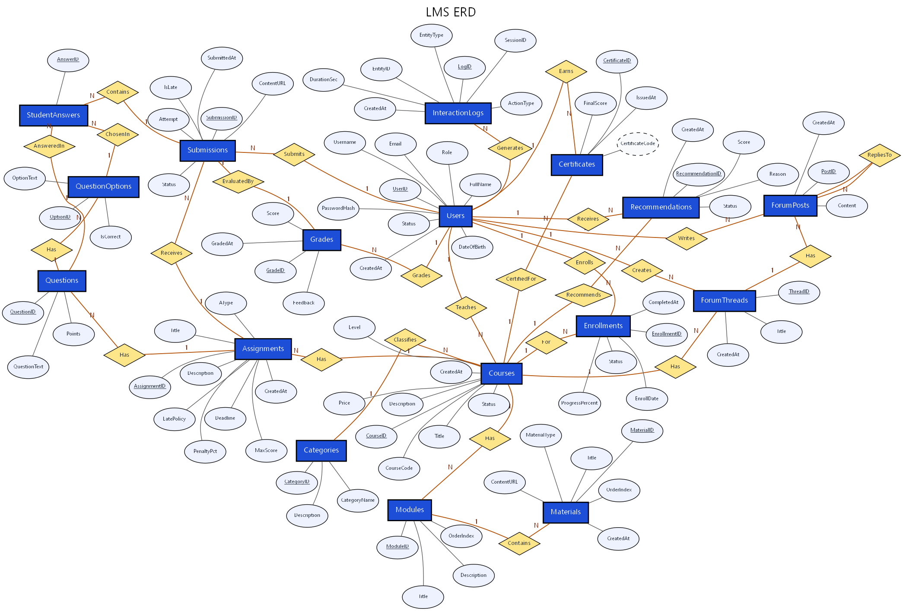

# LMS — Phân rã cơ sở dữ liệu (Decomposition) & Giải thích từng bảng/thuộc tính

> **Môn:** DBI202 — Database Systems
> **Dự án:** Online Learning Management System (LMS)
> **Nội dung:** Giải thích chi tiết từng thực thể (bảng), từng thuộc tính (ý nghĩa,
> kiểu dữ liệu, ràng buộc), khóa (PK / khóa dự tuyển / khóa ngoại), phụ thuộc hàm và
> lý do thiết kế đã đạt **3NF**. Tài liệu phục vụ tiêu chí **Decomposition / Abstraction /
> Application of Constraints** trong rubric chấm điểm cuối kỳ.

**Ký hiệu:** **PK** = khóa chính, **CK** = khóa dự tuyển (candidate key), **FK** = khóa ngoại,
**UK** = UNIQUE, **NN** = NOT NULL.

*Sơ đồ thực thể quan hệ (Chen notation): thực thể = hình chữ nhật, thuộc tính = oval
(khóa chính gạch chân, thuộc tính suy diễn = oval nét đứt), quan hệ = hình thoi kèm
lực lượng 1 / N.*

---

## Nhóm 1 — Người dùng & Danh mục (thực thể gốc, không có FK)

### 1. `Users` — Người dùng (gộp cả 3 vai trò)
| Thuộc tính | Kiểu | Ràng buộc | Ý nghĩa |
|---|---|---|---|
| **UserID** | INT IDENTITY | PK | Định danh người dùng |
| Username | VARCHAR(50) | NN, UK, LEN≥3 | Tên đăng nhập |
| PasswordHash | VARCHAR(255) | NN | Mật khẩu đã băm |
| Email | VARCHAR(150) | NN, UK, định dạng email | Email |
| FullName | NVARCHAR(150) | NN | Họ tên |
| DateOfBirth | DATE | NULL | Ngày sinh |
| Role | VARCHAR(20) | NN, CHECK ∈ {Student, Instructor, Admin} | Vai trò |
| Status | VARCHAR(20) | NN, CHECK ∈ {Active, Inactive, Banned} | Trạng thái tài khoản |
| CreatedAt | DATETIME2 | NN, default now | Thời điểm tạo |

- **CK:** {UserID}, {Username}, {Email} — vì Username/Email UNIQUE nên mỗi cái cũng xác định cả dòng.
- **FD:** `UserID → tất cả cột còn lại`. Không có phụ thuộc bộ phận/bắc cầu ⇒ **3NF**.
- **Ghi chú thiết kế:** gộp 3 vai trò vào 1 bảng bằng cột `Role` thay vì tách bảng Roles → gọn, đủ phạm vi môn.

### 2. `Categories` — Danh mục khóa học
| Thuộc tính | Kiểu | Ràng buộc | Ý nghĩa |
|---|---|---|---|
| **CategoryID** | INT IDENTITY | PK | Định danh danh mục |
| CategoryName | NVARCHAR(100) | NN, UK | Tên danh mục |
| Description | NVARCHAR(500) | NULL | Mô tả |

- **CK:** {CategoryID}, {CategoryName}. **FD:** `CategoryID → CategoryName, Description` ⇒ **3NF**.

---

## Nhóm 2 — Khóa học & nội dung

### 3. `Courses` — Khóa học
| Thuộc tính | Kiểu | Ràng buộc | Ý nghĩa |
|---|---|---|---|
| **CourseID** | INT IDENTITY | PK | Định danh khóa học |
| CourseCode | VARCHAR(20) | NN, UK | Mã khóa học |
| Title | NVARCHAR(200) | NN | Tên khóa học |
| Description | NVARCHAR(MAX) | NULL | Mô tả |
| InstructorID | INT | NN, **FK→Users** | Giảng viên phụ trách |
| CategoryID | INT | **FK→Categories** | Danh mục |
| Level | VARCHAR(20) | CHECK ∈ {Beginner, Intermediate, Advanced} | Cấp độ |
| Price | DECIMAL(10,2) | CHECK ≥ 0 | Học phí |
| Status | VARCHAR(20) | CHECK ∈ {Draft, Published, Archived} | Trạng thái |
| CreatedAt | DATETIME2 | NN, default now | Ngày tạo |

- **CK:** {CourseID}, {CourseCode}. **FK:** InstructorID→Users, CategoryID→Categories.
- **Điểm mấu chốt của 3NF:** `Courses` chỉ giữ `InstructorID`/`CategoryID`, **không** lưu `InstructorName`, `CategoryName` (nếu lưu sẽ là phụ thuộc bắc cầu `CourseID → InstructorID → InstructorName`).

### 4. `Modules` — Chương/Mô-đun của khóa
| Thuộc tính | Kiểu | Ràng buộc | Ý nghĩa |
|---|---|---|---|
| **ModuleID** | INT IDENTITY | PK | Định danh module |
| CourseID | INT | NN, **FK→Courses** (CASCADE) | Khóa học chứa module |
| Title | NVARCHAR(200) | NN | Tên module |
| Description | NVARCHAR(500) | NULL | Mô tả |
| OrderIndex | INT | NN, **UK(CourseID, OrderIndex)** | Thứ tự trong khóa |

- **CK:** {ModuleID}, {CourseID, OrderIndex} (trong 1 khóa, thứ tự là duy nhất).

### 5. `Materials` — Học liệu trong module
| Thuộc tính | Kiểu | Ràng buộc | Ý nghĩa |
|---|---|---|---|
| **MaterialID** | INT IDENTITY | PK | Định danh học liệu |
| ModuleID | INT | NN, **FK→Modules** (CASCADE) | Module chứa học liệu |
| Title | NVARCHAR(200) | NN | Tiêu đề |
| MaterialType | VARCHAR(20) | CHECK ∈ {Document, Video, Link, Slide} | Loại học liệu |
| ContentURL | NVARCHAR(500) | NN | Đường dẫn nội dung |
| OrderIndex | INT | NN | Thứ tự |
| CreatedAt | DATETIME2 | NN, default now | Ngày tạo |

---

## Nhóm 3 — Ghi danh (giải quyết quan hệ M:N)

### 6. `Enrollments` — Đăng ký học *(bảng nối M:N Student↔Course)*
| Thuộc tính | Kiểu | Ràng buộc | Ý nghĩa |
|---|---|---|---|
| **EnrollmentID** | INT IDENTITY | PK | Định danh đăng ký |
| StudentID | INT | NN, **FK→Users** | Sinh viên |
| CourseID | INT | NN, **FK→Courses** | Khóa học |
| EnrollDate | DATETIME2 | NN, default now | Ngày đăng ký |
| Status | VARCHAR(20) | CHECK ∈ {Active, Completed, Dropped} | Trạng thái |
| ProgressPercent | DECIMAL(5,2) | CHECK 0..100 | Tiến độ (%) |
| CompletedAt | DATETIME2 | NULL | Thời điểm hoàn thành |

- **CK:** {EnrollmentID}, {StudentID, CourseID} — **UK(StudentID, CourseID)** đảm bảo 1 SV không đăng ký trùng 1 khóa.
- **Vai trò phân rã:** một SV học nhiều khóa, một khóa có nhiều SV → quan hệ **M:N**. Chuẩn hóa tách nó thành bảng nối này (thay vì nhồi vào Users/Courses gây đa trị/dư thừa).

---

## Nhóm 4 — Bài tập, câu hỏi, đáp án

### 7. `Assignments` — Bài tập / Quiz / Exam
| Thuộc tính | Kiểu | Ràng buộc | Ý nghĩa |
|---|---|---|---|
| **AssignmentID** | INT IDENTITY | PK | Định danh bài tập |
| CourseID | INT | NN, **FK→Courses** (CASCADE) | Khóa học chứa bài |
| Title | NVARCHAR(200) | NN | Tiêu đề |
| Description | NVARCHAR(MAX) | NULL | Mô tả |
| AType | VARCHAR(20) | CHECK ∈ {Assignment, Quiz, Exam} | Loại đánh giá |
| MaxScore | DECIMAL(5,2) | CHECK > 0 | Điểm tối đa |
| Deadline | DATETIME2 | **NN** | Hạn nộp (bắt buộc) |
| LatePolicy | VARCHAR(20) | CHECK ∈ {AcceptLate, RejectLate, Penalty} | Chính sách nộp trễ |
| PenaltyPct | DECIMAL(5,2) | CHECK 0..100 | % trừ điểm khi trễ |
| CreatedAt | DATETIME2 | NN, default now | Ngày tạo |

- Một cột `AType` đại diện cho cả Assignment/Quiz/Exam → không tách 3 bảng, đỡ dư thừa.

### 8. `Questions` — Câu hỏi trắc nghiệm
| Thuộc tính | Kiểu | Ràng buộc | Ý nghĩa |
|---|---|---|---|
| **QuestionID** | INT IDENTITY | PK | Định danh câu hỏi |
| AssignmentID | INT | NN, **FK→Assignments** (CASCADE) | Quiz/Exam chứa câu hỏi |
| QuestionText | NVARCHAR(MAX) | NN | Nội dung câu hỏi |
| Points | DECIMAL(5,2) | CHECK > 0 | Điểm câu hỏi |

### 9. `QuestionOptions` — Đáp án lựa chọn
| Thuộc tính | Kiểu | Ràng buộc | Ý nghĩa |
|---|---|---|---|
| **OptionID** | INT IDENTITY | PK | Định danh đáp án |
| QuestionID | INT | NN, **FK→Questions** (CASCADE) | Câu hỏi chứa đáp án |
| OptionText | NVARCHAR(500) | NN | Nội dung đáp án |
| IsCorrect | BIT | NN, default 0 | Có phải đáp án đúng? |

- Tách `Questions`↔`QuestionOptions` (1:N) để loại nhóm lặp "nhiều đáp án trong 1 câu" → đạt **1NF**.

---

## Nhóm 5 — Nộp bài & chấm điểm

### 10. `Submissions` — Bài nộp
| Thuộc tính | Kiểu | Ràng buộc | Ý nghĩa |
|---|---|---|---|
| **SubmissionID** | INT IDENTITY | PK | Định danh bài nộp |
| AssignmentID | INT | NN, **FK→Assignments** | Bài tập được nộp |
| StudentID | INT | NN, **FK→Users** | Sinh viên nộp |
| SubmittedAt | DATETIME2 | NN, default now | Thời điểm nộp |
| ContentURL | NVARCHAR(500) | NULL | Đường dẫn bài nộp |
| IsLate | BIT | NN, default 0 | Nộp trễ? (trigger tự set) |
| Status | VARCHAR(20) | CHECK ∈ {Submitted, Graded, Rejected} | Trạng thái |
| Attempt | INT | NN, default 1 | Lần nộp thứ mấy |

- **CK:** {SubmissionID}, {AssignmentID, StudentID, Attempt} — **UK** này chống nộp trùng cùng một lần.
- Không lưu lại `Deadline`/`MaxScore` (lấy từ `Assignments`) → tránh dư thừa, giữ **3NF**.

### 11. `StudentAnswers` — Câu trả lời của SV *(bảng nối)*
| Thuộc tính | Kiểu | Ràng buộc | Ý nghĩa |
|---|---|---|---|
| **AnswerID** | INT IDENTITY | PK | Định danh câu trả lời |
| SubmissionID | INT | NN, **FK→Submissions** (CASCADE) | Bài nộp quiz |
| QuestionID | INT | NN, **FK→Questions** | Câu hỏi |
| SelectedOptionID | INT | **FK→QuestionOptions** | Đáp án đã chọn |

- **CK:** {AnswerID}, {SubmissionID, QuestionID} — **UK** đảm bảo mỗi câu trong 1 bài nộp chỉ có 1 lựa chọn. Đây là bảng nối 3 chiều (bài nộp × câu hỏi × đáp án).

### 12. `Grades` — Điểm (1:1 với bài nộp)
| Thuộc tính | Kiểu | Ràng buộc | Ý nghĩa |
|---|---|---|---|
| **GradeID** | INT IDENTITY | PK | Định danh điểm |
| SubmissionID | INT | NN, **FK→Submissions** (CASCADE), **UK** | Bài nộp được chấm (1-1) |
| Score | DECIMAL(5,2) | CHECK ≥ 0 (và ≤ MaxScore qua trigger) | Điểm số |
| Feedback | NVARCHAR(MAX) | NULL | Phản hồi |
| GradedBy | INT | **FK→Users** (NULL = hệ thống tự chấm) | Người chấm |
| GradedAt | DATETIME2 | NN, default now | Thời điểm chấm |

- **CK:** {GradeID}, {SubmissionID}. Vì `SubmissionID` UNIQUE nên mỗi bài nộp có **tối đa 1 điểm** → quan hệ **1:1**.

---

## Nhóm 6 — Thảo luận (diễn đàn)

### 13. `ForumThreads` — Chủ đề thảo luận
| Thuộc tính | Kiểu | Ràng buộc | Ý nghĩa |
|---|---|---|---|
| **ThreadID** | INT IDENTITY | PK | Định danh chủ đề |
| CourseID | INT | NN, **FK→Courses** (CASCADE) | Khóa học |
| CreatedBy | INT | NN, **FK→Users** | Người tạo |
| Title | NVARCHAR(200) | NN | Tiêu đề |
| CreatedAt | DATETIME2 | NN, default now | Ngày tạo |

### 14. `ForumPosts` — Bài viết / trả lời (đệ quy)
| Thuộc tính | Kiểu | Ràng buộc | Ý nghĩa |
|---|---|---|---|
| **PostID** | INT IDENTITY | PK | Định danh bài viết |
| ThreadID | INT | NN, **FK→ForumThreads** (CASCADE) | Chủ đề chứa bài |
| UserID | INT | NN, **FK→Users** | Người viết |
| Content | NVARCHAR(MAX) | NN | Nội dung |
| ParentPostID | INT | **FK→ForumPosts** (tự tham chiếu) | Trả lời bài nào |
| CreatedAt | DATETIME2 | NN, default now | Ngày viết |

- `ParentPostID` trỏ về chính `ForumPosts` → quan hệ **tự tham chiếu** (trả lời lồng nhau).

---

## Nhóm 7 — Phân tích & chứng chỉ

### 15. `Recommendations` — Gợi ý khóa học
| Thuộc tính | Kiểu | Ràng buộc | Ý nghĩa |
|---|---|---|---|
| **RecommendationID** | INT IDENTITY | PK | Định danh gợi ý |
| StudentID | INT | NN, **FK→Users** | SV nhận gợi ý |
| CourseID | INT | NN, **FK→Courses** | Khóa học gợi ý |
| Reason | NVARCHAR(300) | NULL | Lý do gợi ý |
| Score | DECIMAL(5,4) | CHECK 0..1 | Độ tin cậy |
| Status | VARCHAR(20) | CHECK ∈ {Shown, Clicked, Enrolled, Ignored} | Trạng thái (đo hiệu quả) |
| CreatedAt | DATETIME2 | NN, default now | Thời điểm gợi ý |

- Cố ý **không** đặt UK(StudentID, CourseID) vì cùng 1 khóa có thể gợi ý lại nhiều lần theo thời gian.

### 16. `InteractionLogs` — Nhật ký tương tác
| Thuộc tính | Kiểu | Ràng buộc | Ý nghĩa |
|---|---|---|---|
| **LogID** | BIGINT IDENTITY | PK | Định danh log |
| UserID | INT | **FK→Users** (NULL được) | Người dùng |
| SessionID | UNIQUEIDENTIFIER | NN | Định danh phiên |
| ActionType | VARCHAR(50) | NN | Loại hành động (Login, ViewMaterial…) |
| EntityType | VARCHAR(50) | NULL | Loại đối tượng tác động |
| EntityID | INT | NULL | Định danh đối tượng |
| DurationSec | INT | NULL | Thời lượng (giây) |
| CreatedAt | DATETIME2 | NN, default now | Thời điểm |

### 17. `Certificates` — Chứng chỉ hoàn thành
| Thuộc tính | Kiểu | Ràng buộc | Ý nghĩa |
|---|---|---|---|
| **CertificateID** | INT IDENTITY | PK | Định danh chứng chỉ |
| StudentID | INT | NN, **FK→Users** | SV được cấp |
| CourseID | INT | NN, **FK→Courses** | Khóa học |
| FinalScore | DECIMAL(5,2) | NN, **CHECK ≥ 80**, 0..100 | Điểm tổng kết khi cấp |
| IssuedAt | DATETIME2 | NN, default now | Thời điểm cấp |
| CertificateCode | (computed) | suy diễn `LMS-CERT-#####` | Mã in được |

- **CK:** {CertificateID}, {StudentID, CourseID}, {CertificateCode}. `CertificateCode` là thuộc tính **suy diễn** (nên trong ERD vẽ oval nét đứt), tính từ `CertificateID` → không lưu dư thừa.

---

## Tóm tắt logic phân rã (để trình bày khi thuyết trình)

1. **1NF** — bỏ đa trị / nhóm lặp: tách "nhiều module trong 1 khóa" → `Modules`, "nhiều đáp án trong 1 câu" → `QuestionOptions`. Mỗi ô một giá trị, mỗi bảng có PK.
2. **2NF** — bỏ phụ thuộc bộ phận: bảng gộp khóa kép `(Student, Course, Assignment)` được tách ra `Users`, `Courses`, `Assignments`, và quan hệ M:N → bảng nối `Enrollments`.
3. **3NF** — bỏ phụ thuộc bắc cầu: `Courses` chỉ giữ `InstructorID`/`CategoryID` (không lưu tên); `Submissions` không lưu lại `Deadline`/`MaxScore`; `Grades.GradedBy` là FK thay vì lưu tên người chấm.
4. **Ràng buộc nghiệp vụ** — PK/FK/UNIQUE + CHECK (Role, Status, Price ≥ 0, FinalScore ≥ 80…) + trigger (đánh dấu nộp trễ, chỉ Instructor/Admin được chấm, khóa `Published` phải có ≥ 1 module).

### Bảng tổng hợp quan hệ giữa các thực thể

| Quan hệ | Loại | Hiện thực bằng |
|---|---|---|
| Instructor (User) **phụ trách** Courses | 1:N | `Courses.InstructorID → Users` |
| Category **phân loại** Courses | 1:N | `Courses.CategoryID → Categories` |
| Course **có** Modules | 1:N | `Modules.CourseID → Courses` |
| Module **chứa** Materials | 1:N | `Materials.ModuleID → Modules` |
| Student **ghi danh** Course | **M:N** | bảng nối `Enrollments(StudentID, CourseID)` |
| Course **có** Assignments | 1:N | `Assignments.CourseID → Courses` |
| Assignment **có** Questions | 1:N | `Questions.AssignmentID → Assignments` |
| Question **có** Options | 1:N | `QuestionOptions.QuestionID → Questions` |
| Student **nộp** Submissions | 1:N | `Submissions.StudentID → Users` |
| Assignment **nhận** Submissions | 1:N | `Submissions.AssignmentID → Assignments` |
| Submission **có** StudentAnswers | 1:N | `StudentAnswers.SubmissionID → Submissions` |
| Submission **được chấm bởi** Grade | 1:1 | `Grades.SubmissionID` (UNIQUE) |
| Course **có** ForumThreads | 1:N | `ForumThreads.CourseID → Courses` |
| Thread **có** Posts (lồng nhau) | 1:N + tự tham chiếu | `ForumPosts.ThreadID`, `ParentPostID → ForumPosts` |
| Student **nhận** Recommendations | 1:N | `Recommendations.StudentID → Users` |
| User **sinh** InteractionLogs | 1:N | `InteractionLogs.UserID → Users` |
| Student **đạt** Certificate cho Course | 1 chứng chỉ / cặp | `Certificates(StudentID, CourseID)` UNIQUE |
