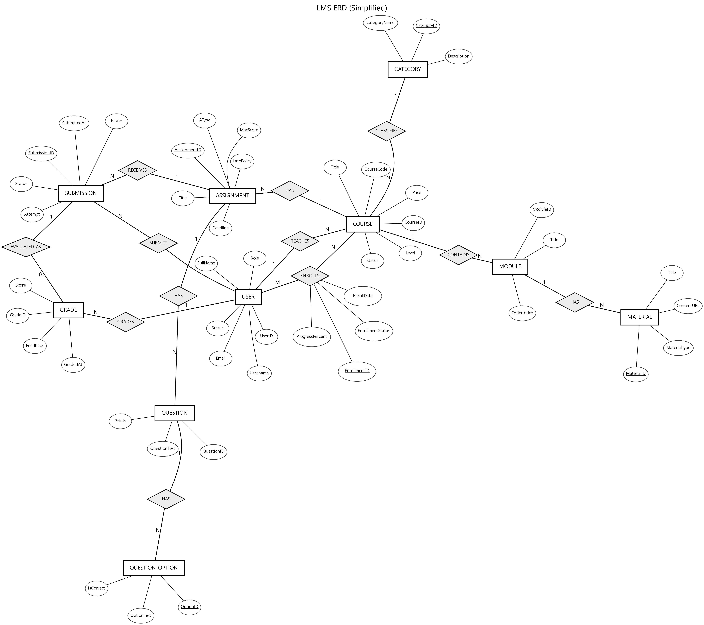

# Lab 4 — Relational Database Design Process

> **Course:** DBI202 — Database Systems
> **Lab:** 4 — Relational Database Design Process
> **Project:** Online Learning Management System (LMS)
> **Group:** 1
> **Members:** Huynh Pham Phi Linh — SE211780, Nguyen Tan Thinh — SE212249, Nguyen Quoc Bao — SE212261, Nguyen Hoang Vu — SE212202
> **Class:** AI2014
> **Date:** 01/07/2026

---

## 1. Objective

The objective of this lab is to carry out the full relational design process for our Online
Learning Management System (LMS). Starting from the requirements of the domain, we build a
conceptual Entity-Relationship (ER) model, convert it into a logical relational schema (with
primary and foreign keys and the resolution of many-to-many relationships), map that schema into a
physical design (SQL Server data types and indexes), and finally specify the integrity constraints
that keep the data correct. Every artifact in this report corresponds to the implemented schema in
`sql/01_schema.sql`.

---

## 2. Entity-Relationship Diagram (ERD)

The LMS manages users (students, instructors, admins), a course catalogue organised into
categories, the modules and materials that make up each course, student enrolments, assignments and
quizzes with their submissions and grades, discussion forums, course recommendations, interaction
logs, and completion certificates. From these requirements we identified **17 entities** (listed in
§2.1). Figure 1 gives a conceptual view in Chen notation, where rectangles are entities, ovals are
attributes (the primary key is underlined), and diamonds are relationships annotated with their
cardinality. To keep the diagram readable it focuses on the core entities and their main
relationships; the complete set of 17 tables is mapped in the logical schema (§3).

*Figure 1. Conceptual ERD of the LMS in Chen notation, focusing on the core entities and their main relationships.*

### 2.1. Entities and their main attributes

| # | Entity | Main attributes (key attributes in bold) |
|---|---|---|
| 1 | `Users` | **UserID**, Username, Email, FullName, Role, Status |
| 2 | `Categories` | **CategoryID**, CategoryName, Description |
| 3 | `Courses` | **CourseID**, CourseCode, Title, InstructorID, CategoryID, Level, Price, Status |
| 4 | `Modules` | **ModuleID**, CourseID, Title, OrderIndex |
| 5 | `Materials` | **MaterialID**, ModuleID, Title, MaterialType, ContentURL |
| 6 | `Enrollments` | **EnrollmentID**, StudentID, CourseID, EnrollDate, Status, ProgressPercent |
| 7 | `Assignments` | **AssignmentID**, CourseID, Title, AType, MaxScore, Deadline |
| 8 | `Questions` | **QuestionID**, AssignmentID, QuestionText, Points |
| 9 | `QuestionOptions` | **OptionID**, QuestionID, OptionText, IsCorrect |
| 10 | `Submissions` | **SubmissionID**, AssignmentID, StudentID, SubmittedAt, IsLate, Attempt |
| 11 | `StudentAnswers` | **AnswerID**, SubmissionID, QuestionID, SelectedOptionID |
| 12 | `Grades` | **GradeID**, SubmissionID, Score, Feedback, GradedBy |
| 13 | `ForumThreads` | **ThreadID**, CourseID, CreatedBy, Title |
| 14 | `ForumPosts` | **PostID**, ThreadID, UserID, Content, ParentPostID |
| 15 | `Recommendations` | **RecommendationID**, StudentID, CourseID, Score, Status |
| 16 | `InteractionLogs` | **LogID**, UserID, ActionType, EntityType, CreatedAt |
| 17 | `Certificates` | **CertificateID**, StudentID, CourseID, FinalScore, IssuedAt |

### 2.2. Relationships and cardinalities

| Relationship | Cardinality | Notes |
|---|---|---|
| Instructor (User) owns Course | 1 : N | A course has exactly one owning instructor |
| Category classifies Course | 1 : N | A category groups many courses |
| Course has Modules | 1 : N | A module belongs to one course |
| Module has Materials | 1 : N | A material belongs to one module |
| Student enrols in Course | **M : N** | Resolved by the `Enrollments` junction |
| Course has Assignments | 1 : N | |
| Assignment has Questions | 1 : N | |
| Question has Options | 1 : N | |
| Assignment receives Submissions | 1 : N | |
| Student makes Submissions | 1 : N | |
| Submission has StudentAnswers | 1 : N | |
| Submission has Grade | 1 : 1 | A submission receives at most one grade |
| Course has ForumThreads | 1 : N | |
| Thread has Posts (nested replies) | 1 : N + self | `ParentPostID` references `ForumPosts` |
| User receives Recommendations | 1 : N | |
| User generates InteractionLogs | 1 : N | |
| Student earns Certificate for Course | **M : N**, ≤ 1 per pair | Resolved by `Certificates` |

---

## 3. Logical Diagram (Relational Schema)

The ER model is converted into relations using the standard mapping rules:

1. **Each entity becomes a table** with a surrogate `IDENTITY` primary key.
2. **Each 1:N relationship becomes a foreign key** on the "many" side (for example
   `Modules.CourseID → Courses`, `Courses.InstructorID → Users`, `Courses.CategoryID → Categories`).
3. **Each M:N relationship becomes a junction table** carrying both foreign keys and the
   relationship attributes:
   - `Enrollments(StudentID, CourseID, EnrollDate, Status, ProgressPercent, CompletedAt)` with
     `UNIQUE(StudentID, CourseID)`.
   - `Certificates(StudentID, CourseID, FinalScore, IssuedAt)` with `UNIQUE(StudentID, CourseID)`.
4. **The 1:1 relationship** between a submission and its grade is mapped by placing the foreign key
   on `Grades` and adding `UNIQUE(SubmissionID)` so a submission has at most one grade.
5. **The recursive relationship** (a reply answering another post) becomes a self-referencing
   foreign key `ForumPosts.ParentPostID → ForumPosts(PostID)`.

The resulting relational schema, with primary keys and foreign keys, is:

| Table | Primary key | Foreign keys |
|---|---|---|
| `Users` | UserID | — |
| `Categories` | CategoryID | — |
| `Courses` | CourseID | InstructorID→Users, CategoryID→Categories |
| `Modules` | ModuleID | CourseID→Courses (CASCADE) |
| `Materials` | MaterialID | ModuleID→Modules (CASCADE) |
| `Enrollments` | EnrollmentID | StudentID→Users, CourseID→Courses |
| `Assignments` | AssignmentID | CourseID→Courses (CASCADE) |
| `Questions` | QuestionID | AssignmentID→Assignments (CASCADE) |
| `QuestionOptions` | OptionID | QuestionID→Questions (CASCADE) |
| `Submissions` | SubmissionID | AssignmentID→Assignments, StudentID→Users |
| `StudentAnswers` | AnswerID | SubmissionID→Submissions (CASCADE), QuestionID→Questions, SelectedOptionID→QuestionOptions |
| `Grades` | GradeID | SubmissionID→Submissions (CASCADE), GradedBy→Users |
| `ForumThreads` | ThreadID | CourseID→Courses (CASCADE), CreatedBy→Users |
| `ForumPosts` | PostID | ThreadID→ForumThreads (CASCADE), UserID→Users, ParentPostID→ForumPosts |
| `Recommendations` | RecommendationID | StudentID→Users, CourseID→Courses |
| `InteractionLogs` | LogID | UserID→Users |
| `Certificates` | CertificateID | StudentID→Users, CourseID→Courses |

The schema is normalised to 3NF (analysed in Lab 3), and a complete column-level data dictionary is
provided in `docs/Normalization_and_DataDictionary.md` (Part B).

---

## 4. Physical Diagram (Detailed Table Design)

### 4.1. Data types

We mapped every attribute to an appropriate SQL Server type:

- **Surrogate keys:** `INT IDENTITY(1,1)`; `InteractionLogs.LogID` uses `BIGINT IDENTITY` because
  the log table grows fastest.
- **Text:** `VARCHAR` for ASCII codes and enumerations (`Username`, `CourseCode`, `Role`, `Status`)
  and `NVARCHAR` for human-readable Unicode content (`FullName`, `Title`, `Description`).
- **Money and scores:** `DECIMAL(10,2)` for `Price`, `DECIMAL(5,2)` for scores and percentages,
  `DECIMAL(5,4)` for the recommendation confidence value (0..1).
- **Time:** `DATETIME2` with `DEFAULT SYSDATETIME()`.
- **Flags and identifiers:** `BIT` for `IsCorrect` / `IsLate`; `UNIQUEIDENTIFIER` for `SessionID`.
- **Computed column:** `Certificates.CertificateCode` is a computed column that derives a
  human-friendly serial from the identity value
  (`'LMS-CERT-' + RIGHT('00000' + CAST(CertificateID AS VARCHAR(10)), 5)`).

### 4.2. Indexes

Besides the clustered primary-key indexes, we created secondary indexes for the most frequent
lookups and reports:

| Index | Table(column) | Purpose |
|---|---|---|
| `IX_Courses_Instructor` | `Courses(InstructorID)` | List the courses of an instructor |
| `IX_Enroll_Course` | `Enrollments(CourseID)` | Enrolment counts / rosters per course |
| `IX_Enroll_Student` | `Enrollments(StudentID)` | A student's enrolled courses |
| `IX_Sub_Student` | `Submissions(StudentID)` | A student's submissions |
| `IX_Sub_Assignment` | `Submissions(AssignmentID)` | Submissions per assignment (grading) |
| `IX_Log_User_Time` | `InteractionLogs(UserID, CreatedAt)` | Behaviour analytics by user over time |

---

## 5. List and Description of Constraints

### 5.1. Column-level and table-level declarative constraints

- **NOT NULL** — required columns cannot be empty, for example `Users.Username`, `Users.Email`,
  `Courses.Title`, `Enrollments.StudentID`, `Submissions.AssignmentID`, `Grades.Score`.
- **UNIQUE** — natural keys and cardinality rules: `Users.Username`, `Users.Email`,
  `Courses.CourseCode`, `Modules(CourseID, OrderIndex)`, `Enrollments(StudentID, CourseID)`,
  `Submissions(AssignmentID, StudentID, Attempt)`, `StudentAnswers(SubmissionID, QuestionID)`,
  `Grades.SubmissionID`, and `Certificates(StudentID, CourseID)`.
- **PRIMARY KEY** — one surrogate identity key per table (17 tables) that uniquely identifies each
  row and provides entity integrity.
- **FOREIGN KEY** — referential integrity for every relationship (see §3). `ON DELETE CASCADE` is
  applied along ownership chains (`Modules`, `Materials`, `Assignments`, `Questions`,
  `QuestionOptions`, `StudentAnswers`, `Grades`, `ForumThreads`, `ForumPosts`) so that deleting a
  parent cleanly removes its dependent rows, while enrolments and submissions are **not** cascaded
  from `Users`, so historical academic data is only removed on purpose.
- **CHECK** — domain and value rules: `Users.Role IN ('Student','Instructor','Admin')`,
  `Enrollments.ProgressPercent BETWEEN 0 AND 100`, `Courses.Price >= 0`, `Assignments.MaxScore > 0`,
  `Recommendations.Score BETWEEN 0 AND 1`, `Certificates.FinalScore >= 80`, and an e-mail format
  pattern on `Users.Email`.
- **DEFAULT** — sensible defaults so common inserts stay simple: `Enrollments.Status = 'Active'`,
  `Submissions.Attempt = 1`, `CreatedAt = SYSDATETIME()`, and similar.

### 5.2. Rules enforced by triggers

A few business rules cannot be written as declarative constraints because they compare rows across
tables. These are enforced by triggers (`sql/02_triggers.sql`):

| Trigger | Rule enforced |
|---|---|
| `trg_Courses_InstructorRole` | A course's owner must have the `Instructor` role |
| `trg_Enroll_Validate` | Only `Student` accounts may enrol, and only in `Published` courses |
| `trg_Submissions_Policy` | Checks enrolment, sets the `IsLate` flag, and applies the late policy |
| `trg_Modules_KeepAtLeastOne` | A published course must keep at least one module |
| `trg_Courses_PublishNeedsModule` | A course can be `Published` only if it has a module |
| `trg_Grades_MarkGraded` | Grader must be Instructor/Admin, score ≤ MaxScore, submission marked Graded |
| `trg_StudentAnswers_OptionMatchesQuestion` | A chosen option must belong to its own question |

---

## 6. Conclusion and Reflection

We designed the LMS database by following the relational design process end to end: from the
requirements we drew a conceptual ER model of 17 entities, mapped it to a logical schema (resolving
the two many-to-many relationships with the `Enrollments` and `Certificates` junction tables and the
1:1 submission–grade relationship with a `UNIQUE` foreign key), gave it a physical design with
suitable SQL Server data types and secondary indexes, and layered the integrity constraints on top.

Working through the process made it clear how much the constraints contribute to data integrity and
reliability. Primary and foreign keys guarantee that every row is identifiable and that no
enrolment, submission, or grade can point to a non-existent user or course; `UNIQUE` constraints
stop duplicate accounts, duplicate enrolments, and more than one certificate per student per course;
`CHECK` constraints keep values inside their valid domains (for example a certificate can never be
issued below 80%); and triggers cover the cross-table rules that declarative constraints cannot
express. Because these rules live in the database rather than in application code, the data stays
consistent no matter which client connects — a solid foundation for the SQL programming carried out
in Lab 5.
